# Amiyo-Go Complete Marketplace Documentation With Screenshots

Generated: 2026-06-04

This single PDF source combines the thesis, role documentation, workflow diagrams, audit notes, testing notes, and README references into one complete project document.

এই একক PDF source-এ thesis, role documentation, workflow diagram, audit note, testing note এবং README reference একসাথে রাখা হয়েছে।

## How This Combined PDF Is Organized

- Part 1: Visual screenshot index with English and Bangla explanations.
- Part 2: Main thesis documentation with architecture and bilingual workflow narrative.
- Part 3: Role features, workflow diagrams, audit, testing, courier, and README references.

## Included Source Documents

- Thesis Documentation: AMIYO_GO_THESIS_DOCUMENTATION.md - Main project thesis with architecture, screenshots, role workflows, testing, deployment, and bilingual operating narrative.
- Role Features Documentation: ROLE_FEATURES_DOCUMENTATION.md - Customer, vendor, and admin feature inventory and role responsibilities.
- Marketplace Workflow Diagrams: MARKETPLACE_WORKFLOW_DIAGRAMS.md - Architecture diagrams, module maps, state machines, and target workflow match status.
- Project Workflow: PROJECT_WORKFLOW.md - Implementation workflow and operational project map.
- Marketplace Role Workflows: MARKETPLACE_ROLE_WORKFLOWS.md - Role-by-role workflow documentation for buyer, seller, and operator journeys.
- Daraz-Level Marketplace Audit: DARAZ_LEVEL_MARKETPLACE_AUDIT.md - Marketplace maturity audit and Daraz-level readiness notes.
- Professional Feature Gap Status: DARAZ_PROFESSIONAL_FEATURE_GAP_STATUS.md - Professional feature gap tracking and implementation status.
- Courier Integration Workflow: COURIER_INTEGRATION_WORKFLOW.md - Courier provider workflow and delivery integration notes.
- Testing Documentation: TESTING_DOCUMENTATION.md - Testing strategy, verification notes, and quality workflow.
- Feature Reference: FEATURE_REFERENCE.md - Project feature reference and quick lookup.
- Project README: README.md - General repository overview.
- Customer README: README_USER.md - Customer-facing feature and usage documentation.
- Vendor README: README_VENDOR.md - Vendor/seller-center feature and usage documentation.
- Admin README: README_ADMIN.md - Admin/operator feature and usage documentation.

## Visual Screenshot Index

These screenshots are captured from the running Amiyo-Go frontend and included so the documentation explains both the system design and the real user interface.

এই screenshot-গুলো running Amiyo-Go frontend থেকে নেওয়া হয়েছে, যাতে documentation-এ system design-এর পাশাপাশি real UI-ও বোঝা যায়।

### Screenshot 1: Customer Home Page

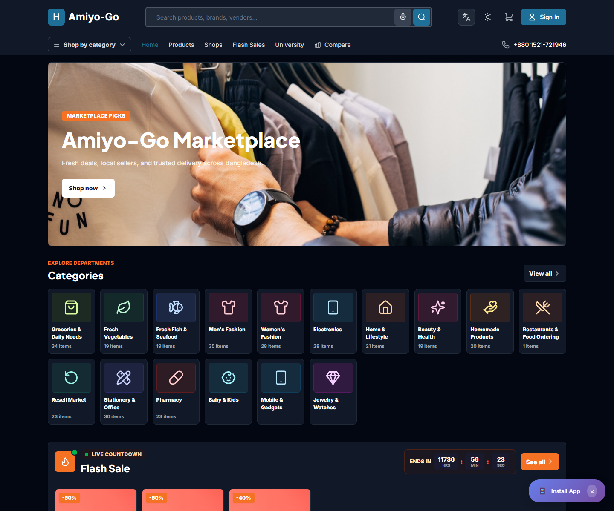

English: Shows the modern marketplace landing page, controlled promotional sections, product discovery, and customer entry points.

বাংলা: এখানে আধুনিক মার্কেটপ্লেস হোমপেজ, অ্যাডমিন-কন্ট্রোলড প্রমোশন সেকশন, পণ্য খোঁজা এবং কাস্টমার এন্ট্রি পয়েন্ট দেখা যায়।

### Screenshot 2: Customer University

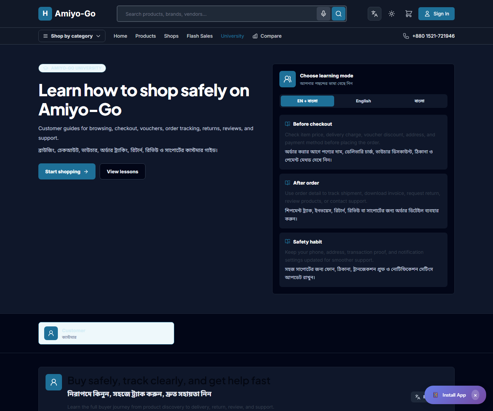

English: Shows the customer learning center. Public users see only safe customer education, while vendor/admin operating lessons stay behind protected role routes.

বাংলা: এটি কাস্টমার লার্নিং সেন্টার দেখায়। পাবলিক ইউজার শুধু নিরাপদ কাস্টমার গাইড দেখে, ভেন্ডর/অ্যাডমিন অপারেশন গাইড protected role route-এর ভিতরে থাকে।

### Screenshot 3: Shop Discovery

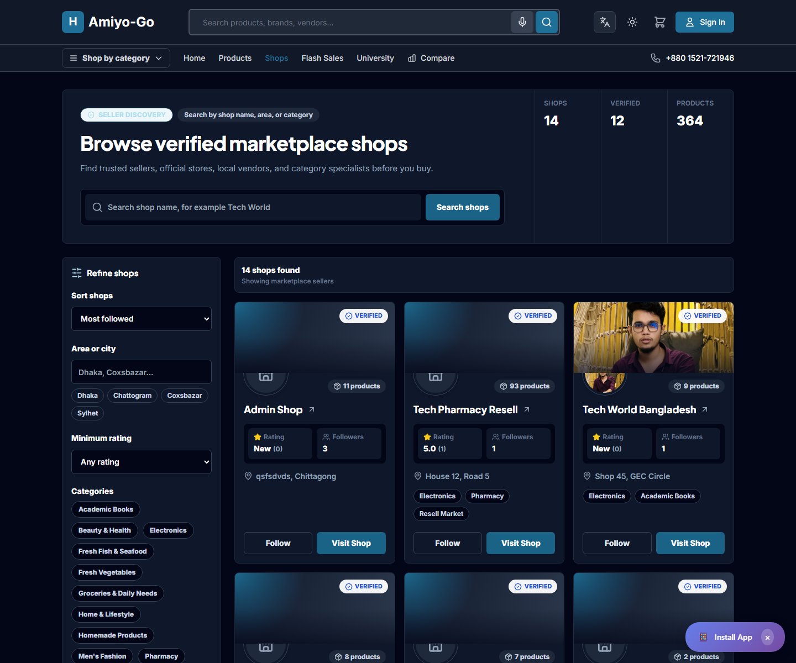

English: Shows public shop browsing, shop search, filters, ratings, follower signals, and storefront navigation.

বাংলা: এখানে পাবলিক শপ ব্রাউজিং, শপ সার্চ, ফিল্টার, রেটিং, ফলোয়ার সিগন্যাল এবং storefront navigation দেখা যায়।

### Screenshot 4: Account Registration

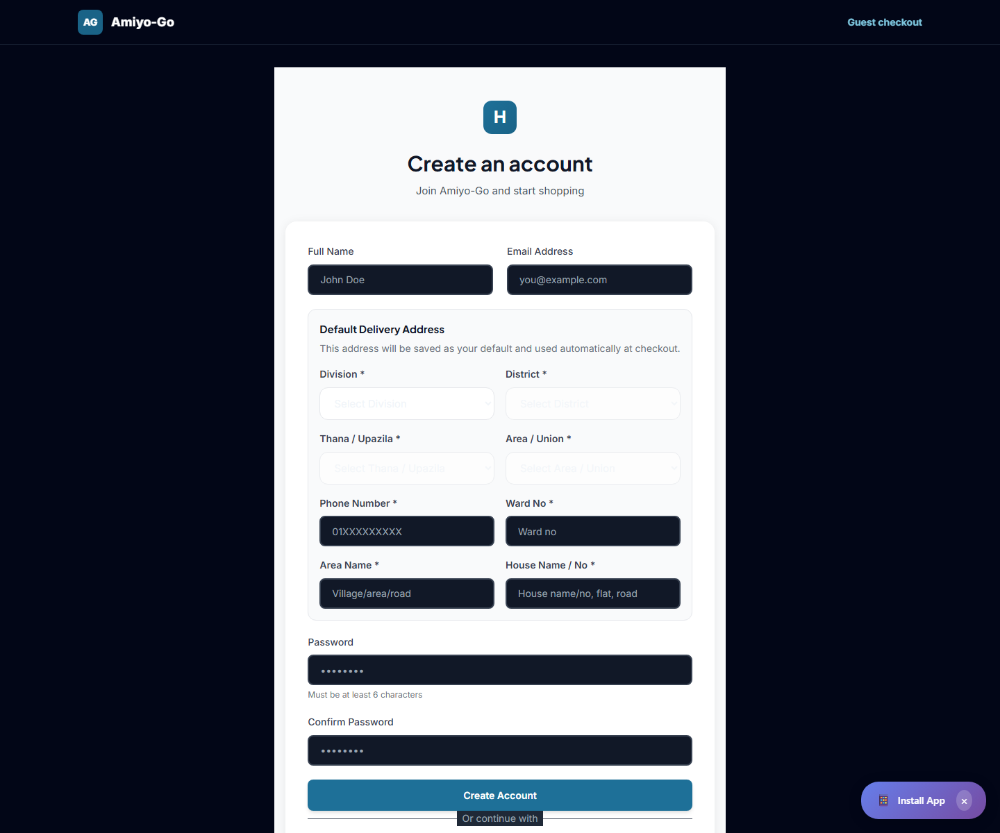

English: Shows account creation and address capture, which connects identity, delivery, checkout, order history, and support.

বাংলা: এটি account creation এবং address capture দেখায়, যা identity, delivery, checkout, order history এবং support-এর সাথে যুক্ত।

### Screenshot 5: Login And Protected Access

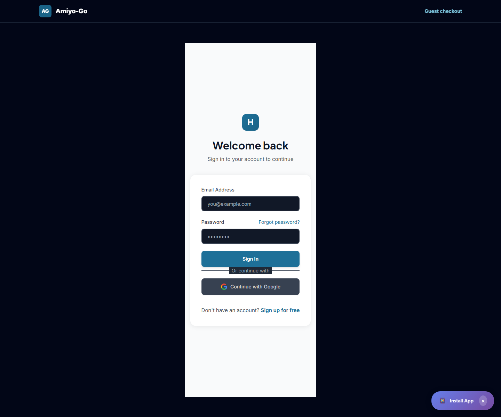

English: Shows authentication entry. After login, route guards decide whether the user enters customer, vendor, or admin workflows.

বাংলা: এটি authentication entry দেখায়। লগইনের পরে route guard ঠিক করে user customer, vendor নাকি admin workflow-তে যাবে।

### Screenshot 6: Mobile Home Experience

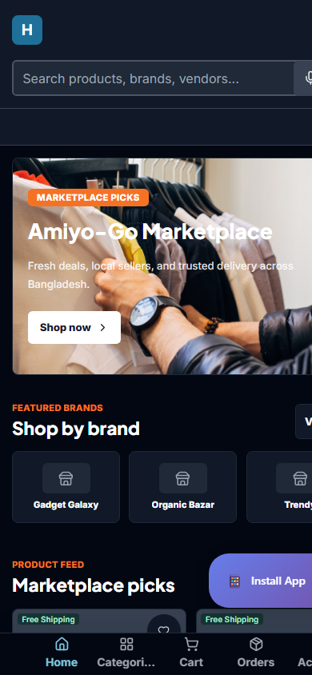

English: Shows the responsive marketplace experience for mobile users, including compressed discovery sections and PWA-friendly layout.

বাংলা: এটি mobile user-এর responsive marketplace experience দেখায়, যেখানে compact discovery section এবং PWA-friendly layout আছে।

# Combined Source Documents

The following sections include the project's existing documentation files in one continuous PDF.

# Thesis Documentation

Source file: AMIYO_GO_THESIS_DOCUMENTATION.md

Main project thesis with architecture, screenshots, role workflows, testing, deployment, and bilingual operating narrative.

# Amiyo-Go Marketplace Thesis Documentation

**Project:** Amiyo-Go Multi-Vendor Marketplace
**Document type:** Thesis-style technical documentation
**Last updated:** 2026-06-04
**Prepared for:** Product, engineering, operations, vendor, and admin review

---

## Abstract

Amiyo-Go is a role-based multi-vendor marketplace system designed to support customer shopping, vendor seller-center operations, and admin marketplace governance. The project has evolved beyond a simple ecommerce catalog into a marketplace operating system with modules for catalog management, vendor onboarding, order fulfillment, courier workflow, returns, payments, promotions, trust and safety, analytics, staff permissions, and documentation/training.

The application follows a modular monolith architecture. The frontend is built with React, React Router, Tailwind CSS, reusable UI components, and role-specific layouts. The backend is a Node.js and Express API layer using MongoDB through Mongoose and native MongoDB access. Selected background workflows use BullMQ/Redis where configured. The system includes adapter-ready integrations for courier providers, payment providers, notification channels, object storage, and search provider abstraction.

This documentation records the full implementation scope, current architecture, feature inventory, role workflows, data model map, API surface, quality practices, deployment notes, known limitations, and future production-hardening roadmap. It is intended to work as a project thesis, handover document, and production-readiness reference.

## Keywords

Marketplace, ecommerce, multi-vendor, seller center, admin dashboard, logistics, COD, returns, trust and safety, analytics, promotions, React, Node.js, Express, MongoDB, Firebase, BullMQ.

---

## Table of Contents

1. Introduction
2. Project Goals and Scope
3. Stakeholder and Role Analysis
4. Technology Stack
5. System Architecture and UI Screenshots
6. Frontend Architecture
7. Backend Architecture
8. Database and Persistence Model
9. Feature Documentation by Role
10. Business Workflows
11. API and Service Map
12. Security, Trust, and Permissions
13. Logistics and Courier Integration
14. Promotions, Growth, and Personalization
15. Analytics and Reporting
16. Testing and Quality Assurance
17. Deployment and Environment Configuration
18. Documentation and Training Layer
19. Production-Readiness Assessment
20. Limitations and Future Work
21. Conclusion
22. Appendices

---

# Chapter 1: Introduction

## 1.1 Background

Modern marketplaces are not only product listing websites. They are operational platforms where customers, sellers, and platform operators coordinate through structured workflows. A Daraz-level marketplace needs customer discovery and checkout, seller-center controls, logistics state tracking, finance settlement, dispute handling, campaign tools, analytics, and staff governance.

Amiyo-Go is designed around that concept. The project connects customer shopping actions, vendor operating tools, and admin governance into one system. The core value is not only that products can be purchased, but that the marketplace can be managed after the order is placed.

## 1.2 Problem Statement

A normal ecommerce application usually solves only these problems:

- Display products.
- Add products to cart.
- Place an order.
- Let an admin view orders.

A real marketplace must solve many more:

- Sellers need onboarding, KYC, product moderation, stock management, packing, finance, promotions, and reputation tools.
- Customers need trustworthy shopping, order tracking, invoices, returns, refunds, support, reviews, saved addresses, alerts, loyalty, and notifications.
- Admins need vendor approval, moderation queues, dispatch controls, COD reconciliation, payment verification, payout management, trust and safety, analytics, staff permissions, and audit logs.
- Operators need clear documentation and training so each role understands what they should see and do.

Amiyo-Go addresses these needs through a modular marketplace workflow.

## 1.3 Project Aim

The aim of Amiyo-Go is to provide a production-oriented marketplace foundation that can operate with manual workflows first and gradually attach paid/external integrations such as courier APIs, payment gateways, SMS providers, object storage, and search engines.

## 1.4 Thesis Objective

This document has four objectives:

1. Explain the complete project architecture.
2. Document all major customer, vendor, and admin features.
3. Record operational workflows and implementation status.
4. Provide a production-readiness reference for future hardening.

---

# Chapter 2: Project Goals and Scope

## 2.1 Functional Goals

The main functional goals are:

- Build a three-role marketplace: customer, vendor, and admin.
- Allow customers to browse, search, purchase, track, return, review, and get support.
- Allow vendors to manage shop, KYC, catalog, inventory, orders, fulfillment, returns, finance, marketing, Q&A, reviews, and reports.
- Allow admins to manage vendors, products, orders, returns, payouts, COD, logistics, promotions, trust, staff, analytics, and platform settings.
- Support customer-facing shop storefronts with follow/unfollow and vendor products.
- Support marketplace growth through promotions, flash sales, loyalty, recommendations, alerts, and notifications.
- Support logistics through internal shipment state machines and adapter-ready courier booking.
- Support role learning through Amiyo-Go University with protected vendor/admin learning content.

## 2.2 Non-Functional Goals

Important non-functional goals include:

- Maintainable modular monolith design.
- Role-based access control.
- Secure API boundaries.
- Responsive frontend UI.
- Progressive Web App readiness.
- Auditable admin and finance actions.
- Extensible integration adapters.
- Documentation-first handover.
- Testable frontend and backend modules.

## 2.3 Scope Boundary

The project currently includes many production-grade foundations, but some external systems remain environment-dependent:

- MongoDB is the current database. PostgreSQL is not the current implementation.
- Redis and BullMQ exist for selected background workflows, but they are not yet universal for every event.
- Courier APIs are adapter-ready. Manual and internal courier workflows remain valid without paid courier API activation.
- Payment provider adapters exist, but production payment depth depends on provider credentials and webhook configuration.
- Email, push, and optional SMS rely on configured providers.
- Object storage/upload provider behavior depends on environment configuration.

---

# Chapter 3: Stakeholder and Role Analysis

## 3.1 Customer

The customer is the buyer role. Customers use the marketplace to discover products, compare options, place orders, track delivery, request returns, review products, and contact support.

Customer priorities:

- Trustworthy product information.
- Clear prices and discounts.
- Smooth checkout.
- Accurate order tracking.
- Easy returns and support.
- Useful recommendations and alerts.

## 3.2 Vendor

The vendor is the seller role. Vendors use Amiyo-Go as a seller center to manage shop identity, products, stock, orders, packing, dispatch, returns, finance, promotions, reviews, and support communication.

Vendor priorities:

- Clear onboarding and KYC status.
- Product approval workflow.
- Fast order handling.
- Finance clarity.
- Campaign and voucher tools.
- Shop reputation and customer communication.

## 3.3 Admin

The admin is the marketplace operator role. Admins control the platform through queues, policies, settings, staff permissions, audit logs, moderation, logistics, finance, trust, and analytics.

Admin priorities:

- Central visibility.
- Exception handling.
- Approval workflows.
- Fraud and dispute control.
- Revenue and payout accuracy.
- Staff access governance.
- Operational dashboards.

---

# Chapter 4: Technology Stack

## 4.1 Frontend Stack

| Area | Technology |
| --- | --- |
| Framework | React |
| Router | React Router |
| Build tool | Vite |
| Styling | Tailwind CSS and reusable UI components |
| Icons | lucide-react |
| HTTP | axios and fetch patterns |
| Forms | react-hook-form where used |
| Charts | Chart.js, Recharts |
| Maps | Leaflet and react-leaflet |
| Notifications | react-hot-toast, push subscription UI |
| i18n | i18next and react-i18next |
| PWA | Manifest and service worker support |
| Tests | Jest, React Testing Library |

## 4.2 Backend Stack

| Area | Technology |
| --- | --- |
| Runtime | Node.js |
| API framework | Express |
| Database | MongoDB |
| ODM | Mongoose |
| Native database access | mongodb package where needed |
| Auth integration | Firebase Admin SDK |
| File upload | multer, upload service, storage adapters |
| PDF generation | pdfkit |
| Queues | BullMQ and Redis where configured |
| Email | nodemailer and email services |
| Push | web-push |
| Payments | Provider adapter services including bKash/Nagad/SSLCommerz/Stripe patterns |
| Courier | Courier provider service and Amiyo Delivery integration service |
| Security | helmet, cors, rate limit, sanitization |
| Logging | winston |
| Tests | Jest, Supertest |

## 4.3 Infrastructure and Integrations

External or optional integrations include:

- Firebase authentication and admin claims.
- MongoDB Atlas or local MongoDB.
- Redis for queues where enabled.
- Email provider.
- Web push provider keys.
- Courier providers such as RedX, Steadfast, local/internal delivery, and Amiyo Delivery integration.
- Payment gateways and manual payment verification.
- Object storage adapters.

---

# Chapter 5: System Architecture

## 5.1 Architectural Style

Amiyo-Go uses a modular monolith architecture. All business domains are inside one backend application, but each major domain has its own routes, controllers, models, services, utilities, and frontend pages.

This architecture is appropriate because:

- It is easier to develop and test than microservices.
- It keeps cross-domain workflows in one codebase.
- It allows future extraction of heavy modules if scale demands it.
- It supports fast iteration for marketplace features.

## 5.2 High-Level System Flow

```text
Customer Web App / Vendor Dashboard / Admin Dashboard
-> React frontend with role-based layouts and guards
-> Express API
-> Domain route modules
-> Services and utilities
-> MongoDB collections/models
-> Optional queues, storage, courier, payment, email, push
```

## 5.3 Main Backend Domains

The backend registers route groups for:

- Products and catalog.
- Search and discovery.
- Categories and dynamic categories.
- Orders and vendor orders.
- Shipments and logistics.
- Users, accounts, addresses.
- Wishlist and alerts.
- Reviews and Q&A.
- Coupons, vouchers, offers, campaigns, promotions.
- Returns and refunds.
- Payments and webhooks.
- Support and chats.
- Flash sales and recommendations.
- Growth systems.
- Trust and safety.
- Platform settings.
- Delivery settings and courier rules.
- Vendor staff, KYC, shop, products, logistics, finance, growth.
- Admin users, vendors, products, payments, banners, settings, staff, COD, reviews, finance, payouts, analytics, logistics, customers, platform, audit.

## 5.4 Frontend Role Layouts

The frontend separates role experience through:

- Main/customer layout.
- Vendor layout.
- Admin layout.
- Route guards.
- Role-specific navigation.
- Protected University pages for vendor/admin training.

## 5.5 Screenshot Walkthrough and How It Works

This screenshot set was captured from the running frontend on 2026-06-04. It intentionally uses public and access pages only, so the PDF does not expose private admin/vendor data or real customer records. Protected vendor/admin dashboards are documented through workflows and route descriptions instead of unauthenticated screenshots.

এই স্ক্রিনশটগুলো ২০২৬-০৬-০৪ তারিখে রানিং frontend থেকে নেওয়া হয়েছে। এখানে শুধু public/access page ব্যবহার করা হয়েছে, তাই PDF-এ private admin/vendor data বা real customer record প্রকাশ করা হয়নি। Protected vendor/admin dashboard স্ক্রিনশটের বদলে workflow এবং route description দিয়ে ব্যাখ্যা করা হয়েছে।

### Figure 1: Customer Home Page


**How it works in English:**

- The customer enters through the home page.
- The header gives search, category navigation, product links, shops, flash sales, compare, language, theme, cart, and sign-in access.
- The hero area promotes the marketplace and sends users into shopping.
- Category, flash sale, product, and shop sections help users discover products quickly.
- Admin-controlled banners and sections can change the front page without code changes.

**কীভাবে কাজ করে বাংলায়:**

- কাস্টমার home page দিয়ে marketplace-এ প্রবেশ করে।
- Header থেকে search, category, product, shops, flash sale, compare, language, theme, cart এবং sign-in access পাওয়া যায়।
- Hero section marketplace offer দেখায় এবং user-কে shopping flow-তে নিয়ে যায়।
- Category, flash sale, product এবং shop section দ্রুত product discovery করতে সাহায্য করে।
- Admin-controlled banner এবং section code change ছাড়াই homepage update করতে পারে।

### Figure 2: Customer Learning Center


**How it works in English:**

- Public users only see customer learning content on `/university`.
- Vendor and admin operating lessons are not bundled into the public route.
- Customers learn checkout, vouchers, order tracking, returns, reviews, and support.
- Language mode supports English, Bangla, or both together.

**কীভাবে কাজ করে বাংলায়:**

- Public user `/university` পেজে শুধু customer guide দেখে।
- Vendor/admin operating lesson public route-এ bundle করা হয় না।
- Customer checkout, voucher, order tracking, return, review এবং support শেখে।
- Language mode English, Bangla বা দুই ভাষা একসাথে support করে।

### Figure 3: Shop Discovery


**How it works in English:**

- Customers can browse verified marketplace shops.
- Search supports shop name, area, and category intent.
- Filters allow sorting by popularity, location, rating, and category.
- Each shop card shows trust signals, product count, follower count, location, and visit/follow actions.
- The backend `/api/shops` route returns safe public vendor fields only.

**কীভাবে কাজ করে বাংলায়:**

- Customer verified marketplace shop browse করতে পারে।
- Search shop name, area এবং category intent support করে।
- Filter দিয়ে popularity, location, rating এবং category অনুযায়ী result দেখা যায়।
- Shop card-এ trust signal, product count, follower count, location, visit এবং follow action থাকে।
- Backend `/api/shops` route শুধু safe public vendor field return করে।

### Figure 4: Account Registration and Address Capture


**How it works in English:**

- A new customer creates an account before using full account features.
- Registration captures basic identity and default delivery address.
- Address fields are structured for Bangladesh delivery workflow.
- The saved address later supports checkout, delivery calculation, courier assignment, and support.

**কীভাবে কাজ করে বাংলায়:**

- নতুন customer full account feature ব্যবহারের আগে account তৈরি করে।
- Registration basic identity এবং default delivery address নেয়।
- Address fields Bangladesh delivery workflow অনুযায়ী structured।
- Saved address পরে checkout, delivery calculation, courier assignment এবং support-এ ব্যবহার হয়।

### Figure 5: Login and Protected Access


**How it works in English:**

- Users sign in before accessing protected customer, vendor, or admin pages.
- Route guards redirect unauthenticated users to login.
- Admin and vendor pages also check role/permission after authentication.
- Guest checkout remains available where the project allows it.

**কীভাবে কাজ করে বাংলায়:**

- Protected customer, vendor বা admin page access করার আগে user sign in করে।
- Route guard unauthenticated user-কে login page-এ পাঠায়।
- Admin এবং vendor page authentication-এর পরে role/permission check করে।
- Project যেখানে allow করে সেখানে guest checkout available থাকে।

### Figure 6: Mobile Home Experience


**How it works in English:**

- The same marketplace experience adapts to a mobile viewport.
- Navigation, category discovery, cart, and account access remain reachable.
- PWA support allows the site to behave closer to an installable app.
- Mobile layout is important because marketplace traffic is usually phone-heavy.

**কীভাবে কাজ করে বাংলায়:**

- একই marketplace experience mobile viewport অনুযায়ী responsive হয়।
- Navigation, category discovery, cart এবং account access সহজে পাওয়া যায়।
- PWA support site-কে installable app-এর মতো ব্যবহারযোগ্য করে।
- Marketplace traffic সাধারণত mobile-heavy হওয়ায় mobile layout খুব গুরুত্বপূর্ণ।

---

# Chapter 6: Frontend Architecture

## 6.1 Public and Customer Pages

Important customer-facing pages include:

- Home.
- Products.
- Product detail.
- Category page.
- Search results.
- Shops listing.
- Shop detail.
- Cart.
- Checkout and guest checkout.
- Order confirmation.
- Orders.
- Order detail.
- Returns.
- Wishlist.
- Compare.
- Loyalty dashboard.
- Notifications.
- Messages/support.
- My reviews.
- Profile and addresses.
- Flash sales.
- Campaign landing.
- University customer learning page.

## 6.2 Vendor Pages

Important vendor pages include:

- Vendor dashboard.
- Vendor KYC.
- Vendor shop settings.
- Vendor shop profile.
- Vendor bank settings.
- Vendor category requests.
- Vendor products.
- Add/edit product.
- Bulk upload.
- Product detail.
- Orders and order detail.
- Returns and return detail.
- Finance.
- Marketing.
- Reports.
- Reviews.
- Q&A.
- Messages/support chat.
- Protected Vendor University.

## 6.3 Admin Pages

Important admin pages include:

- Admin dashboard.
- Operations center.
- Vendors and vendor KYC.
- Vendor chats.
- Products and product moderation.
- Category management.
- Dynamic categories.
- Category requests.
- Orders.
- Returns.
- Payment verifications.
- Finance and payouts.
- COD delivery/reconciliation.
- Logistics.
- Delivery settings.
- Promotions, offers, coupons, vouchers, flash sales.
- Banners and home controls.
- Newsletter.
- Customers and customer insights.
- Reviews and Q&A moderation.
- Support.
- Trust and safety.
- User/staff management.
- Platform controls/settings.
- Audit logs.
- Analytics reports.
- Protected Admin University.

## 6.4 UI and Styling Pattern

The frontend uses Tailwind CSS with reusable components. UI patterns include:

- Cards for repeated items.
- Data tables for admin and vendor queues.
- Status badges for workflow states.
- Filter bars and saved views.
- Mobile bottom navigation.
- Professional home page sections.
- Product cards with badges and vendor links.
- Shop storefront headers, tabs, maps, and product grids.
- Dashboard metric cards and queue cards.

## 6.5 State and Data Access Pattern

The project primarily uses React state, context-style utilities, axios/fetch API calls, and route-level data loading patterns. Authentication state is integrated with Firebase and role guards. Some pages use local state and effect-driven fetching, while service modules centralize API calls in several domains.

---

# Chapter 7: Backend Architecture

## 7.1 API Layer

The backend API is organized through Express route modules under `Server/routes`. `Server/index.js` registers the domain routes and applies middleware such as:

- Helmet security headers.
- CORS configuration.
- JSON body limits.
- Request sanitization.
- Rate limits for API, search, uploads, product views, and payments.
- Static upload serving.
- Audit middleware for sensitive actions.
- Error handling.

## 7.2 Service Layer

Service modules under `Server/services` handle reusable business logic. Important services include:

- Marketplace event bus.
- Order event service.
- Notification services.
- Email and push services.
- Invoice generation.
- Promotion service.
- Promotion rules engine.
- Discount calculator service.
- Loyalty service.
- Recommendation service.
- Growth event bus and growth notification service.
- Analytics event and warehouse services.
- Trust policy, risk scoring, trust case, and enforcement services.
- Courier provider service.
- Amiyo Delivery integration service.
- Payment provider services.
- Search provider registry and Mongo search provider.
- Upload and storage services.
- Bulk upload queue.

## 7.3 Utility Layer

Utilities support cross-cutting logic:

- Logistics state machine.
- Logistics scope helpers.
- Delivery calculator.
- Customer order experience.
- Manual payment proof helpers.
- Vendor settlement.
- Vendor staff audit.
- Platform features.
- Geocoding with Nominatim.
- Query optimizer.

## 7.4 Model Layer

The backend model layer uses Mongoose schemas for major collections:

- User.
- Vendor.
- VendorStaff.
- VendorShop.
- Product.
- Category.
- DynamicProduct.
- DynamicCategory.
- Order.
- VendorOrder.
- Shipment.
- Return.
- Payment.
- PaymentVerification.
- Coupon.
- Offer.
- Promotion.
- Campaign.
- FlashSale.
- Review.
- Question.
- SupportTicket.
- Notification.
- Loyalty.
- Wishlist.
- StockAlert.
- VendorPayout.
- TrustSafety.
- AuditLog.
- AnalyticsSummary.
- Banner.
- DeliverySettings.
- StoreLocation.

---

# Chapter 8: Database and Persistence Model

## 8.1 Current Database

The current data store is MongoDB. The project uses both Mongoose models and native MongoDB access in places. This is important because some target architecture diagrams may mention PostgreSQL as a future migration target, but the current implementation is MongoDB.

## 8.2 Core Persistence Groups

| Domain | Main models/collections |
| --- | --- |
| Identity | User, Firebase identity claims, staff permissions |
| Vendor | Vendor, VendorShop, VendorStaff, VendorKYC fields |
| Catalog | Product, Category, DynamicCategory, DynamicProduct |
| Cart/Wishlist | Frontend cart state, Wishlist, StockAlert |
| Checkout/Orders | Order, VendorOrder, OrderEvent |
| Payments | Payment, PaymentVerification, provider transaction fields |
| Logistics | Shipment, delivery settings, dispatch assignments, courier metadata |
| Returns | Return, reverse logistics fields, refund state |
| Reviews/Q&A | Review, Question |
| Support | SupportTicket, LiveChat, VendorChat, AdminVendorChat |
| Promotions | Coupon, Voucher routes, Offer, Promotion, Campaign, FlashSale |
| Loyalty | Loyalty wallet/transactions and rewards |
| Notifications | Notification, NotificationSubscription, PushSubscription |
| Trust | TrustSafety, risk events, reports, disputes, enforcements, appeals patterns |
| Analytics | AnalyticsSummary, event stream services, campaign analytics |
| Admin/Audit | AuditLog, Permission, platform settings |

## 8.3 Data Principles

The project follows these data principles:

- Store order snapshots for price, discount, delivery fee, and promotion logic.
- Split master orders into vendor orders for seller-center workflows.
- Preserve payment and manual verification state separately from order display.
- Keep shipment state machine fields separate from reverse logistics and COD state.
- Use audit logs for sensitive admin actions.
- Store promotion snapshots so historical orders remain accurate after rules change.
- Separate public shop data from sensitive vendor KYC/bank data.

---

# Chapter 9: Feature Documentation by Role

## 9.1 Customer Features

### 9.1.1 Account and Identity

Customers can:

- Register and login.
- Logout.
- Reset password.
- Manage profile.
- Use guest checkout where enabled.
- Manage saved addresses.
- Set default delivery address.
- Configure notification preferences.
- Request account export/delete through account routes.

### 9.1.2 Discovery and Shopping

Customers can:

- Browse home page sections.
- Browse categories.
- Search products.
- Use filters and sorting.
- View product detail.
- View vendor storefronts.
- Browse all shops.
- Follow shops.
- Use wishlist.
- Compare products.
- View recently viewed and recommendation surfaces.
- Access flash sales and campaign pages.

### 9.1.3 Product Detail

Product detail supports:

- Media gallery.
- Variant selection.
- Product video support where media URL exists.
- Badges and trust signals.
- Delivery estimate widget.
- Product Q&A.
- Reviews with rich review components.
- Seller info strip.
- Share/report actions.
- Frequently bought together.
- Product recommendations.
- Stock alert button.

### 9.1.4 Cart and Checkout

Checkout supports:

- Cart item management.
- Vendor-grouped cart behavior where implemented.
- Coupon/voucher validation.
- Loyalty points redemption.
- Shipping/delivery fee display.
- Address selection.
- Payment method selection.
- COD and manual/online payment patterns.
- Guest checkout.
- Discount persistence into order, invoice, and order detail.

### 9.1.5 Orders and Post-Purchase

Customers can:

- View order history.
- Open order detail.
- Track shipment.
- See courier assignment when available.
- See item subtotal, delivery charge, discount, and final total.
- Reorder.
- Download or view invoice where enabled.
- Request return/refund.
- Review purchased products.
- Open support.

### 9.1.6 Engagement

Customer engagement includes:

- Notifications.
- Push subscriptions.
- Wishlist alerts.
- Stock alerts.
- Loyalty dashboard.
- Rewards.
- Followed vendor signals.
- Amiyo-Go University customer guide.

## 9.2 Vendor Features

### 9.2.1 Onboarding

Vendors can:

- Register as seller.
- Submit KYC.
- Manage shop profile.
- Add pickup/contact information.
- Request category access.
- See vendor status.
- Use protected vendor dashboard after approval.

### 9.2.2 Shop Management

Vendor shop tools include:

- Shop settings.
- Shop media.
- Shop location.
- Public storefront data.
- Slug-based shop URLs.
- Banner/logo.
- Tagline and description.
- Policies.
- Working hours.
- Social links.
- Vendor categories.

### 9.2.3 Product and Inventory

Vendors can:

- Add products.
- Edit products.
- Save product fields and variants.
- Upload product images.
- Submit for moderation.
- View rejected/pending/approved states.
- Use bulk upload jobs.
- Track product detail and product performance.
- Handle stock and low stock workflows.

### 9.2.4 Orders and Fulfillment

Vendors can:

- View vendor order queues.
- Open order details.
- Process orders.
- Add notes where supported.
- Pack items.
- Print packing slips/labels where workflow supports it.
- Mark pickup-ready.
- Work with logistics and courier assignment.
- Handle returns and disputes.

### 9.2.5 Finance

Vendor finance includes:

- Earnings dashboard.
- Commission visibility.
- Refund and deduction visibility.
- COD settlement visibility.
- Payout request and history.
- Bank settings.
- Finance ledger style views.

### 9.2.6 Marketing and Reputation

Vendors can:

- Manage marketing/vouchers.
- Join or participate in campaigns where enabled.
- Track reports.
- View reviews.
- Reply or manage reputation workflows where implemented.
- Use Q&A.
- Use vendor support chat.
- Learn through protected Vendor University.

## 9.3 Admin Features

### 9.3.1 Platform Control

Admins can:

- Access admin dashboard.
- Use RBAC-aware admin navigation.
- Manage staff.
- Use platform settings.
- View audit logs.
- Use admin operations center.
- Use admin global search.
- Control home banners and sections.

### 9.3.2 Vendor Management

Admins can:

- Review vendor applications.
- Review KYC.
- Approve/reject/suspend vendors.
- Review vendor details.
- Monitor vendor performance.
- Manage vendor categories.
- Review vendor staff and access patterns.

### 9.3.3 Product and Catalog Operations

Admins can:

- View all products.
- Moderate pending products.
- Approve/reject/disable products.
- Bulk moderate products.
- Scan moderation config.
- Review duplicates.
- Review IP/counterfeit reports.
- Manage categories and dynamic categories.
- Manage category fields/attributes.

### 9.3.4 Orders and Returns

Admins can:

- View and search global orders.
- Export orders.
- View returns queue.
- Review return evidence.
- Approve/reject/escalate returns.
- Process refund states through finance routes.
- Monitor delivery failures and logistics exceptions.

### 9.3.5 Finance and Payouts

Admins can:

- Verify manual payments.
- Approve/reject payment proof.
- Use payment verification bulk actions.
- View finance operations.
- Manage payout queue.
- Approve/reject/mark payout paid.
- Manage commission rules.
- View refund workflow.
- Export revenue reports.
- Reconcile COD.
- Monitor payout exposure.

### 9.3.6 Logistics

Admins can:

- View logistics dashboard.
- View state machine.
- List shipments.
- Assign courier.
- Update shipment state.
- Record delivery attempts.
- Mark return-to-origin.
- Confirm RTO received.
- Generate labels.
- Confirm manifest pickup.
- Download waybill.
- Manage COD state.
- Manage delivery zones.
- Manage courier partners.
- Manage dispatch manifest.
- Manage pickup staff.
- Manage delivery fee rules.
- Monitor failed deliveries.

### 9.3.7 Growth and Promotions

Admins can:

- Manage coupons/vouchers.
- Manage offers.
- Manage promotions.
- Pause/resume/expire/duplicate promotions.
- Manage flash sales.
- Manage campaigns.
- Manage banners.
- Manage notification templates/logs.
- Run abandoned cart detection.
- Review growth analytics.
- Manage experiments where enabled.

### 9.3.8 Trust and Safety

Admins can:

- Review trust and safety dashboard.
- Process reports.
- Review disputes.
- Apply enforcement actions.
- Handle appeals patterns.
- Review suspicious reviews, returns, vendors, payouts, and promotions.
- Use risk scoring and trust policy services.

### 9.3.9 Analytics and Reporting

Admins can:

- View analytics reports.
- Use KPI framework and event services.
- Review growth analytics.
- Review customer insights.
- Export reports.
- Track logistics, finance, trust, growth, campaign, and operational metrics.

---

# Chapter 10: Business Workflows

## 10.1 Customer Purchase Workflow

```text
Customer visits home
-> browses category/search/shop/product
-> opens product detail
-> selects variant
-> adds to cart
-> applies voucher/points if available
-> selects address
-> selects payment method
-> reviews order total
-> places order
-> order is created
-> vendor order split is created
-> payment/COD state is recorded
-> shipment draft or logistics state is prepared
-> customer tracks order
-> customer receives item
-> review/return/support is possible
```

## 10.2 Discount Persistence Workflow

```text
Checkout validates coupon or promotion
-> backend recalculates discount on order placement
-> order stores discount breakdown and final total
-> invoice reads stored discounted totals
-> order list/detail displays payable amount
-> vendor/admin views use stored order snapshot
```

This workflow prevents the mismatch where checkout shows a discount but order or invoice shows the original price.

## 10.3 Vendor Product Workflow

```text
Vendor creates product
-> saves product information, category, images, price, stock
-> submits product for moderation
-> admin reviews listing
-> approved product becomes public
-> rejected product returns with reason
-> vendor edits and resubmits if needed
```

## 10.4 Vendor Fulfillment Workflow

```text
Customer places order
-> vendor receives vendor order
-> vendor verifies item/payment/address
-> vendor packs item
-> vendor marks pickup-ready
-> admin/vendor courier workflow starts
-> shipment moves through logistics state machine
-> delivered, failed, or RTO state is recorded
-> finance settlement follows payment and delivery state
```

## 10.5 Admin Exception Workflow

```text
Order/vendor/product/return/payment/logistics issue enters queue
-> admin filters and assigns case
-> admin reviews evidence and linked records
-> admin takes allowed action
-> audit log records action
-> notification or workflow state updates affected roles
```

## 10.6 Return Workflow

```text
Customer requests return
-> vendor/admin reviews request and evidence
-> return approved/rejected/escalated
-> reverse logistics is scheduled if approved
-> returned item is received
-> item is inspected
-> restock/dispose/refurbish decision is recorded
-> refund and vendor deduction are applied
```

## 10.7 COD Workflow

```text
COD pending
-> courier collects cash at delivery
-> COD collected
-> courier/platform remits cash
-> COD remitted
-> platform settles vendor after deductions
```

Exception states include COD failed and COD disputed.

## 10.8 Protected University Workflow

```text
Public user opens /university
-> sees customer-only learning content

Vendor opens /vendor/university
-> route guard protects seller learning content

Admin opens /admin/university
-> admin permission guard protects operator learning content
```

This prevents public users from viewing internal vendor/admin operating guidance.

## 10.9 End-to-End Operating Narrative in English

Amiyo-Go works as a connected marketplace loop. The customer starts from the home page, search, categories, or shops. After choosing a product, the customer checks price, stock, seller information, delivery estimate, reviews, Q&A, and available offers. The customer adds items to cart, applies vouchers or loyalty points, selects an address and payment method, then places the order.

When the order is placed, the backend recalculates totals and stores a final order snapshot. This snapshot includes subtotal, delivery charge, discount, payable total, promotion details, payment method, customer address, and item information. The master order is split into vendor orders so each seller can process only their part of the purchase.

The vendor receives the vendor order in the seller center. The vendor checks item, stock, payment state, and delivery address. The vendor packs the product, prepares slip/label where available, and marks the order pickup-ready. Admin or vendor logistics workflows then assign courier, schedule pickup, update shipment state, and track delivery.

If the order is COD, COD state runs beside shipment state. If delivery succeeds, COD can move from pending to collected, remitted, and settled. If delivery fails, admin can record delivery attempts, re-attempt delivery, or mark return-to-origin. If the customer requests a return after delivery, reverse logistics starts and the item moves through approval, pickup, received, inspection, and final stock/refund decision.

The admin controls the marketplace by queues. Admins review vendor applications, product moderation, payments, returns, payouts, logistics exceptions, COD reconciliation, support tickets, trust cases, campaigns, staff permissions, analytics, and audit logs. This queue-first model keeps customer, vendor, and platform operations connected and traceable.

## 10.10 সম্পূর্ণ কাজের ধারা বাংলায়

Amiyo-Go একটি connected marketplace loop হিসেবে কাজ করে। Customer home page, search, category বা shop থেকে shopping শুরু করে। Product বাছাই করার পরে customer price, stock, seller information, delivery estimate, review, Q&A এবং available offer দেখে। এরপর cart-এ item যোগ করে, voucher বা loyalty point apply করে, address ও payment method select করে order place করে।

Order place হলে backend আবার total calculate করে final order snapshot save করে। এই snapshot-এ subtotal, delivery charge, discount, payable total, promotion details, payment method, customer address এবং item information থাকে। Master order vendor order-এ split হয়, যাতে প্রতিটি seller শুধু তার নিজের order অংশ process করতে পারে।

Vendor seller center-এ vendor order পায়। Vendor item, stock, payment state এবং delivery address check করে। এরপর product pack করে, slip/label ready করে এবং order pickup-ready mark করে। তারপর admin বা vendor logistics workflow courier assign করে, pickup schedule করে, shipment state update করে এবং delivery track করে।

Order যদি COD হয়, তাহলে shipment state-এর পাশাপাশি COD state চলে। Delivery successful হলে COD pending থেকে collected, remitted এবং settled state-এ যেতে পারে। Delivery failed হলে admin delivery attempt record করে, re-attempt দিতে পারে অথবা return-to-origin mark করতে পারে। Delivery-এর পরে customer return request করলে reverse logistics শুরু হয় এবং item approval, pickup, received, inspection ও final stock/refund decision-এর মধ্য দিয়ে যায়।

Admin marketplace queue-based control করে। Admin vendor application, product moderation, payment verification, return, payout, logistics exception, COD reconciliation, support ticket, trust case, campaign, staff permission, analytics এবং audit log manage করে। এই queue-first model customer, vendor এবং platform operation-কে connected এবং traceable রাখে।

---

# Chapter 11: API and Service Map

## 11.1 Public and Customer APIs

Important API groups:

- `/api/products`
- `/api/search`
- `/api/categories`
- `/api/shops`
- `/api/orders`
- `/api/orders/guest`
- `/api/payments`
- `/api/shipments`
- `/api/returns`
- `/api/reviews`
- `/api/wishlist`
- `/api/addresses`
- `/api/coupons`
- `/api/vouchers`
- `/api/offers`
- `/api/flash-sales`
- `/api/recommendations`
- `/api/notifications`
- `/api/support`
- `/api/loyalty`
- `/api/stock-alerts`
- `/api/account`

## 11.2 Vendor APIs

Important vendor API groups:

- `/api/vendors`
- `/api/vendor/kyc`
- `/api/vendors/staff`
- `/api/vendor/shop`
- `/api/vendor/products`
- `/api/vendors/finance`
- `/api/vendors` for vendor order management routes.
- `/api/vendor/logistics`
- `/api/vendor/growth`
- `/api/vendor-chat`

## 11.3 Admin APIs

Important admin API groups:

- `/api/admin/dashboard`
- `/api/admin/users`
- `/api/admin/vendors`
- `/api/admin/vendors/kyc`
- `/api/admin/products`
- `/api/admin/payment-verification`
- `/api/admin/banners`
- `/api/admin/settings`
- `/api/admin/staff`
- `/api/admin/vouchers`
- `/api/admin/cod`
- `/api/admin/reviews`
- `/api/admin/orders`
- `/api/admin/vendor-marketing`
- `/api/admin/finance`
- `/api/admin/payouts`
- `/api/admin/alerts`
- `/api/admin/search`
- `/api/admin/promotions`
- `/api/admin/growth`
- `/api/admin/logistics`
- `/api/admin/customers`
- `/api/admin/trust-safety`
- `/api/admin/platform`
- `/api/admin/audit`
- `/api/admin/analytics`
- `/api/admin/dispatch`

## 11.4 Integration APIs and Services

Integration-related modules include:

- Payment provider services.
- Webhook routes.
- Courier provider service.
- Amiyo Delivery integration service.
- Upload service routes.
- Email queue and email service.
- Push service.
- SMS service placeholder.
- Analytics event ingestion.
- Marketplace event bus.

---

# Chapter 12: Security, Trust, and Permissions

## 12.1 Authentication

Authentication is integrated with Firebase. Backend routes use token verification middleware and role checks such as admin/vendor/customer route protection.

## 12.2 Authorization

Authorization patterns include:

- AdminRoute and VendorRoute frontend guards.
- Backend `verifyToken`, `verifyAdmin`, and role/permission checks.
- Admin RBAC and permission-aware navigation.
- Staff permission controls.
- Protected vendor/admin University content.

## 12.3 API Protection

API protection includes:

- Helmet.
- CORS configuration.
- Rate limiting.
- Mongo sanitization.
- Upload limits.
- Payment/search/upload-specific rate limits.
- Audit middleware for sensitive admin operations.

## 12.4 Trust and Safety

Trust and safety modules support:

- Risk scoring.
- Reports.
- Disputes.
- Enforcement.
- Appeals pattern.
- Review moderation.
- Return abuse signals.
- Promo abuse protection.
- Payout risk controls.
- Auditability.

## 12.5 Staff Governance

Admin can add staff/managers and give section-based permissions. The intended production rule is:

- Staff can operate assigned sections.
- Staff should not receive delete/settings permissions unless necessary.
- Sensitive actions require audit logs.
- Super-admin-only permissions should remain restricted.

---

# Chapter 13: Logistics and Courier Integration

## 13.1 Shipment State Machine

Forward logistics states:

```text
created
-> pending_packing
-> packed
-> pickup_ready
-> pickup_scheduled
-> picked_up
-> in_transit
-> out_for_delivery
-> delivered
```

Exception states:

```text
delivery_failed
-> out_for_delivery
or
delivery_failed
-> return_to_origin
```

## 13.2 Reverse Logistics State Machine

```text
return_requested
-> return_approved
-> return_pickup_scheduled
-> return_picked_up
-> return_in_transit
-> return_received
-> inspected
-> restocked / disposed / refurbished
```

## 13.3 COD State Machine

```text
cod_pending
-> cod_collected
-> cod_remitted
-> cod_settled
```

Exception states:

```text
cod_failed
cod_disputed
```

## 13.4 Courier Assignment

Courier assignment can be:

- Internal/manual courier.
- Area-based courier rules.
- RedX adapter-backed booking when credentials are configured.
- Steadfast adapter-backed booking when credentials are configured.
- Amiyo Delivery integration.
- Future local instant delivery provider.

## 13.5 No-Paid-API Operating Mode

The marketplace can operate without paid courier APIs by using:

- Manual courier assignment.
- Internal courier state updates.
- Packing and pickup-ready workflow.
- Manual tracking number entry.
- Admin logistics dashboard.
- COD state updates.
- Manual delivery attempt/RTO handling.

This is important because the system can run before every delivery partner is integrated.

---

# Chapter 14: Promotions, Growth, and Personalization

## 14.1 Promotion Engine

Promotion-related features include:

- Coupons.
- Vouchers.
- Offers.
- Platform promotions.
- Vendor marketing items.
- Flash sales.
- Campaigns.
- Promotion snapshots.
- Discount calculators.
- Stacking/conflict logic patterns.

## 14.2 Loyalty

Loyalty features include:

- Loyalty dashboard.
- Points redemption.
- Rewards.
- Customer loyalty ledger patterns.
- Admin loyalty adjustment.

## 14.3 Recommendations and Discovery

Discovery and recommendation features include:

- Product recommendations.
- Frequently bought together.
- Similar products.
- Recently viewed patterns.
- Search suggestions/history.
- Shop discovery.
- Followed vendor signals where enabled.

## 14.4 Notifications

Notification features include:

- In-app notification center.
- Push subscriptions.
- Email services.
- Growth notifications.
- Notification templates/logs in admin growth routes.
- Order/return/support/promotion notifications where emitted.

---

# Chapter 15: Analytics and Reporting

## 15.1 Analytics Foundation

The project includes:

- Analytics event service.
- Analytics KPI framework.
- Analytics warehouse service.
- Analytics intelligence service.
- Growth event service.
- Campaign analytics service.
- Admin analytics routes.
- Vendor reports.

## 15.2 KPI Categories

Customer KPIs:

- Sessions.
- Product views.
- Add-to-cart rate.
- Checkout rate.
- Conversion rate.
- AOV.
- Repeat purchases.
- Notification engagement.

Vendor KPIs:

- GMV.
- Net sales.
- Order count.
- Fulfillment speed.
- Return rate.
- Cancellation rate.
- Stockout risk.
- Review score.
- Campaign GMV.

Admin KPIs:

- Total GMV.
- Commission revenue.
- Refund rate.
- Payout exposure.
- COD exposure.
- RTO rate.
- Support SLA.
- Logistics SLA.
- Fraud/dispute rate.
- Active customers/vendors.

## 15.3 Report Surfaces

Report surfaces include:

- Admin analytics reports.
- Admin dashboard overview.
- Admin operations overview.
- Finance reports and export.
- Vendor reports.
- Growth analytics.
- Campaign analytics.
- Customer insights.
- Logistics dashboard.
- Trust and safety dashboard.

---

# Chapter 16: Testing and Quality Assurance

## 16.1 Existing Test Structure

The project contains frontend and backend test scripts:

- Client: `npm run test`
- Client: `npm run build`
- Server: `npm test`
- Server: `npm run test:all`
- Server: API and notification test scripts.

Frontend tests exist in areas such as:

- Route guards.
- Design system.
- Delivery estimate widget.
- Admin dashboard hardening.
- Vendor home command center.

Backend test scripts include:

- Server health/API tests.
- Push notification tests.
- Email checks.
- Flash sale checks.
- Performance test script.

## 16.2 Quality Checks Used for This Documentation

For this documentation package:

- Existing source files and route maps were inspected.
- Current feature docs were consolidated.
- Current backend route registration was reviewed.
- Frontend page/layout structure was reviewed.
- PDF generation was implemented with a reusable script.

## 16.3 Recommended Production Test Plan

Before production release, run:

1. Client build.
2. Client unit/component tests.
3. Server unit/API tests.
4. Authentication guard tests.
5. Checkout discount persistence test.
6. Order creation and vendor split test.
7. Payment verification workflow test.
8. Courier assignment workflow test.
9. Return/refund/vendor deduction test.
10. Admin RBAC and staff permission test.
11. Shop storefront/follow test.
12. Notification event test.
13. Analytics emission test.
14. Mobile responsive smoke test.

---

# Chapter 17: Deployment and Environment Configuration

## 17.1 Client Deployment

The client is a Vite React app and can be deployed to providers such as Netlify, Vercel, or static hosting. It uses environment variables for API base URL and frontend configuration.

## 17.2 Server Deployment

The server is a Node.js Express application. Deployment requires:

- Node.js runtime.
- MongoDB connection.
- Firebase Admin configuration.
- CORS allowed origins.
- Upload/storage configuration.
- Optional Redis.
- Optional email/push credentials.
- Optional payment/courier credentials.

## 17.3 Environment Safety

Never publish real secrets in documentation, screenshots, or public repositories. Use `.env.example` only for variable names and placeholder values.

Important environment groups:

- MongoDB URL.
- Firebase service credentials.
- JWT/API secrets.
- CORS origins.
- Client/server URLs.
- Courier provider tokens.
- Payment provider keys.
- Email credentials.
- Push VAPID keys.
- Storage provider credentials.
- Redis URL.

## 17.4 Operational Dependencies

The marketplace can run with partial integrations, but production reliability improves when these are configured:

- Stable MongoDB.
- Redis for queues.
- Email provider.
- Push keys.
- Payment webhook verification.
- Courier provider credentials.
- Storage/CDN provider.
- Error logging and monitoring.

---

# Chapter 18: Documentation and Training Layer

## 18.1 Existing Documentation Files

The repository includes documentation such as:

- `README.md`
- `README_ADMIN.md`
- `README_VENDOR.md`
- `README_USER.md`
- `ROLE_FEATURES_DOCUMENTATION.md`
- `MARKETPLACE_WORKFLOW_DIAGRAMS.md`
- `MARKETPLACE_ROLE_WORKFLOWS.md`
- `DARAZ_LEVEL_MARKETPLACE_AUDIT.md`
- `DARAZ_PROFESSIONAL_FEATURE_GAP_STATUS.md`
- `TESTING_DOCUMENTATION.md`
- `COURIER_INTEGRATION_WORKFLOW.md`
- Dynamic category/product docs.

## 18.2 Amiyo-Go University

Amiyo-Go University provides role learning:

- Public `/university`: customer-only learning content.
- Protected `/vendor/university`: vendor learning content.
- Protected `/admin/university`: admin/operator learning content.

This protects internal operating information from public users while still giving each role contextual guidance.

---

# Chapter 19: Production-Readiness Assessment

## 19.1 Strong Areas

Current strong areas:

- Role-based marketplace architecture.
- Large admin control surface.
- Vendor seller-center pages.
- Customer shopping and post-purchase flows.
- Shop storefront feature.
- Discount persistence improvements.
- Logistics state machine foundations.
- COD and reverse logistics state foundations.
- Promotion, flash sale, loyalty, and growth foundations.
- Trust and safety foundations.
- Analytics/reporting foundations.
- Staff/RBAC patterns.
- Documentation and training layer.

## 19.2 Remaining Hardening Areas

High-value production hardening still recommended:

- Make BullMQ event bus universal for all order/payment/return/support/logistics events.
- Expand failed-job and failed-notification monitoring UI.
- Strengthen end-to-end tests for every admin queue.
- Add more complete payment provider webhook coverage.
- Add real courier API production booking and tracking after provider selection.
- Improve analytics emission audit for every state transition.
- Add more observability for queue lag, stale dashboards, and failed integrations.
- Add stricter secret scanning and environment validation.
- Add formal release checklist and rollback procedure.

## 19.3 Market Launch Readiness

Amiyo-Go has enough functional breadth to operate a controlled marketplace pilot if:

- MongoDB is stable.
- Auth and CORS are correctly configured.
- Manual payment verification is operational.
- Manual/internal courier workflow is accepted initially.
- Admin staff permissions are configured carefully.
- Vendors are onboarded with real KYC review.
- Support and returns policies are clearly published.
- Operational staff follow queue-based procedures.

For high-scale public launch, the hardening areas in section 19.2 should be prioritized.

---

# Chapter 20: Limitations and Future Work

## 20.1 Current Limitations

Known limitations include:

- Some integrations are adapter-ready but not fully live without credentials.
- Redis/BullMQ is not yet universal across every workflow.
- Some analytics dashboards depend on consistent event emission.
- Some advanced Daraz-level features are present as foundations but need deeper automation.
- External courier tracking depends on provider API support.
- Payment gateway behavior depends on provider setup and webhook reliability.
- Some queue and dashboard views require production data to validate deeply.

## 20.2 Future Work

Future work should include:

- Full event bus coverage.
- Production courier adapters.
- Payment gateway webhook hardening.
- Server-side cart persistence with guest merge.
- Advanced sponsored product advertising.
- Map-pin address improvements.
- Deep seller health score automation.
- More formal fraud thresholds.
- Scheduled reports and data quality alerts.
- A/B testing analytics.
- More comprehensive Playwright/Cypress end-to-end tests.
- Production monitoring dashboards.
- Automated backup and restore plan.

---

# Chapter 21: Conclusion

Amiyo-Go is structured as a real marketplace operating system rather than a basic ecommerce app. It supports customer shopping, seller-center operations, and admin governance through role-specific pages, backend domain modules, data models, and workflows.

The current implementation includes strong foundations for catalog, search, checkout, orders, vendor operations, admin operations, logistics, COD, returns, payments, promotions, loyalty, notifications, trust, analytics, staff permissions, shop storefronts, and documentation. The system can operate without paid courier APIs by using manual/internal logistics workflows and can later attach provider APIs through adapter services.

The next stage should focus on reliability, observability, end-to-end testing, queue unification, payment/courier production hardening, and data quality. With those improvements, Amiyo-Go can move closer to a production-grade Daraz-level marketplace.

---

# Appendices

## Appendix A: Feature Matrix

| Feature Area | Customer | Vendor | Admin |
| --- | --- | --- | --- |
| Account/profile | Yes | Yes | Staff/admin |
| Saved addresses | Yes | Pickup/shop address | View/manage where needed |
| Product browse | Yes | Own product view | All products |
| Product creation | No | Yes | Admin edit/moderate |
| Product moderation | No | Submission/rejection view | Yes |
| Shop storefront | Browse/follow | Manage own shop | Control visibility/settings |
| Cart/checkout | Yes | No | Order oversight |
| Vouchers/promos | Apply | Create/join where enabled | Create/manage |
| Orders | Own orders | Vendor orders | Global orders |
| Packing/dispatch | Track only | Pack/pickup-ready | Monitor/override |
| Courier assignment | View | View/request where enabled | Assign/reassign |
| COD | Pay at delivery | Settlement visibility | Reconcile |
| Returns | Request | Respond/inspect | Decide/monitor/refund |
| Reviews/Q&A | Ask/review | Reply/manage | Moderate |
| Support | Create tickets | Vendor messages | Queue/assign/reply |
| Finance | Order payment view | Earnings/payouts | Payout/finance controls |
| Analytics | Personal surfaces | Vendor reports | Full platform reports |
| Trust/safety | Report issues | Respond to cases | Full queue/enforcement |
| University | Customer guide | Protected vendor guide | Protected admin guide |

## Appendix B: Important Commands

```text
Client:
cd Client
npm run dev
npm run build
npm run test

Server:
cd Server
npm run dev
npm start
npm test
npm run seed
npm run make:admin

Documentation PDF:
node scripts/generateThesisPdf.js
```

## Appendix C: Key Route Examples

```text
Customer:
/products
/product/:id
/shops
/shops/:slug
/cart
/checkout
/orders
/orders/:orderId
/returns
/support
/university

Vendor:
/vendor/dashboard
/vendor/shop/settings
/vendor/products
/vendor/orders
/vendor/finance
/vendor/marketing
/vendor/reports
/vendor/university

Admin:
/admin
/admin/operations
/admin/products
/admin/vendors
/admin/orders
/admin/returns
/admin/logistics
/admin/finance
/admin/payouts
/admin/trust-safety
/admin/analytics
/admin/staff
/admin/university
```

## Appendix D: Glossary

| Term | Meaning |
| --- | --- |
| COD | Cash on delivery |
| RTO | Return to origin |
| KYC | Know your customer/business verification |
| GMV | Gross merchandise value |
| SLA | Service level agreement |
| RBAC | Role-based access control |
| Vendor order | Vendor-specific split of a customer order |
| Promotion snapshot | Saved discount rule result for historical order accuracy |
| Reverse logistics | Return shipment workflow after delivery |
| Queue-first operations | Admin pattern where staff handle exception queues before routine browsing |

## Appendix E: Source Documentation References

This thesis documentation consolidates information from the project source code and existing docs:

- `README.md`
- `README_ADMIN.md`
- `README_VENDOR.md`
- `README_USER.md`
- `ROLE_FEATURES_DOCUMENTATION.md`
- `MARKETPLACE_WORKFLOW_DIAGRAMS.md`
- `MARKETPLACE_ROLE_WORKFLOWS.md`
- `DARAZ_LEVEL_MARKETPLACE_AUDIT.md`
- `DARAZ_PROFESSIONAL_FEATURE_GAP_STATUS.md`
- `TESTING_DOCUMENTATION.md`
- `COURIER_INTEGRATION_WORKFLOW.md`
- `Server/index.js`
- `Server/routes`
- `Server/models`
- `Server/services`
- `Client/src/pages`
- `Client/src/components`
- `Client/src/layouts`
- `Client/src/routes`

# Role Features Documentation

Source file: ROLE_FEATURES_DOCUMENTATION.md

Customer, vendor, and admin feature inventory and role responsibilities.

# Amiyo-Go Role Features Documentation

Last updated: 2026-05-19

This document explains Amiyo-Go as a three-role marketplace system:

- Customer: discovers products, buys, tracks, returns, reviews, and gets support.
- Vendor: runs a seller-center workflow for products, orders, fulfillment, finance, marketing, and reputation.
- Admin: operates the whole marketplace through approvals, queues, moderation, payouts, logistics, trust, analytics, and settings.

Use this file with:

- `MARKETPLACE_WORKFLOW_DIAGRAMS.md`
- `MARKETPLACE_ROLE_WORKFLOWS.md`
- `DARAZ_PROFESSIONAL_FEATURE_GAP_STATUS.md`
- `PROJECT_WORKFLOW.md`

## Customer Features

### 1. Account And Identity

Customers can:

- Register, login, logout, reset password, and manage profile data.
- Use guest checkout for buying without a full account.
- Manage saved addresses and default delivery address.
- Maintain notification, privacy, and account preferences.
- Use customer account security features where enabled.

Important workflow:

```text
Customer creates account or continues as guest
-> Adds profile/contact/address data
-> Browses and buys
-> Can later manage orders, returns, reviews, and support from account area
```

### 2. Discovery And Shopping

Customers can discover products through:

- Homepage sections: hero, category strip, flash sales, featured products, recommendations, vendors, and arrivals.
- Category pages with filters, sorting, chips, and empty states.
- Search results with autocomplete, filters, sorting, and no-result recovery.
- Product detail pages with gallery, variants, delivery/trust information, seller card, Q&A, reviews, and recommendations.
- Vendor storefront pages.
- Flash sale and promotional product surfaces.
- Recently viewed and personalized recommendation areas.

Trust signals shown to customers include:

- Official store indicators.
- Free shipping or fast delivery badges.
- Top-rated product badges.
- Verified purchase reviews.
- Seller information and marketplace protection language.

### 3. Product Detail Features

Product detail supports:

- Image gallery with swipe and zoom.
- Product video display when product media contains video URLs.
- Variant selection with variant-specific images.
- Size/color options.
- Price, original price, stock state, SKU, rating, and sold count.
- Delivery estimate and return/trust content.
- Seller information.
- Product Q&A.
- Customer reviews with sorting and filtering.
- Related products and frequently bought together.
- Add to cart and buy now actions.
- Sticky mobile CTA.

Review features:

- Verified purchase review check.
- Photo review upload.
- Hosted video URL support.
- Review filtering by star rating, verified, photos, and videos.
- Review sorting by newest, oldest, highest rating, lowest rating, and helpful.
- Helpful vote support.
- Admin and vendor replies where available.

### 4. Cart And Checkout

Customers can:

- Add/remove products from cart.
- Update quantities.
- See vendor-grouped cart sections.
- Apply platform coupons or store vouchers.
- Redeem loyalty points/coins where available.
- See vendor delivery breakdown and total delivery fee.
- Choose saved or new address.
- Use Bangladesh cascading address fields.
- Choose payment method.
- Submit manual payment info where required.
- Place authenticated or guest orders.

Checkout workflow:

```text
Cart
-> Address
-> Payment
-> Review
-> Place order
-> Order success
-> Tracking and post-purchase actions
```

Discount workflow:

```text
Customer applies voucher
-> Server validates voucher
-> Checkout preview shows discount
-> Order creation recalculates discount server-side
-> Order, invoice, vendor split, and admin order views store/display payable totals
```

### 5. Orders And Post-Purchase

Customers can:

- View order history.
- Open order detail pages.
- See itemized order totals, delivery fee, discount, and final payable amount.
- Download or view invoice where available.
- Track shipment timeline.
- See courier and delivery state when assigned.
- Cancel eligible orders inside policy windows.
- Reorder.
- Start returns/refunds.
- Open support tickets linked to orders.
- Review purchased products.

Post-purchase workflow:

```text
Order placed
-> Payment/COD state recorded
-> Vendor receives vendor order
-> Shipment draft is created
-> Vendor/admin logistics move shipment through state machine
-> Customer tracks delivery
-> Customer can review, return, or get support
```

### 6. Returns, Refunds, And Support

Customers can:

- Request returns for eligible delivered orders.
- Add reason, details, and evidence.
- Track return/refund status.
- See refund information and expected status.
- Create support tickets.
- View ticket threads and updates.
- Receive notifications for support, return, order, and delivery updates.

Return workflow:

```text
Customer requests return
-> Vendor/admin reviews
-> Return approved or rejected
-> Reverse logistics progresses
-> Inspection/restock/disposal decision
-> Refund and vendor deduction are recorded
```

### 7. Loyalty And Engagement

Customer engagement features include:

- Loyalty points/coins balance.
- Points redemption at checkout.
- Daily check-in rewards where enabled.
- Referral and reward surfaces where enabled.
- Wishlist and wishlist collections.
- Price-drop and stock alert preferences.
- Notification center.
- Followed vendor and recommendation surfaces where enabled.

## Vendor Features

### 1. Vendor Onboarding And Status

Vendors can:

- Apply to become a seller.
- Submit shop information and KYC details.
- Upload required identity/business/bank information where enabled.
- Wait for admin approval.
- See status screens for pending, rejected, suspended, or missing KYC states.
- Request category access.

Vendor status workflow:

```text
Vendor applies
-> KYC/shop data submitted
-> Admin reviews
-> Approved vendors access seller center
-> Pending/rejected/suspended vendors see status guidance
```

### 2. Seller Center Dashboard

Vendor dashboard shows:

- Revenue and order KPIs.
- Pending orders.
- Low stock items.
- Returns pending.
- Payout balance.
- Unread support/customer messages.
- Rejected or pending products.
- Top products.
- Sales and performance widgets.
- Seller health/scorecard indicators.

The dashboard is designed as an action center:

```text
What needs action now?
How is the business performing?
What is hurting performance?
```

### 3. Product And Catalog Management

Vendors can:

- Create products.
- Save drafts.
- Submit products for moderation.
- Edit existing products.
- Manage product images and media.
- Manage variants, SKU, price, stock, and shipping fields.
- See approved, pending, rejected, disabled, and draft states.
- View rejection reasons.
- Use bulk upload where available.
- View product performance.

Product workflow:

```text
Vendor creates product
-> Product enters pending moderation
-> Admin approves, rejects, or requests changes
-> Approved product becomes visible to customers
-> Critical vendor edits can send product back to moderation
```

### 4. Inventory Management

Vendors can:

- Track product stock.
- See low stock and out-of-stock products.
- Update stock manually.
- Track product performance and stock risk through reports.
- Use SKU-level stock where product variant data supports it.

Inventory operations should keep:

- Customer stock status accurate.
- Product cards honest.
- Checkout stock validation reliable.
- Vendor action queues clear.

### 5. Orders And Fulfillment

Vendors can:

- View order queues by status.
- Open vendor order detail.
- See customer, payment, product, and shipping information.
- Accept/process orders.
- Add packing notes.
- Print packing slips.
- Mark orders packed.
- Mark pickup-ready.
- Generate or use shipment labels where workflow supports it.
- See assigned courier/tracking data.
- Track COD state and payment state.

Fulfillment workflow:

```text
Customer places order
-> Vendor receives vendor order
-> Vendor packs items
-> Vendor marks pickup ready
-> Manifest/courier workflow starts
-> Shipment moves through logistics state machine
-> Delivery, failure, RTO, or return flow is recorded
```

### 6. Logistics And Courier Workflow

Vendors can participate in logistics by:

- Preparing orders for dispatch.
- Printing packing slips.
- Marking pickup-ready.
- Viewing shipment/courier details.
- Working with admin-assigned or area-based courier rules.
- Handling return-to-origin and reverse logistics where assigned.

Courier assignment can be:

- Manual/internal courier.
- Local courier.
- RedX/Steadfast adapter-backed booking when admin configuration and env credentials are available.
- Future local instant delivery provider.

### 7. Returns And Disputes

Vendors can:

- View return requests linked to their products.
- Review customer reason and evidence.
- Approve or reject according to policy.
- Upload response/evidence.
- Track admin escalation.
- Track refund and vendor deduction impact.
- Mark received/inspection state where reverse logistics requires it.

Vendor return finance rule:

```text
Completed/approved refunds reduce vendor earnings through return deduction fields.
Vendor finance and admin finance views should show gross, deductions, and net payout separately.
```

### 8. Finance And Payouts

Vendors can:

- View earnings dashboard.
- See gross sales, commission, refunds, deductions, and net earnings.
- See COD pending/collected/remitted states where available.
- View transaction ledger.
- Request payouts.
- View payout history.
- Download or view statements where enabled.

Finance workflow:

```text
Order paid or COD remitted
-> Commission calculated
-> Refunds/returns deducted
-> Eligible vendor balance updated
-> Vendor requests payout
-> Admin approves/holds/rejects
-> Payout marked paid
```

### 9. Marketing And Growth

Vendors can:

- Create or request store vouchers.
- Join campaigns.
- Manage seller picks/featured products where enabled.
- View voucher and campaign performance.
- See customer engagement and repeat buyer data in reports.
- Use shop presentation features to improve conversion.

Future/advanced vendor growth:

- Sponsored product advertising.
- CPC budget management.
- Deeper campaign analytics.
- Automated promotion recommendations.

### 10. Shop, Support, And Reputation

Vendors can:

- Manage shop logo, banner, description, policy, social/contact information, and pickup details.
- Use support inbox/chat tools.
- Answer Q&A.
- Reply to reviews.
- Track response health.
- Use saved quick replies and message templates where enabled.
- See reputation and rating indicators.

## Admin Features

### 1. Admin Shell, RBAC, And Staff Control

Admins can:

- Use a role-based admin shell.
- Access permission-aware navigation.
- Use RBAC staff roles and permission matrix.
- Manage staff accounts.
- Use audit logs for sensitive actions.
- Use global search and operational shortcuts where enabled.
- Add section managers or staff accounts for operations, support, finance, moderation, marketing, logistics, or vendor management.
- Keep delete actions and platform setting changes locked to Super Admin only.

Example staff roles:

- Super admin.
- Operations manager.
- Support.
- Finance.
- Moderation.
- Marketing.

### 2. Admin Dashboard And Operations Center

Admin dashboard supports:

- GMV/order/revenue metrics.
- Active vendors/customers.
- Pending approvals.
- Queue summaries.
- Ops alerts.
- SLA indicators.
- Finance and payout exposure.
- Logistics and COD indicators.
- Analytics and reports shortcuts.

Admin operating principle:

```text
Admin does not manage only pages.
Admin manages queues, exceptions, risk, and platform controls.
```

### 3. Vendor Management

Admins can:

- View vendors list.
- Review vendor applications.
- Review KYC and shop information.
- Approve, reject, suspend, restore, or request more info.
- View requested categories.
- Review vendor products, orders, returns, finance, and performance.
- Apply tier/badge/status changes where enabled.
- Issue warnings or enforcement actions.
- View vendor audit trail.

Vendor approval workflow:

```text
Vendor submits application
-> Admin reviews KYC/profile/category/payout info
-> Admin approves, rejects, or requests more information
-> Vendor gets notification
-> Approved vendor gains seller center access
```

### 4. Product And Catalog Operations

Admins can:

- Review product moderation queue.
- Approve/reject products.
- Request edits.
- Add moderation notes.
- Edit product data on behalf of operations where enabled.
- Review duplicate/listing-quality/IP/counterfeit reports.
- Manage categories and nested category tree.
- Manage attributes and dynamic fields.
- Manage commission rules by category.
- Review brand/official store registrations where enabled.

Product moderation workflow:

```text
Vendor submits product
-> Product enters moderation queue
-> Admin checks images, category, attributes, price, policy, and vendor
-> Admin approves, rejects, disables, or requests edits
-> Result is visible to vendor with notes
```

### 5. Order Operations

Admins can:

- View global orders.
- Search orders by full or short id.
- Filter by status, vendor, payment, courier, and date.
- Open order detail panels.
- See buyer, payment, delivery, vendor split, items, discount, and timeline.
- Reassign courier.
- Override address/courier/return-window/refund actions where permitted.
- Monitor COD reconciliation.
- Monitor SLA breaches.
- Monitor fraud order queue.

Admin order workflow:

```text
Order created by customer
-> Vendor fulfills normally
-> Admin monitors exceptions
-> Admin intervenes for payment, delivery, fraud, refund, or dispute issues
```

### 6. Logistics, Courier, And COD

Admins can:

- Manage delivery zones.
- Manage courier partners.
- Set courier provider mode: manual, local, RedX, Steadfast.
- Check courier provider credential readiness.
- Assign or reassign courier.
- Manage dispatch manifests.
- Confirm pickup.
- Track failed deliveries.
- Trigger re-attempt or return-to-seller.
- Monitor RTO.
- Track COD float, collected, remitted, failed, disputed, and settled states.

Forward shipment states:

```text
created
-> pending_packing
-> packed
-> pickup_ready
-> pickup_scheduled
-> picked_up
-> in_transit
-> out_for_delivery
-> delivered
```

Exception states:

```text
delivery_failed
-> out_for_delivery
or
delivery_failed
-> return_to_origin
```

### 7. Returns, Refunds, And Disputes

Admins can:

- View return queue.
- Open return detail.
- Review customer evidence.
- Review vendor response.
- Approve/reject/escalate return cases.
- Process refunds.
- Track vendor deductions.
- Manage return-to-origin and reverse logistics states.
- Resolve disputes in favor of customer, vendor, or partial outcome.

Dispute workflow:

```text
Issue opened
-> Evidence collected
-> Vendor/customer responses reviewed
-> Admin decision recorded
-> Refund, payout hold, enforcement, or closure applied
-> Audit log persists action
```

### 8. Finance And Payout Operations

Admins can:

- View payout queue.
- Review vendor payout requests.
- Approve, reject, hold, process, or mark paid.
- View vendor ledgers.
- Reconcile refunds and deductions.
- Reconcile COD remittances.
- Manage commission rules.
- Export reports.
- Monitor payout exposure and finance risk.

Finance workflow:

```text
Orders generate gross sales
-> Commissions and deductions calculated
-> Returns/refunds adjust earnings
-> COD remittance updates settlement
-> Vendor payout request enters admin queue
-> Admin approves/holds/rejects
```

### 9. Promotions, Notifications, And Growth

Admins can:

- Create platform coupons/vouchers.
- Manage offers.
- Manage flash sales.
- Manage campaigns.
- Review vendor campaign nominations.
- Manage loyalty rules.
- Configure promotion stacking rules.
- View promotion analytics.
- Manage notification templates/logs where enabled.
- Send broadcasts and newsletters.

Promotion workflow:

```text
Promotion created or scheduled
-> Rule scope and eligibility saved
-> Customer applies or receives automatic discount
-> Checkout validates promotion
-> Order stores promotion snapshot
-> Analytics measures usage and GMV impact
```

### 10. Support And Customer Operations

Admins can:

- View support queue.
- Assign tickets.
- Manage priorities and SLA.
- Reply to customers.
- Add internal notes.
- Link tickets to customer, vendor, order, return, or product.
- Resolve or escalate cases.
- View customer profile, order history, loyalty, referrals, returns, and risk indicators.

### 11. Trust And Safety

Admins can:

- View fraud/risk dashboards.
- Review suspicious users, vendors, returns, reviews, promotions, and payouts.
- Review reports for products, reviews, vendors, and content.
- Moderate reviews and Q&A.
- Handle counterfeit/IP reports.
- Issue enforcement actions.
- Manage appeals.
- View policy violations and audit trail.
- Suspend or restrict accounts.

Trust workflow:

```text
Risk signal or report created
-> Trust queue receives case
-> Admin reviews evidence and history
-> Enforcement or clearance decision recorded
-> Appeal can be submitted where policy allows
```

### 12. Analytics And Reports

Admins can:

- View platform analytics.
- Review GMV, commission revenue, refund rate, payout exposure, support SLA, logistics SLA, COD exposure, fraud/dispute rate, active vendors, and active customers.
- View search, product, vendor, campaign, notification, logistics, trust, finance, and retention analytics where data exists.
- Export CSV/PDF reports where available.
- Monitor analytics job/data quality where enabled.

Analytics workflow:

```text
Frontend/backend events captured
-> Event stream stores raw event
-> Warehouse/aggregation jobs build daily facts
-> Admin/vendor/customer dashboards read summarized metrics
```

### 13. Platform Settings And Observability

Admins can:

- Manage platform configuration.
- Manage delivery settings.
- Manage payment/manual payment settings.
- Manage email/push configuration.
- Manage terms/policy versions.
- Use audit logs.
- Use operations monitoring for jobs, queues, email failures, push failures, and cron status where enabled.

## Current High-Value Remaining Gaps

These are not blockers for the current marketplace workflow, but they are the next professional upgrades:

### Verified Architecture Gap Status

| Item | Status | Notes |
| --- | --- | --- |
| Unified BullMQ event bus coverage | Partial | `MarketplaceEventBus` exists with Mongo outbox and optional BullMQ worker, but every domain transition still needs publisher coverage. |
| Immediate shipment draft at order creation | Implemented | Order creation creates shipment drafts per vendor/platform group. |
| Unified notification pipeline | Partial | Event-bus notification work exists, but some controllers still create/send notifications directly. |
| Search provider abstraction | Implemented | Search now uses a provider registry with MongoDB as the default provider; Typesense/Meilisearch can be added later behind the same interface. |
| Payment provider adapter | Not yet implemented | Payment logic still needs a uniform provider adapter for bKash, Nagad, Stripe, COD, and manual verification. |
| Server-side cart persistence with guest merge | Not yet implemented | Cart is still mostly client-side; add persisted carts only if cross-device guest merge is required. |
| Vendor activation checklist/score | Implemented | Vendor dashboards expose readiness and seller action-center checks. |
| Failed-job / failed-notification monitoring UI | Partial | Admin operations views expose integration/job readiness, but deeper retry/detail screens can still be expanded. |
| Analytics emission audit | Partial | Analytics/event services exist; transition-by-transition emission coverage still needs a formal audit pass. |

1. Sponsored product advertising with CPC budget and promoted labels.
2. Direct video upload workflow for product/review videos.
3. Map-pin address capture using Leaflet/OpenStreetMap.
4. EMI/installment metadata and display.
5. Formal bundle promotion rules.
6. Deeper official brand storefront pages.
7. Stronger automation for seller health alerts, lifecycle marketing, and fraud thresholds.

## Role Workflow Summary

```text
Customer discovers product
-> Customer places order
-> Payment/COD state is recorded
-> Vendor prepares and ships
-> Logistics tracks delivery
-> Customer receives, reviews, returns, or asks support
-> Admin handles approvals, exceptions, disputes, payouts, trust, and analytics
-> Finance settles vendor earnings
-> Promotions and notifications drive repeat purchase
```

# Marketplace Workflow Diagrams

Source file: MARKETPLACE_WORKFLOW_DIAGRAMS.md

Architecture diagrams, module maps, state machines, and target workflow match status.

# Amiyo-Go Marketplace Workflow Diagrams

This document maps the intended marketplace workflow to the current Amiyo-Go codebase. It is diagram-first and should be read together with `PROJECT_WORKFLOW.md`, `MARKETPLACE_ROLE_WORKFLOWS.md`, `DARAZ_LEVEL_MARKETPLACE_AUDIT.md`, and `TESTING_DOCUMENTATION.md`.

## Current Workflow Verdict

The project broadly follows the target modular-monolith marketplace workflow:

- Customer, vendor, and admin frontends are routed through role-based React layouts.
- The backend is a Node.js/Express modular monolith with route groups for catalog, checkout/orders, payments, logistics, returns, reviews, support, promotions, trust, analytics, and admin.
- The current data store is MongoDB through both native Mongo collections and Mongoose models. The supplied PostgreSQL box is a target architecture item, not the current implementation.
- Redis is optional infrastructure. BullMQ exists for selected background workflows, and marketplace events now use a Mongo-backed outbox with an optional BullMQ worker adapter.
- Search currently uses API/database search through a provider boundary. A dedicated search index such as Typesense is still a future provider implementation.
- Shipment state machines, COD states, returns, trust, growth, analytics, and RedX/Steadfast courier adapter foundations exist, but some external integrations still need production credentials, webhooks, and provider-specific depth.

## System Architecture


```mermaid
flowchart TB
    subgraph Clients
        C1[Customer Web App]
        C2[Vendor Dashboard]
        C3[Admin Dashboard]
    end

    subgraph Frontend["React Frontend"]
        FE[Role-based layouts]
        CL[CustomerLayout]
        VL[VendorLayout]
        AL[AdminLayout]
        GUARDS[Route guards and RBAC]
    end

    subgraph Backend["Node.js API - Modular Monolith"]
        API[Express API Layer]
        AUTH[Auth and Identity]
        USER[Users and Addresses]
        VENDOR[Vendors, KYC, Staff]
        CATALOG[Catalog, Products, Categories]
        SEARCH[Search and Discovery]
        CART[Client Cart and Wishlist APIs]
        CHECKOUT[Checkout via Orders]
        ORDER[Orders and Vendor Orders]
        PAYMENT[Payments, Manual Verification, Refunds]
        LOGISTICS[Shipments, Dispatch, COD]
        RETURNS[Returns and Reverse Logistics]
        REVIEW[Reviews, Q and A, Moderation]
        SUPPORT[Support Tickets and Chat]
        PROMO[Coupons, Offers, Promotions, Loyalty]
        NOTIF[Notifications, Email, Push]
        TRUST[Trust, Reports, Disputes, Enforcement]
        ANALYTICS[Analytics Events and Reports]
        ADMIN[Admin, RBAC, Audit]
    end

    subgraph Data["Current Data Layer"]
        MDB[(MongoDB)]
        MONGO[Mongoose + native Mongo models]
        REDIS[(Redis optional)]
        QUEUE[Mongo event outbox + BullMQ selected jobs]
        STORAGE[(Uploads / object storage adapters)]
        FTS[(Search index later)]
    end

    subgraph External["External Integrations"]
        EMAIL[Email Provider]
        PUSH[Push / Service Worker]
        SMS[SMS Provider later]
        COURIER[Courier APIs: RedX / Steadfast / local later]
        PAYGW[Payment APIs / webhooks]
    end

    C1 --> FE
    C2 --> FE
    C3 --> FE
    FE --> CL
    FE --> VL
    FE --> AL
    FE --> GUARDS
    GUARDS --> API

    API --> AUTH
    API --> USER
    API --> VENDOR
    API --> CATALOG
    API --> SEARCH
    API --> CART
    API --> CHECKOUT
    API --> ORDER
    API --> PAYMENT
    API --> LOGISTICS
    API --> RETURNS
    API --> REVIEW
    API --> SUPPORT
    API --> PROMO
    API --> NOTIF
    API --> TRUST
    API --> ANALYTICS
    API --> ADMIN

    AUTH --> MDB
    USER --> MDB
    VENDOR --> MDB
    CATALOG --> MDB
    SEARCH --> MDB
    CART --> MDB
    CHECKOUT --> MDB
    ORDER --> MDB
    PAYMENT --> MDB
    LOGISTICS --> MDB
    RETURNS --> MDB
    REVIEW --> MDB
    SUPPORT --> MDB
    PROMO --> MDB
    NOTIF --> MDB
    TRUST --> MDB
    ANALYTICS --> MDB
    ADMIN --> MDB
    MDB --> MONGO

    CATALOG --> STORAGE
    VENDOR --> STORAGE
    RETURNS --> STORAGE
    REVIEW --> STORAGE
    LOGISTICS --> STORAGE
    ANALYTICS --> STORAGE

    API --> REDIS
    API --> QUEUE
    SEARCH -. future .-> FTS

    QUEUE --> EMAIL
    QUEUE --> PUSH
    QUEUE -. later .-> SMS
    LOGISTICS --> COURIER
    PAYMENT --> PAYGW
```

## Module Dependency Map

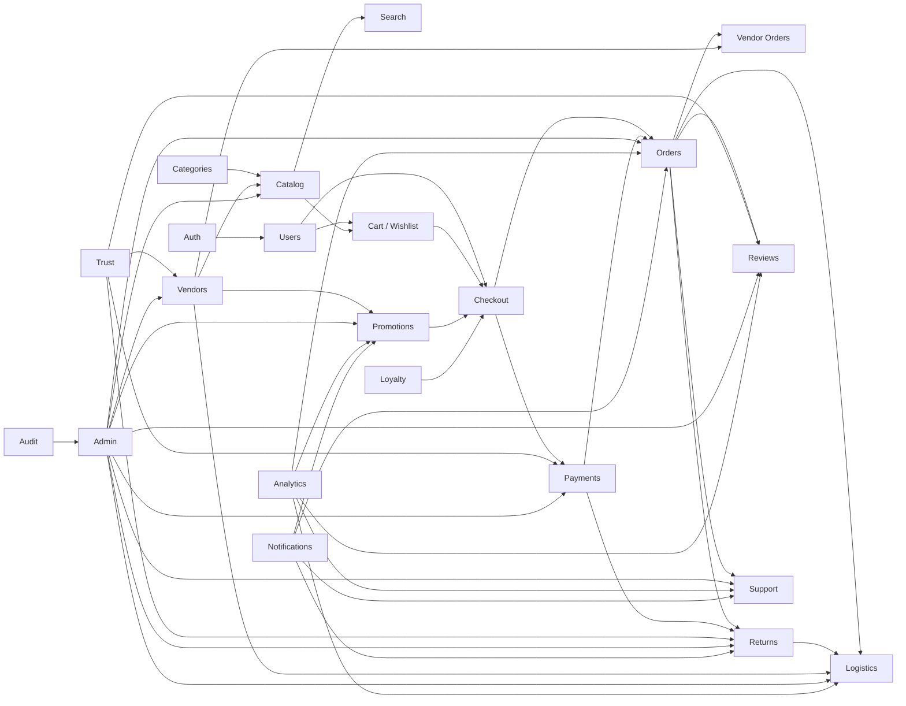
```mermaid
flowchart LR
    AUTH[Auth]
    USER[Users]
    VENDOR[Vendors]
    CATALOG[Catalog]
    CATEGORY[Categories]
    SEARCH[Search]
    CART[Cart / Wishlist]
    CHECKOUT[Checkout]
    ORDER[Orders]
    VORDER[Vendor Orders]
    PAYMENT[Payments]
    LOGISTICS[Logistics]
    RETURNS[Returns]
    REVIEW[Reviews]
    SUPPORT[Support]
    PROMO[Promotions]
    LOYALTY[Loyalty]
    NOTIF[Notifications]
    TRUST[Trust]
    ANALYTICS[Analytics]
    ADMIN[Admin]
    AUDIT[Audit]

    AUTH --> USER
    USER --> CART
    USER --> CHECKOUT
    CATEGORY --> CATALOG
    VENDOR --> CATALOG
    CATALOG --> SEARCH
    CATALOG --> CART
    CART --> CHECKOUT
    PROMO --> CHECKOUT
    LOYALTY --> CHECKOUT
    CHECKOUT --> ORDER
    CHECKOUT --> PAYMENT
    ORDER --> VORDER
    ORDER --> LOGISTICS
    ORDER --> RETURNS
    ORDER --> REVIEW
    ORDER --> SUPPORT
    PAYMENT --> ORDER
    PAYMENT --> RETURNS
    RETURNS --> LOGISTICS
    VENDOR --> VORDER
    VENDOR --> LOGISTICS
    VENDOR --> PROMO
    TRUST --> REVIEW
    TRUST --> RETURNS
    TRUST --> PAYMENT
    TRUST --> VENDOR
    ADMIN --> VENDOR
    ADMIN --> CATALOG
    ADMIN --> ORDER
    ADMIN --> RETURNS
    ADMIN --> REVIEW
    ADMIN --> PAYMENT
    ADMIN --> LOGISTICS
    ADMIN --> PROMO
    ADMIN --> SUPPORT
    ANALYTICS --> ORDER
    ANALYTICS --> PROMO
    ANALYTICS --> LOGISTICS
    ANALYTICS --> REVIEW
    ANALYTICS --> SUPPORT
    NOTIF --> ORDER
    NOTIF --> RETURNS
    NOTIF --> PROMO
    NOTIF --> SUPPORT
    AUDIT --> ADMIN
```

## Customer Buying Flow

Current important routes:

- Frontend: `/products`, `/search`, `/product/:id`, `/cart`, `/checkout`, `/checkout/guest`, `/orders`, `/orders/:orderId`, `/returns`, `/support`, `/notifications`
- Backend: `/api/products`, `/api/search`, `/api/coupons/validate`, `/api/growth/promotions/evaluate`, `/api/orders`, `/api/orders/guest`, `/api/payments`, `/api/shipments/track/:orderId`, `/api/returns`

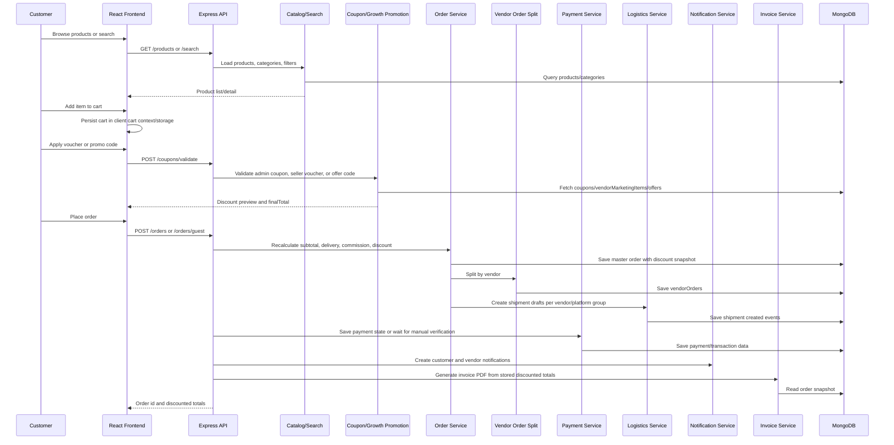
```mermaid
sequenceDiagram
    participant U as Customer
    participant FE as React Frontend
    participant API as Express API
    participant Catalog as Catalog/Search
    participant Promo as Coupon/Growth Promotion
    participant Order as Order Service
    participant VendorOrder as Vendor Order Split
    participant Pay as Payment Service
    participant Logistics as Logistics Service
    participant Notif as Notification Service
    participant Invoice as Invoice Service
    participant DB as MongoDB

    U->>FE: Browse products or search
    FE->>API: GET /products or /search
    API->>Catalog: Load products, categories, filters
    Catalog->>DB: Query products/categories
    Catalog-->>FE: Product list/detail

    U->>FE: Add item to cart
    FE->>FE: Persist cart in client cart context/storage

    U->>FE: Apply voucher or promo code
    FE->>API: POST /coupons/validate
    API->>Promo: Validate admin coupon, seller voucher, or offer code
    Promo->>DB: Fetch coupons/vendorMarketingItems/offers
    Promo-->>FE: Discount preview and finalTotal

    U->>FE: Place order
    FE->>API: POST /orders or /orders/guest
    API->>Order: Recalculate subtotal, delivery, commission, discount
    Order->>DB: Save master order with discount snapshot
    Order->>VendorOrder: Split by vendor
    VendorOrder->>DB: Save vendorOrders
    Order->>Logistics: Create shipment drafts per vendor/platform group
    Logistics->>DB: Save shipment created events
    API->>Pay: Save payment state or wait for manual verification
    Pay->>DB: Save payment/transaction data
    API->>Notif: Create customer and vendor notifications
    API->>Invoice: Generate invoice PDF from stored discounted totals
    Invoice->>DB: Read order snapshot
    API-->>FE: Order id and discounted totals
```

## Voucher and Discount Persistence Flow

This flow is important because checkout previews must match the final order, order list, and invoice.

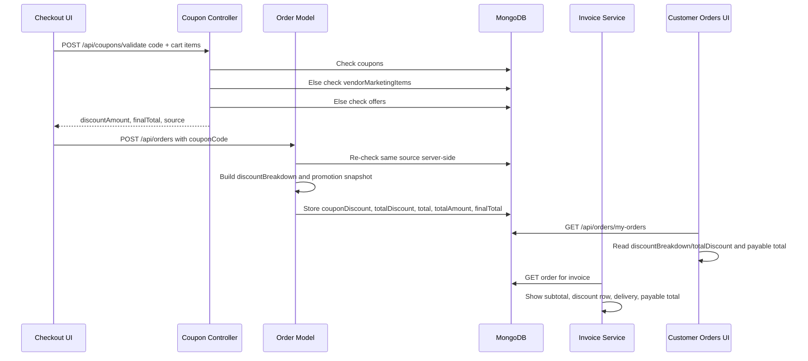
```mermaid
sequenceDiagram
    participant FE as Checkout UI
    participant Coupon as Coupon Controller
    participant Order as Order Model
    participant DB as MongoDB
    participant Invoice as Invoice Service
    participant OrdersUI as Customer Orders UI

    FE->>Coupon: POST /api/coupons/validate code + cart items
    Coupon->>DB: Check coupons
    Coupon->>DB: Else check vendorMarketingItems
    Coupon->>DB: Else check offers
    Coupon-->>FE: discountAmount, finalTotal, source

    FE->>Order: POST /api/orders with couponCode
    Order->>DB: Re-check same source server-side
    Order->>Order: Build discountBreakdown and promotion snapshot
    Order->>DB: Store couponDiscount, totalDiscount, total, totalAmount, finalTotal

    OrdersUI->>DB: GET /api/orders/my-orders
    OrdersUI->>OrdersUI: Read discountBreakdown/totalDiscount and payable total
    Invoice->>DB: GET order for invoice
    Invoice->>Invoice: Show subtotal, discount row, delivery, payable total
```

## Vendor Operations Flow

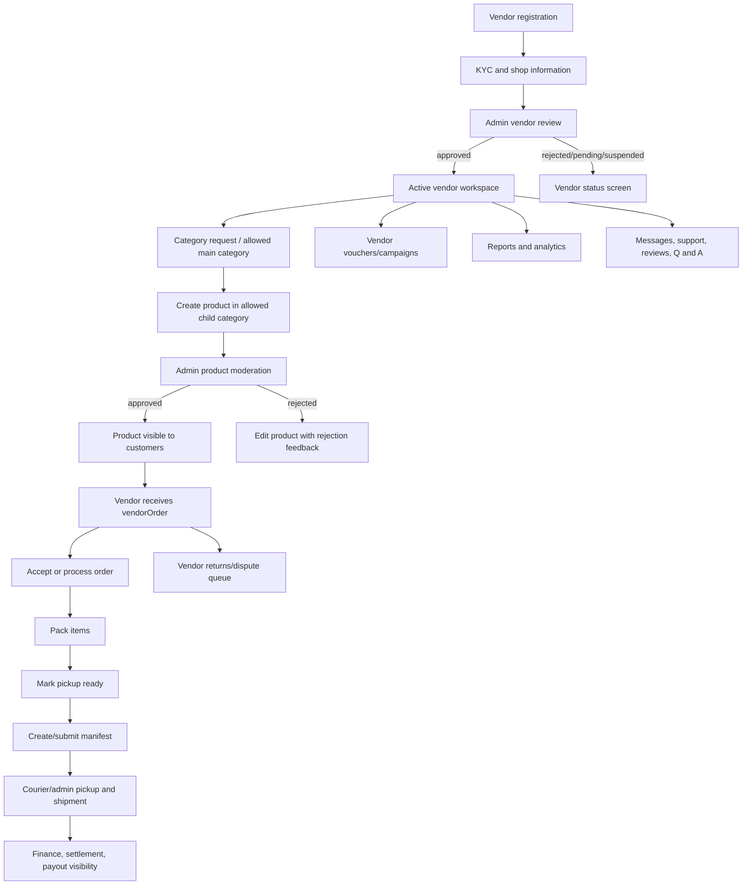
```mermaid
flowchart TB
    VENDOR_REGISTER[Vendor registration] --> KYC[KYC and shop information]
    KYC --> ADMIN_REVIEW[Admin vendor review]
    ADMIN_REVIEW -->|approved| ACTIVE_VENDOR[Active vendor workspace]
    ADMIN_REVIEW -->|rejected/pending/suspended| STATUS_SCREEN[Vendor status screen]

    ACTIVE_VENDOR --> CATEGORY_REQUEST[Category request / allowed main category]
    CATEGORY_REQUEST --> PRODUCT_CREATE[Create product in allowed child category]
    PRODUCT_CREATE --> MODERATION[Admin product moderation]
    MODERATION -->|approved| LISTING[Product visible to customers]
    MODERATION -->|rejected| EDIT_PRODUCT[Edit product with rejection feedback]

    LISTING --> ORDER_RECEIVED[Vendor receives vendorOrder]
    ORDER_RECEIVED --> ACCEPT[Accept or process order]
    ACCEPT --> PACK[Pack items]
    PACK --> PICKUP_READY[Mark pickup ready]
    PICKUP_READY --> MANIFEST[Create/submit manifest]
    MANIFEST --> SHIPPED[Courier/admin pickup and shipment]
    SHIPPED --> FINANCE[Finance, settlement, payout visibility]

    ORDER_RECEIVED --> RETURNS[Vendor returns/dispute queue]
    ACTIVE_VENDOR --> MARKETING[Vendor vouchers/campaigns]
    ACTIVE_VENDOR --> REPORTS[Reports and analytics]
    ACTIVE_VENDOR --> SUPPORT[Messages, support, reviews, Q and A]
```

## Admin Operations Flow

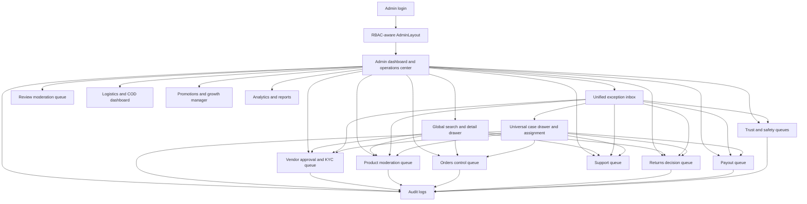
```mermaid
flowchart TB
    ADMIN_LOGIN[Admin login] --> RBAC[RBAC-aware AdminLayout]
    RBAC --> DASH[Admin dashboard and operations center]

    DASH --> GLOBAL_SEARCH[Global search and detail drawer]
    DASH --> EXCEPTION_INBOX[Unified exception inbox]
    EXCEPTION_INBOX --> CASE_DRAWER[Universal case drawer and assignment]
    DASH --> VENDOR_QUEUE[Vendor approval and KYC queue]
    DASH --> PRODUCT_QUEUE[Product moderation queue]
    DASH --> ORDER_QUEUE[Orders control queue]
    DASH --> RETURN_QUEUE[Returns decision queue]
    DASH --> PAYOUT_QUEUE[Payout queue]
    DASH --> SUPPORT_QUEUE[Support queue]
    DASH --> REVIEW_QUEUE[Review moderation queue]
    DASH --> TRUST_QUEUE[Trust and safety queues]
    DASH --> LOGISTICS_DASH[Logistics and COD dashboard]
    DASH --> PROMO_DASH[Promotions and growth manager]
    DASH --> ANALYTICS_DASH[Analytics and reports]
    DASH --> AUDIT_LOGS[Audit logs]

    GLOBAL_SEARCH --> ORDER_QUEUE
    GLOBAL_SEARCH --> VENDOR_QUEUE
    GLOBAL_SEARCH --> PRODUCT_QUEUE
    GLOBAL_SEARCH --> RETURN_QUEUE
    GLOBAL_SEARCH --> SUPPORT_QUEUE
    EXCEPTION_INBOX --> VENDOR_QUEUE
    EXCEPTION_INBOX --> PRODUCT_QUEUE
    EXCEPTION_INBOX --> RETURN_QUEUE
    EXCEPTION_INBOX --> PAYOUT_QUEUE
    EXCEPTION_INBOX --> SUPPORT_QUEUE
    EXCEPTION_INBOX --> TRUST_QUEUE
    CASE_DRAWER --> VENDOR_QUEUE
    CASE_DRAWER --> PRODUCT_QUEUE
    CASE_DRAWER --> ORDER_QUEUE
    CASE_DRAWER --> RETURN_QUEUE
    CASE_DRAWER --> PAYOUT_QUEUE
    CASE_DRAWER --> SUPPORT_QUEUE
    CASE_DRAWER --> AUDIT_LOGS
    VENDOR_QUEUE --> AUDIT_LOGS
    PRODUCT_QUEUE --> AUDIT_LOGS
    ORDER_QUEUE --> AUDIT_LOGS
    RETURN_QUEUE --> AUDIT_LOGS
    PAYOUT_QUEUE --> AUDIT_LOGS
    TRUST_QUEUE --> AUDIT_LOGS
```

## Logistics State Machine

The current code has state machines in `Server/utils/logisticsStateMachine.js` and shipment routes under `/api/shipments`, `/api/vendor/logistics`, and `/api/admin/logistics`.

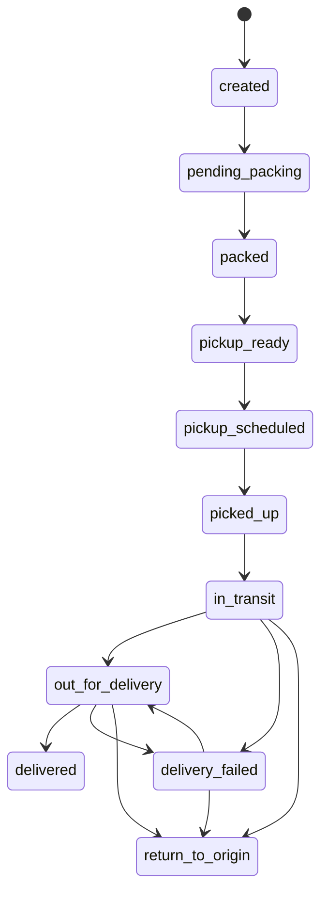
```mermaid
stateDiagram-v2
    [*] --> created
    created --> pending_packing
    pending_packing --> packed
    packed --> pickup_ready
    pickup_ready --> pickup_scheduled
    pickup_scheduled --> picked_up
    picked_up --> in_transit
    in_transit --> out_for_delivery
    in_transit --> delivery_failed
    in_transit --> return_to_origin
    out_for_delivery --> delivered
    out_for_delivery --> delivery_failed
    out_for_delivery --> return_to_origin
    delivery_failed --> out_for_delivery
    delivery_failed --> return_to_origin
```

## Reverse Logistics State Machine

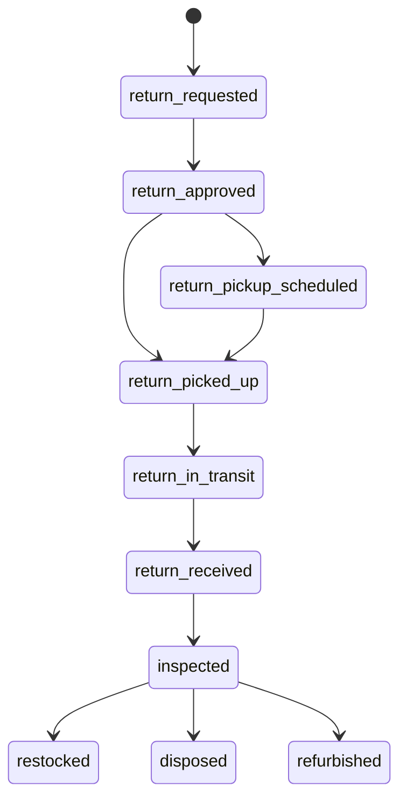
```mermaid
stateDiagram-v2
    [*] --> return_requested
    return_requested --> return_approved
    return_approved --> return_pickup_scheduled
    return_approved --> return_picked_up
    return_pickup_scheduled --> return_picked_up
    return_picked_up --> return_in_transit
    return_in_transit --> return_received
    return_received --> inspected
    inspected --> restocked
    inspected --> disposed
    inspected --> refurbished
```

## COD State Machine

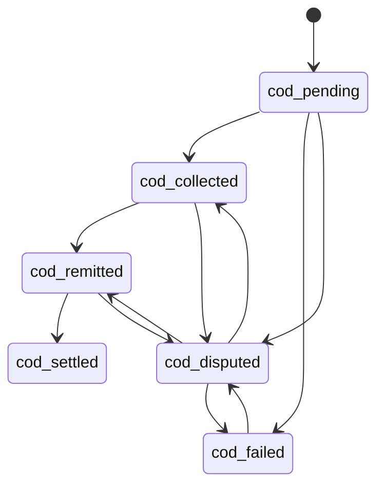
```mermaid
stateDiagram-v2
    [*] --> cod_pending
    cod_pending --> cod_collected
    cod_pending --> cod_failed
    cod_pending --> cod_disputed
    cod_collected --> cod_remitted
    cod_collected --> cod_disputed
    cod_remitted --> cod_settled
    cod_remitted --> cod_disputed
    cod_failed --> cod_disputed
    cod_disputed --> cod_collected
    cod_disputed --> cod_failed
    cod_disputed --> cod_remitted
```

## Analytics and Intelligence Flow

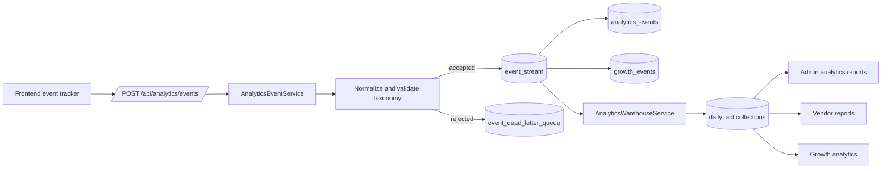
```mermaid
flowchart LR
    FE[Frontend event tracker] --> API[/POST /api/analytics/events/]
    API --> EVENT_SERVICE[AnalyticsEventService]
    EVENT_SERVICE --> VALIDATE[Normalize and validate taxonomy]
    VALIDATE -->|accepted| STREAM[(event_stream)]
    VALIDATE -->|rejected| DLQ[(event_dead_letter_queue)]
    STREAM --> LEGACY[(analytics_events)]
    STREAM --> GROWTH[(growth_events)]
    STREAM --> WAREHOUSE[AnalyticsWarehouseService]
    WAREHOUSE --> FACTS[(daily fact collections)]
    FACTS --> ADMIN_REPORTS[Admin analytics reports]
    FACTS --> VENDOR_REPORTS[Vendor reports]
    FACTS --> GROWTH_DASH[Growth analytics]
```

## Marketplace Event Bus Flow

The current code has a platform-wide event bus in `Server/services/marketplaceEventBus.js`. It writes important workflow events into `marketplace_events`, stages in-app/email/push work in `marketplace_notification_queue`, and processes in-app notifications immediately when Redis/BullMQ is not enabled. When Redis is enabled with `MARKETPLACE_EVENT_USE_REDIS=true` or `REDIS_URL`, the same event IDs can be processed by the BullMQ `marketplace-events` worker.

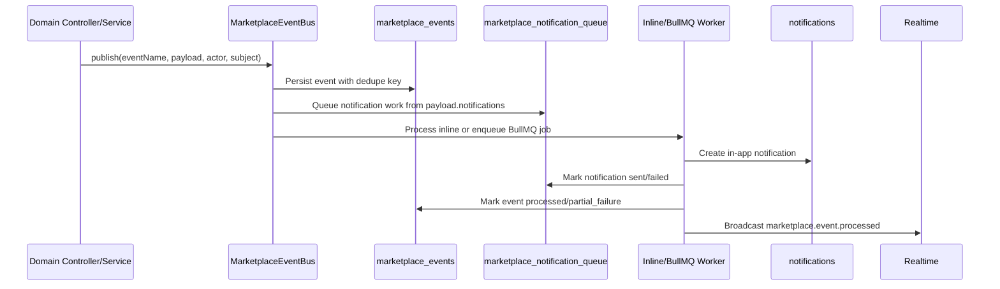
```mermaid
sequenceDiagram
    participant Domain as Domain Controller/Service
    participant Bus as MarketplaceEventBus
    participant Events as marketplace_events
    participant Queue as marketplace_notification_queue
    participant Worker as Inline/BullMQ Worker
    participant Notifications as notifications
    participant Realtime as Realtime

    Domain->>Bus: publish(eventName, payload, actor, subject)
    Bus->>Events: Persist event with dedupe key
    Bus->>Queue: Queue notification work from payload.notifications
    Bus->>Worker: Process inline or enqueue BullMQ job
    Worker->>Notifications: Create in-app notification
    Worker->>Queue: Mark notification sent/failed
    Worker->>Events: Mark event processed/partial_failure
    Worker->>Realtime: Broadcast marketplace.event.processed
```

## Main Collections and Persistence Map

| Domain | Main current collections/models |
| --- | --- |
| Identity | `users`, Firebase identity claims, admin role/permission data |
| Vendor | `vendors`, `vendorStaff`, KYC fields, vendor category requests |
| Catalog | `products`, `categories`, dynamic category/field collections |
| Cart | Mostly frontend cart state; wishlist is persisted through `wishlists` |
| Checkout/order | `orders`, `vendorOrders`, `promotion_snapshots` |
| Payments | `payments`, manual verification fields, payment webhooks |
| Logistics | `shipments`, `shipment_events`, `manifests`, `couriers` |
| Returns | `returns`, return evidence, vendor responses, refund fields |
| Promotions | `coupons`, `offers`, `vendorMarketingItems`, campaign collections |
| Notifications | `marketplace_events`, `marketplace_notification_queue`, `notifications`, notification subscriptions, push/email logs where configured |
| Trust | risk/report/dispute/enforcement/appeal collections and audit logs |
| Analytics | `event_stream`, `analytics_events`, `growth_events`, daily analytics summary collections |
| Admin/audit | `audit_logs`, RBAC permissions and staff-role records |

## Target Diagram Match Status

| Target area | Current status | Notes |
| --- | --- | --- |
| Customer web, vendor dashboard, admin dashboard | Present | Routed through React role layouts and guards. |
| Node.js modular monolith | Present | `Server/index.js` registers domain route modules. |
| REST API | Present | Express routes under `/api/*`. |
| Realtime/push | Partial | Push/service-worker support exists; not every domain emits through one realtime bus. |
| PostgreSQL | Not current | Current database is MongoDB. PostgreSQL would be a migration, not documentation of today. |
| Redis | Partial/optional | Config exists and can be required by env, but app can run without Redis. |
| BullMQ jobs | Partial | Used for selected jobs such as bulk upload; marketplace events have a Mongo outbox and optional BullMQ worker adapter. |
| Marketplace event bus | Present | `MarketplaceEventBus` persists workflow events, queues notification work, and powers order-created/timeline events. |
| Object storage | Partial | Upload routes/services exist; storage provider depends on configuration. |
| Search provider abstraction | Present | Search routes now call a provider registry with MongoDB as the default provider, so a future Typesense adapter can be added behind the same controller boundary. |
| Search index/Typesense | Future | Search currently works through MongoDB-backed API search; a dedicated external index is still a future provider. |
| Checkout to order flow | Present | `/api/orders` and `/api/orders/guest`; discount persistence is now aligned with invoice/order views. |
| Payment gateway flow | Partial | Payment records, manual verification, and webhooks exist; gateway depth depends on provider setup. |
| Logistics state machine | Present | Forward, reverse, and COD state machines exist. |
| Auto shipment draft at order placement | Present | Order creation now creates shipment drafts for each vendor/platform group; vendor logistics actions continue the state machine. |
| RedX / Steadfast courier adapters | Present | Credentials are env-only; admin config maps courier partners to zones. Production use still needs rotated secrets and provider-specific endpoint verification. |
| Vendor seller action center | Present | Vendor dashboard groups late fulfillment, return responses, rejected listings, stock risk, payout holds, category requests, KYC, payout setup, and marketing gaps into one prioritized seller queue. |
| Vendor bulk operations | Present | Seller center supports server-side bulk order status transitions, product bulk field edits, bulk submit/delist/delete actions, and CSV exports for selected/filtered rows. |
| Vendor finance command view | Present | Vendor dashboard summarizes available payout estimate, pending payout exposure, COD pending/collected, return deductions, payout holds, delivered earnings, and refund exposure. |
| Vendor finance reconciliation | Present | Vendor finance center reconciles gross sales, commission, shipping adjustments, returns, COD exposure, pending/held/paid payouts, and available balance. |
| Vendor fulfillment command view | Present | Vendor dashboard shows active packing/pickup work, late SLA breaches, due-soon orders, and the next fulfillment deadline. |
| Vendor readiness checks | Present | Vendor dashboard scores KYC, shop profile, category access, payout setup, catalog readiness, fulfillment health, returns, marketing, and team access. |
| Admin global search | Present | Admin header can search orders, vendors, products, customers, returns, and support tickets with a detail drawer. |
| Admin exception inbox | Present | Admin dashboard now consolidates vendor, catalog, finance, support, trust, notification, and job exceptions with priority, SLA, owner, next action, and workspace links. |
| Admin universal case workflow | Present | Exception inbox items can be opened in a shared case drawer with assignment, priority, status, due date, notes, history, audit logging, and workspace handoff links. |
| Admin bulk queue actions | Present | Exception inbox items can be selected and updated in bulk with assignment, status, priority, due date, and notes. |
| Saved admin filters/views | Present | Dashboard views are persisted per admin user in `admin_saved_views` and restore date, vendor, and exception filters. |
| Staff workload dashboard | Present | Admin dashboard shows active ownership, overdue work, unassigned work, critical load, and top workflow per staff member. |
| Finance reconciliation command view | Present | Admin dashboard summarizes COD outstanding, refund exposure, payout holds, pending payout exposure, and vendor deductions. |
| Integration readiness monitor | Present | Admin dashboard reports courier, payment, notification, event-bus, and analytics readiness from env and failure signals. |
| Admin queue operations | Present/partial | Vendors, products, orders, returns, payouts, support, trust, logistics, analytics pages exist. Depth varies by workflow. |
| Analytics event taxonomy and warehouse | Present/partial | Event ingestion, taxonomy, and intelligence services exist; dashboard completeness depends on events being emitted consistently. |
| Admin E2E UI hooks | Present | Dashboard exception inbox, case drawer, bulk action bar, and hardening panels expose stable test ids for browser automation. |
| Vendor E2E UI hooks | Present | Seller action center and seller command panels expose stable test ids for browser automation. |

## Recommended Next Hardening Steps

1. Decide whether PostgreSQL is a real migration target. If yes, add a separate migration plan instead of mixing it into current architecture diagrams.
2. Add a server-side cart collection only if cross-device cart persistence is required.
3. Continue expanding event-bus publishers to every remaining payment-updated, shipment-updated, return-updated, and support-replied path.
4. Add a Typesense or Meilisearch provider implementation behind the existing search provider registry when external search is selected.
5. Add courier webhooks/status polling and provider-specific retry tools after live RedX/Steadfast credentials are rotated and verified.
6. Add vendor payout statement export from the reconciliation tab if finance wants a single CSV for orders, returns, COD, and payout movement.
7. Add Playwright/Cypress browser runs against the new admin and vendor test ids once an E2E runner is selected.
8. Add a diagram update checklist to every future phase so docs and workflow stay synced with implementation.

# Project Workflow

Source file: PROJECT_WORKFLOW.md

Implementation workflow and operational project map.

# Project Workflow

This document describes how the main workflows move through the Amiyo-Go system today.

For architecture and workflow diagrams, see `MARKETPLACE_WORKFLOW_DIAGRAMS.md`.
For customer, vendor, and admin operating workflows, see `MARKETPLACE_ROLE_WORKFLOWS.md`.

## 1. System Roles

### Customer

- Registers and saves a default address
- Browses products and categories
- Adds items to cart
- Checks out and places orders
- Tracks orders, cancels eligible orders, requests returns

### Vendor

- Registers as a seller
- Gets approved by admin
- Receives allowed main categories
- Creates products in any child category under approved main categories
- Manages shop, orders, returns, messages, finance, payouts

### Admin

- Controls categories, commissions, delivery settings, users, vendors, products, orders, payouts, returns, reviews, support
- Moderates vendor products
- Monitors vendor activity and financial performance

## 2. Core Data Flow

The project mainly revolves around these objects:

- `users`
- `vendors`
- `categories`
- `products`
- `orders`
- `vendorOrders`
- `addresses`
- `returns`
- `vendor_payouts`
- `notifications`

`orders` are the customer-facing master records.
`vendorOrders` are the vendor-facing slices of those same orders.

## 3. Customer Account and Address Workflow

### Registration

Customer registration collects:

- name
- email
- phone
- division
- district
- upazila
- union
- ward no
- area or village or road
- house name or number

### Address behavior

- The first valid address can be stored as default
- Default address is used in checkout for the customer's own delivery
- Checkout also supports placing an order for someone else with a separate shipping address

### Why this matters

This address structure feeds:

- delivery fee calculation
- order shipping info
- invoice output
- future reorder convenience

## 4. Shopping Workflow

### Browse and discovery

Customers can:

- browse grouped categories
- use home category dropdowns
- search products
- filter by category and other product data
- open vendor storefronts

### Product detail

Product pages are expected to show:

- title
- images
- description
- category
- price
- stock
- vendor info
- reviews and Q&A where available

### Cart

The cart keeps product rows before checkout.
Delivery calculations must stay consistent between cart and checkout.

## 5. Checkout and Order Creation Workflow

### Checkout stages

1. Load cart items
2. Load saved default address
3. Choose delivery destination
4. Calculate delivery fee
5. Choose payment method
6. Place order

### Delivery fee logic

Delivery is controlled from admin delivery settings and location rules.

The system currently supports:

- area-aware delivery logic
- main service area matching
- vendor and location-aware fee calculation
- per-order delivery breakdown storage

### Commission logic

During order creation:

- each product reads its category commission rate
- minimum commission from parent categories can also affect the effective rate
- the system stores snapshots on the order item:
  - `commissionRateSnapshot`
  - `adminCommissionAmount`
  - `vendorEarningAmount`

This is important because commission must not change historically when the category rate changes later.

### Order splitting

After a customer places one order:

- the master order is stored in `orders`
- vendor-specific records are created or synced into `vendorOrders`
- each line item carries its own vendor and fulfillment state

## 6. Customer Cancellation Workflow

### Allowed cancellation window

Customers can cancel within 30 minutes of order creation.

The order model stores:

- `canCancelUntil`

### What happens on cancellation

When a customer cancels in time:

- master order status becomes cancelled
- `vendorOrders` are synced to cancelled
- stock is restored
- vendor-facing cancellation message is stored
- notifications can be created

Important fields used in vendor and admin views:

- `cancelledByRole`
- `cancellationSource`
- `cancellationMessage`

Expected message:

- `User cancelled this order within 30 minutes.`

## 7. Vendor Onboarding Workflow

### Seller registration

1. User opens seller registration
2. Submits shop and contact information
3. Admin reviews vendor request
4. Admin approves or rejects vendor

### Category access

Admin can assign one or more main categories to a vendor.

If a vendor has a main category:

- they can create products in that main category
- they can also create products in child sections and subcategories under it

This supports workflows like:

- Electronics -> Mobile -> Accessories
- Men's Fashion -> Clothing -> Shirts
- Grocery -> Spices -> Mixed Spices
- Restaurants & Food Ordering -> Street Food -> Fuchka

## 8. Vendor Product Workflow

### Product creation

1. Vendor opens `vendor/products/add`
2. Selects an allowed category
3. Fills product form
4. Uploads images
5. Submits the product

### Category-specific fields

Product forms can change based on category family. Examples:

- electronics specs
- grocery weight or shelf life
- restaurant preparation time
- pharmacy or stationery relevant fields

### Moderation state

Products move through:

- `pending`
- `approved`
- `rejected`

### Important moderation behavior

- new vendor products usually require approval
- editing an already approved product can send it back to `pending`
- admin rejection can store a rejection reason

## 9. Admin Category and Commission Workflow

### Category management

Admins can:

- create grouped category trees
- add nested sections and subcategories
- manage slugs, icons, descriptions, and images
- edit attributes for categories

### Commission management

Admins can set:

- `commissionRate`
- `minimumCommissionRate`

The effective commission for a product is resolved from:

- the category itself
- minimum commission inherited from parent categories

This lets the marketplace guarantee floor commission rates across large category groups.

## 10. Admin Product Moderation Workflow

### Main moderation pages

- `/admin/products`
- `/admin/vendor-activity`
- vendor detail product controls

### Moderation board behavior

Admins can review products by status:

- pending
- approved
- rejected
- all

Available actions include:

- review
- approve
- reject
- disable

## 11. Order Fulfillment Workflow

### Customer-facing order status

The main order can move through:

- pending
- processing
- packed
- shipped
- delivered
- cancelled
- returned

### Item-level status

Each order item also stores fulfillment details such as:

- `itemStatus`
- `trackingNumber`
- `shippedAt`
- `deliveredAt`

### Admin-to-vendor sync

When admin updates an order:

- the master order is updated
- matching vendor order rows are updated
- item-level timestamps are refreshed

This keeps customer, vendor, and admin views aligned.

## 12. Vendor Finance Workflow

### Earnings model

Vendor finance is based on delivered sales, commission, payouts, and returns.

Typical values:

- gross sales
- commission
- net earnings
- pending balance
- paid payouts
- available balance

### Payout request flow

1. Vendor opens finance
2. Reviews eligible balance
3. Submits payout request
4. Admin reviews request
5. Admin approves or rejects
6. Paid amount appears in vendor payout history

### Minimum payout

Vendor payout requests are checked against a minimum threshold before acceptance.

## 13. Return Workflow

### Customer side

Customers can submit return requests from order history.

### Vendor/admin side

Returns are reviewed with:

- request reason
- product and order mapping
- refund and commission details

The system also tracks vendor-side financial impact on returned items.

## 14. Messaging and Notification Workflow

### Messaging

There are separate workflows for:

- customer <-> vendor chat
- vendor <-> admin chat
- support tickets

### Notifications

Notifications can be created for:

- new orders
- status changes
- product moderation events
- review events
- other platform alerts

Frontend notification UI also stores and normalizes notification payloads for display.

## 15. Reporting and Monitoring Workflow

### Vendor

Vendor dashboards show operational performance such as:

- orders
- products
- revenue
- commission
- payouts

### Admin

Admin pages cover:

- vendor activity
- users
- orders
- payouts
- returns
- customer insights
- inventory

## 16. Current External Dependency Notes

Some flows are fully implemented inside the app, while some external providers are still optional or partially mocked.

Known examples from the current codebase:

- email service can run in mock mode when SMTP is not configured
- SMS sending still needs a real provider
- some notification channels are placeholders for real push/email delivery
- stock alert emails still need full provider integration

## 17. Suggested Team Usage

### For product or QA review

Read:

1. `README.md`
2. `PROJECT_WORKFLOW.md`
3. `FEATURE_REFERENCE.md`

### For role-specific onboarding

Read one of:

- `README_USER.md`
- `README_VENDOR.md`
- `README_ADMIN.md`

# Marketplace Role Workflows

Source file: MARKETPLACE_ROLE_WORKFLOWS.md

Role-by-role workflow documentation for buyer, seller, and operator journeys.

# Amiyo-Go Role Workflow Operating Model

Amiyo-Go should operate as a three-role marketplace system. The customer, vendor, and admin workflows are separate experiences, but they are connected through the same order, fulfillment, return, settlement, trust, and analytics records.

Use this document as the product workflow reference. Use `MARKETPLACE_WORKFLOW_DIAGRAMS.md` for architecture diagrams and implementation status.

## Role Overview

| Role | Primary job | Owns | Depends on |
| --- | --- | --- | --- |
| Customer | Browse, buy, track, return, review, and get support | Account, cart, wishlist, orders, returns, reviews, support tickets, notifications | Catalog, checkout, payment, logistics, vendor fulfillment, admin policy |
| Vendor | Run a seller business inside the marketplace | Shop, KYC, products, inventory, orders, fulfillment, returns, finance, promotions, reputation | Admin approval, category permissions, payment settlement, logistics, support |
| Admin | Operate and govern the platform | Approvals, moderation, RBAC, commissions, payouts, disputes, delivery rules, campaigns, trust, analytics | All customer/vendor workflows and audit logs |

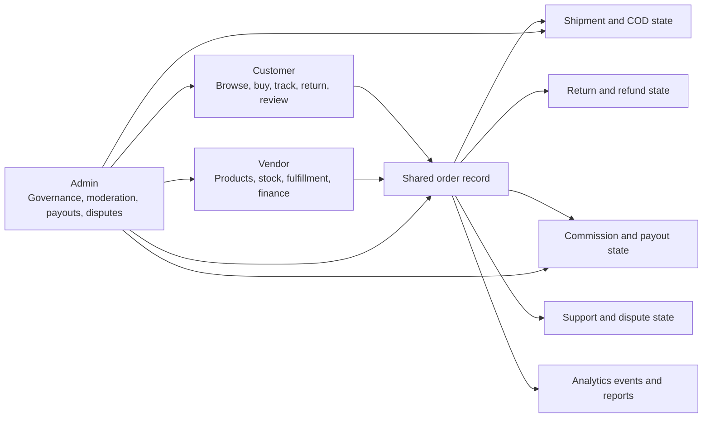
```mermaid
flowchart LR
    CUSTOMER[Customer\nBrowse, buy, track, return, review] --> ORDER[Shared order record]
    VENDOR[Vendor\nProducts, stock, fulfillment, finance] --> ORDER
    ADMIN[Admin\nGovernance, moderation, payouts, disputes] --> ORDER

    ORDER --> LOGISTICS[Shipment and COD state]
    ORDER --> RETURNS[Return and refund state]
    ORDER --> FINANCE[Commission and payout state]
    ORDER --> SUPPORT[Support and dispute state]
    ORDER --> ANALYTICS[Analytics events and reports]

    ADMIN --> VENDOR
    ADMIN --> CUSTOMER
    ADMIN --> FINANCE
    ADMIN --> LOGISTICS
```

## Customer Functionality

### Account and Identity

- Register, login, logout, forgot password, reset password.
- Guest checkout support.
- Email verification and phone verification.
- Profile editing.
- Saved addresses, default address, notification preferences.
- Account delete/export workflows.

### Browse and Shopping

- Homepage, category pages, search, product detail, vendor storefront.
- Filters, sorting, recommendations, followed vendors.
- Wishlist, compare, save for later.
- Flash sales, offers, vouchers, loyalty/coins.

### Cart and Checkout

- Add/remove cart items.
- Vendor-grouped cart.
- Guest cart and logged-in cart merge where applicable.
- Apply voucher, promo, loyalty coins, and shipping selection.
- Address selection, payment selection, order review, order placement.
- COD and online/manual payment flows.

### Orders and Post-Purchase

- Order success page.
- Order history and order detail.
- Shipment timeline and tracking.
- Cancel when allowed.
- Return/refund request.
- Review purchased items.
- Support ticket linked to order.

### Customer Engagement

- Notification center.
- Price-drop alerts.
- Back-in-stock alerts.
- Followed vendor updates.
- Review status and return updates.

## Vendor Functionality

### Onboarding and Shop Setup

- Apply to become vendor.
- Upload KYC documents.
- Wait for approval, rejection, or request-for-info.
- Setup shop profile, logo, banner, description, policies, pickup details.
- Configure payout details and shipping preferences.

### Catalog and Inventory

- Product list.
- Add/edit product.
- Product variants and SKU stock.
- Product images and media.
- Inventory management.
- Draft, pending, approved, rejected, disabled states.
- Bulk CSV upload.
- Product performance view.

### Orders and Fulfillment

- Orders list by status.
- Order detail page.
- Update order status.
- Print packing slip.
- Generate label.
- Mark packed, pickup ready, shipped.
- Add tracking info if manual.
- Handle return request and dispute evidence.

### Finance

- Earnings dashboard.
- Transaction ledger.
- Commission deductions.
- Refund adjustments.
- Payout request and payout history.
- COD settlement visibility.

### Marketing and Growth

- Create vouchers.
- Join campaigns.
- View promotion performance.
- Manage seller picks or featured products.
- Follow conversion, revenue, and repeat buyers.

### Support and Reputation

- Customer message/support inbox.
- Review management.
- Reply to reviews.
- Return dispute replies.
- Shop rating and performance analytics.

## Admin Functionality

### Platform Control

- Admin login and RBAC.
- Staff roles and permissions.
- Audit logs.
- Platform-wide settings and policies.
- Content and policy management.

### Vendor Management

- Vendor list.
- Vendor approval queue.
- Vendor detail page.
- KYC review.
- Suspend, activate, reject, or request more info.
- Vendor performance monitoring.
- Requested category approvals.
- Payout detail checks.

### Catalog Moderation

- Product moderation queue.
- Approve/reject products.
- Edit or request changes.
- Category manager.
- Attribute manager.
- Brand/listing quality control.
- Duplicate listing review.

### Orders and Returns Operations

- Orders overview.
- Order detail and override tools.
- Returns queue.
- Return decision panel.
- Refund processing.
- Delivery failure and dispute handling.

### Finance and Payout Operations

- Commission settings.
- Vendor transaction monitoring.
- Payout queue.
- Approve, hold, or reject payouts.
- Refund reconciliation.
- COD reconciliation.
- Marketplace revenue reporting.

### Promotions and Notifications

- Create platform-wide promotions.
- Manage flash sales and campaigns.
- Approve vendor campaigns when needed.
- Notification templates.
- Delivery logs and retries.

### Trust and Safety

- Review moderation queue.
- Fraud and risk flags.
- Dispute center.
- Suspicious return and promo abuse queue.
- Enforcement and appeal workflow.

### Logistics and Operations

- Courier assignment.
- Delivery settings and area fee rules.
- Manifest monitoring.
- COD status.
- Reverse logistics oversight.
- SLA and failed-job monitoring.

## Customer Purchase Workflow

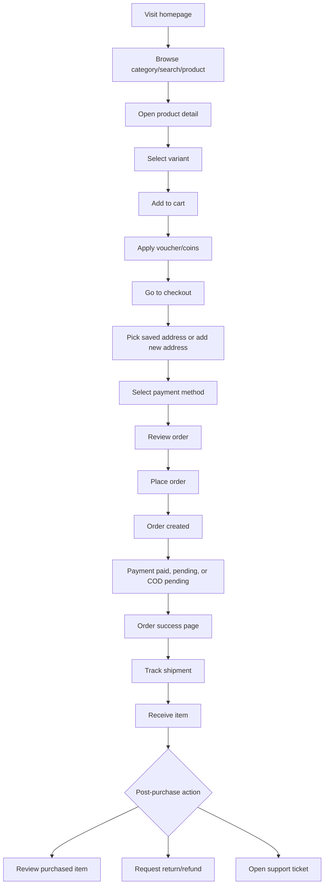
```mermaid
flowchart TB
    HOME[Visit homepage] --> DISCOVER[Browse category/search/product]
    DISCOVER --> PDP[Open product detail]
    PDP --> VARIANT[Select variant]
    VARIANT --> CART[Add to cart]
    CART --> DISCOUNT[Apply voucher/coins]
    DISCOUNT --> CHECKOUT[Go to checkout]
    CHECKOUT --> ADDRESS[Pick saved address or add new address]
    ADDRESS --> PAYMENT[Select payment method]
    PAYMENT --> REVIEW[Review order]
    REVIEW --> PLACE[Place order]
    PLACE --> ORDER[Order created]
    ORDER --> PAYSTATE[Payment paid, pending, or COD pending]
    PAYSTATE --> SUCCESS[Order success page]
    SUCCESS --> TRACK[Track shipment]
    TRACK --> RECEIVE[Receive item]
    RECEIVE --> AFTERSALE{Post-purchase action}
    AFTERSALE --> REVIEW_ITEM[Review purchased item]
    AFTERSALE --> RETURN_ITEM[Request return/refund]
    AFTERSALE --> SUPPORT[Open support ticket]
```

## Vendor Product Workflow

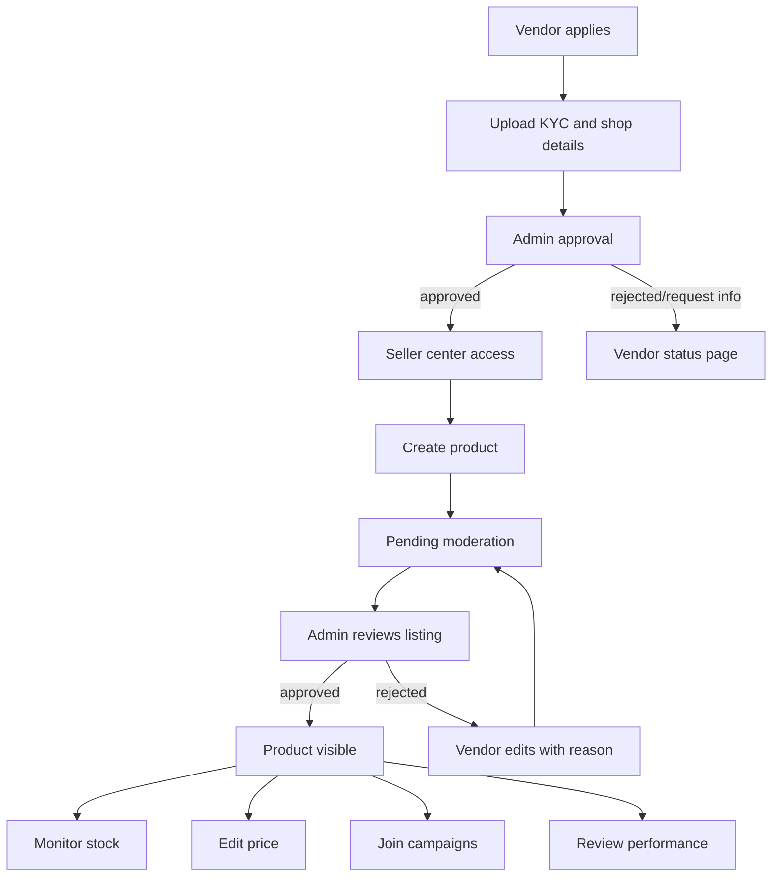
```mermaid
flowchart TB
    APPLY[Vendor applies] --> KYC[Upload KYC and shop details]
    KYC --> ADMIN_APPROVAL[Admin approval]
    ADMIN_APPROVAL -->|approved| SELLER_CENTER[Seller center access]
    ADMIN_APPROVAL -->|rejected/request info| STATUS[Vendor status page]
    SELLER_CENTER --> PRODUCT_CREATE[Create product]
    PRODUCT_CREATE --> PENDING[Pending moderation]
    PENDING --> ADMIN_MOD[Admin reviews listing]
    ADMIN_MOD -->|approved| LIVE[Product visible]
    ADMIN_MOD -->|rejected| FIX[Vendor edits with reason]
    FIX --> PENDING
    LIVE --> STOCK[Monitor stock]
    LIVE --> PRICE[Edit price]
    LIVE --> CAMPAIGN[Join campaigns]
    LIVE --> PERFORMANCE[Review performance]
```

## Vendor Order Workflow

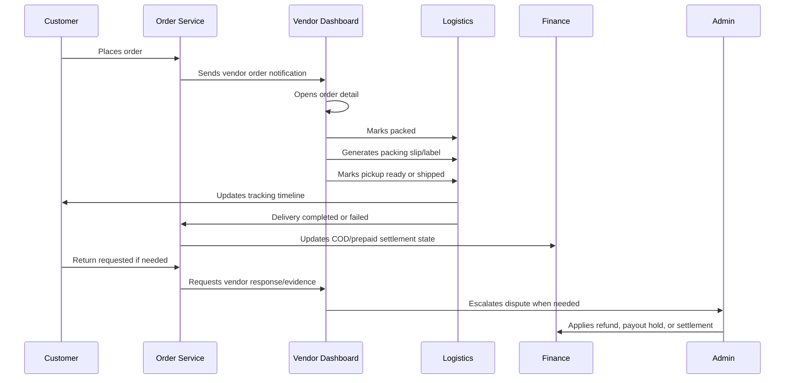
```mermaid
sequenceDiagram
    participant Customer
    participant Order as Order Service
    participant Vendor as Vendor Dashboard
    participant Logistics
    participant Finance
    participant Admin

    Customer->>Order: Places order
    Order->>Vendor: Sends vendor order notification
    Vendor->>Vendor: Opens order detail
    Vendor->>Logistics: Marks packed
    Vendor->>Logistics: Generates packing slip/label
    Vendor->>Logistics: Marks pickup ready or shipped
    Logistics->>Customer: Updates tracking timeline
    Logistics->>Order: Delivery completed or failed
    Order->>Finance: Updates COD/prepaid settlement state
    Customer->>Order: Return requested if needed
    Order->>Vendor: Requests vendor response/evidence
    Vendor->>Admin: Escalates dispute when needed
    Admin->>Finance: Applies refund, payout hold, or settlement
```

## Admin Vendor Approval Workflow

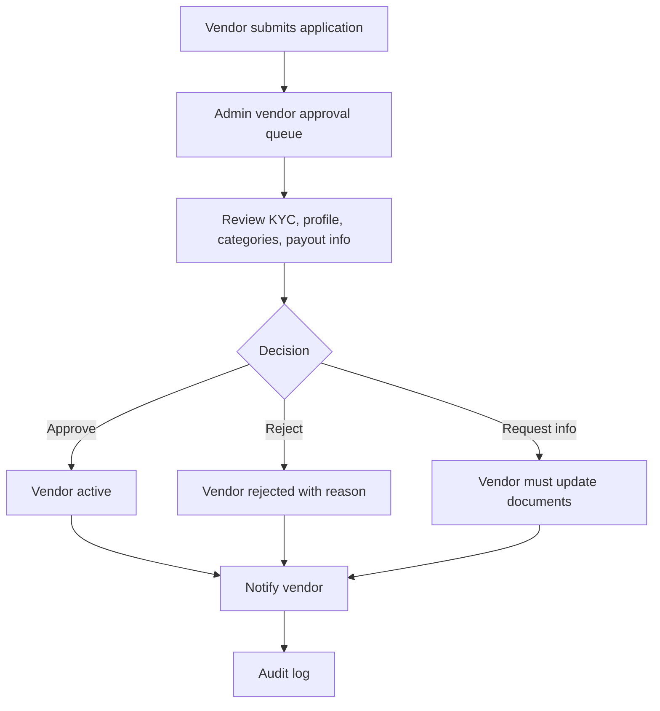
```mermaid
flowchart TB
    SUBMIT[Vendor submits application] --> QUEUE[Admin vendor approval queue]
    QUEUE --> REVIEW[Review KYC, profile, categories, payout info]
    REVIEW --> DECISION{Decision}
    DECISION -->|Approve| APPROVED[Vendor active]
    DECISION -->|Reject| REJECTED[Vendor rejected with reason]
    DECISION -->|Request info| INFO[Vendor must update documents]
    APPROVED --> NOTIFY[Notify vendor]
    REJECTED --> NOTIFY
    INFO --> NOTIFY
    NOTIFY --> AUDIT[Audit log]
```

## Admin Product Moderation Workflow

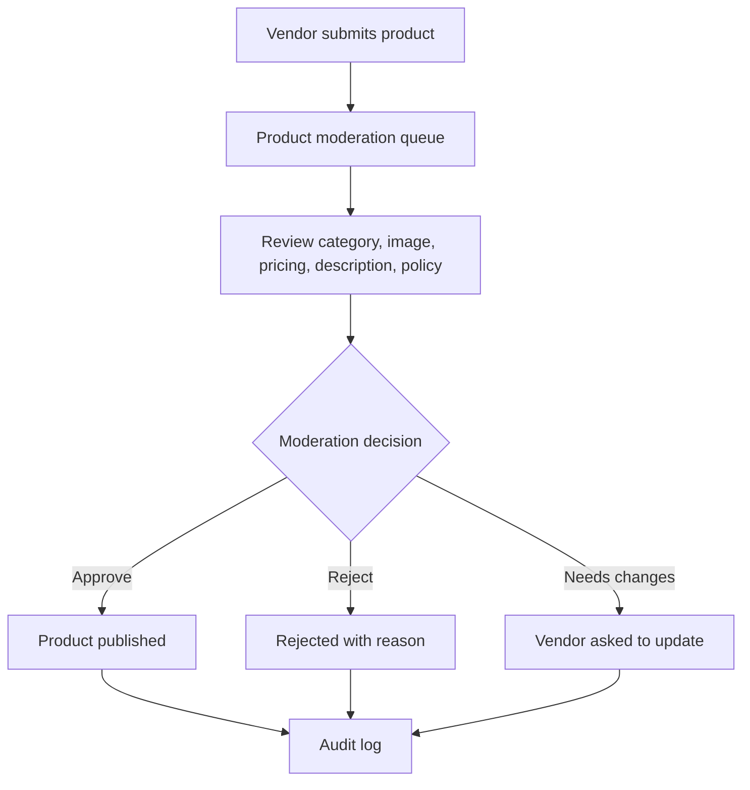
```mermaid
flowchart TB
    SUBMIT[Vendor submits product] --> MOD_QUEUE[Product moderation queue]
    MOD_QUEUE --> CHECK[Review category, image, pricing, description, policy]
    CHECK --> DECIDE{Moderation decision}
    DECIDE -->|Approve| PUBLISHED[Product published]
    DECIDE -->|Reject| REJECTED[Rejected with reason]
    DECIDE -->|Needs changes| CHANGE[Vendor asked to update]
    PUBLISHED --> AUDIT[Audit log]
    REJECTED --> AUDIT
    CHANGE --> AUDIT
```

## Admin Order and Dispute Workflow

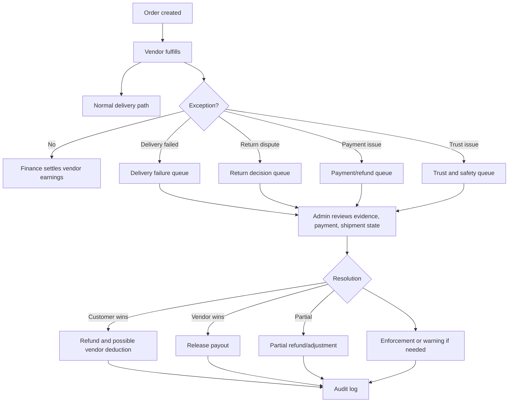
```mermaid
flowchart TB
    ORDER_CREATED[Order created] --> VENDOR_FULFILLS[Vendor fulfills]
    VENDOR_FULFILLS --> NORMAL[Normal delivery path]
    VENDOR_FULFILLS --> EXCEPTION{Exception?}
    EXCEPTION -->|No| SETTLE[Finance settles vendor earnings]
    EXCEPTION -->|Delivery failed| DELIVERY_CASE[Delivery failure queue]
    EXCEPTION -->|Return dispute| RETURN_CASE[Return decision queue]
    EXCEPTION -->|Payment issue| PAYMENT_CASE[Payment/refund queue]
    EXCEPTION -->|Trust issue| TRUST_CASE[Trust and safety queue]
    DELIVERY_CASE --> ADMIN_REVIEW[Admin reviews evidence, payment, shipment state]
    RETURN_CASE --> ADMIN_REVIEW
    PAYMENT_CASE --> ADMIN_REVIEW
    TRUST_CASE --> ADMIN_REVIEW
    ADMIN_REVIEW --> RESOLVE{Resolution}
    RESOLVE -->|Customer wins| REFUND[Refund and possible vendor deduction]
    RESOLVE -->|Vendor wins| PAYOUT[Release payout]
    RESOLVE -->|Partial| PARTIAL[Partial refund/adjustment]
    RESOLVE --> ENFORCE[Enforcement or warning if needed]
    REFUND --> AUDIT[Audit log]
    PAYOUT --> AUDIT
    PARTIAL --> AUDIT
    ENFORCE --> AUDIT
```

## Full Marketplace Loop


```mermaid
flowchart LR
    DISCOVER[User discovers product] --> ORDER[User places order]
    ORDER --> PAYMENT[Payment captured or COD marked]
    PAYMENT --> VENDOR_NOTIFY[Vendor notified]
    VENDOR_NOTIFY --> FULFILL[Vendor packs and ships]
    FULFILL --> TRACK[Logistics updates tracking]
    TRACK --> DELIVER[User receives order]
    DELIVER --> POST[Review, support, or return possible]
    POST --> ADMIN[Admin monitors exceptions]
    ADMIN --> FINANCE[Finance settles vendor earnings]
    FINANCE --> ANALYTICS[Analytics records every step]
    ANALYTICS --> GROWTH[Promotions and notifications drive repeat purchase]
    GROWTH --> DISCOVER
```

## Frontend Module Boundaries

Recommended frontend organization by role and domain:

- `customer/`
- `vendor/`
- `admin/`
- `shared-ui/`
- `auth/`
- `checkout/`
- `orders/`
- `logistics/`
- `returns/`
- `promotions/`
- `notifications/`
- `analytics/`

Current repo note: the existing frontend already separates many role pages under `Client/src/pages`, `Client/src/pages/vendor`, `Client/src/pages/admin`, `Client/src/layouts`, `Client/src/routes`, and shared components. A future folder refactor should be mechanical and tested, not mixed into feature work.

## Backend Module Boundaries

Recommended backend domains:

- `auth`
- `users`
- `vendors`
- `catalog`
- `categories`
- `search`
- `cart`
- `checkout`
- `orders`
- `payments`
- `refunds`
- `logistics`
- `returns`
- `reviews`
- `support`
- `promotions`
- `loyalty`
- `notifications`
- `trust`
- `analytics`
- `admin`
- `audit`

Current repo note: the backend already has domain route/controller/model/service files for most of these. Checkout is currently handled primarily through order creation routes and helpers rather than a standalone checkout module.

## Queue-Based Workflow Targets

Use queue-style workflows for:

- Orders requiring seller action.
- Returns requiring vendor/admin decision.
- Product moderation.
- Vendor approval and KYC review.
- Notifications and retries.
- Payout approval.
- Logistics exceptions.
- Trust and safety reports.

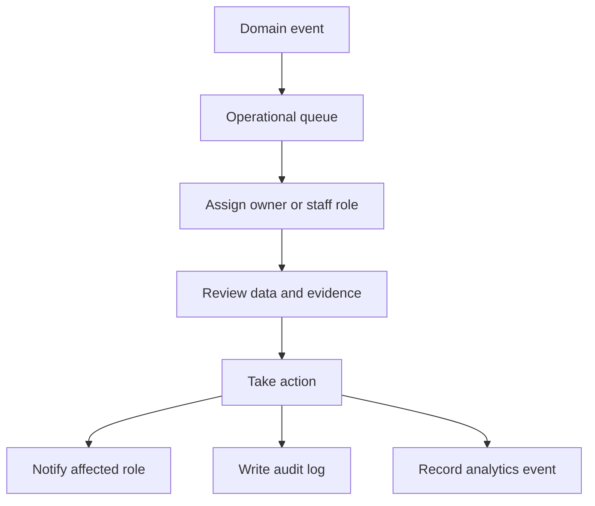
```mermaid
flowchart TB
    EVENT[Domain event] --> QUEUE[Operational queue]
    QUEUE --> ASSIGN[Assign owner or staff role]
    ASSIGN --> REVIEW[Review data and evidence]
    REVIEW --> ACTION[Take action]
    ACTION --> NOTIFY[Notify affected role]
    ACTION --> AUDIT[Write audit log]
    ACTION --> ANALYTICS[Record analytics event]
```

## Implementation Order

1. Auth, roles, and route guards.
2. Customer browse, cart, checkout, and order flow.
3. Vendor onboarding and product workflow.
4. Vendor orders, finance, and shop settings.
5. Admin vendor, product, and order moderation.
6. Returns, support, and reviews.
7. Logistics, COD, and reverse logistics.
8. Promotions, notifications, and loyalty.
9. Trust, fraud, and disputes.
10. Analytics, reports, and dashboards.

## Practical Rule

The marketplace is healthy when every role can finish its side of the same workflow:

- Customer can buy and resolve post-purchase issues.
- Vendor can list, fulfill, earn, and respond.
- Admin can approve, moderate, reconcile, and govern.

If those three workflows stay connected through structured order, shipment, return, payout, support, audit, and analytics records, Amiyo-Go behaves like a real marketplace operating system instead of a simple ecommerce storefront.

# Daraz-Level Marketplace Audit

Source file: DARAZ_LEVEL_MARKETPLACE_AUDIT.md

Marketplace maturity audit and Daraz-level readiness notes.

# Amiyo-Go Daraz-Level Marketplace Audit

Last audited: May 19, 2026

## Purpose

This document turns the Daraz-level marketplace plan into an executable audit for the current Amiyo-Go codebase. It lists what exists today, marks the maturity of each area, and defines the next work in the correct order: reliability first, then buyer flow, seller center, admin operations, logistics, trust, growth, analytics, and scale.

## Status Legend

- Complete: usable end to end with real routes, UI, backend logic, and tests.
- Partial: exists and is usable in places, but still has missing workflows, inconsistent UI, weak edge cases, or incomplete integration.
- Mock: UI or backend path exists but depends on simulated data, mock mode, placeholders, or incomplete external integration.
- Broken: code exists but is likely not wired correctly, unsafe, or unable to meet the expected workflow.
- Missing: no meaningful implementation found.

## Immediate Freeze Rule

Freeze new random feature work until Phase 1 is closed. The project already has many customer, vendor, admin, logistics, promotion, support, and analytics files. The current risk is not lack of pages; it is uneven completion, mixed patterns, and operational gaps.

## Inventory Snapshot

- Frontend route count: about 110 route entries in `Client/src/routes/Routes.jsx`.
- Backend route/controller handler references: about 596 route declarations across `Server/routes` and route-style controller files.
- Frontend tests: 24 suites / 93 tests at last verification.
- Backend tests: 64 suites / 404 tests at last verification.
- Major frontend shells: `CustomerLayout`, `AuthLayout`, `VendorLayout`, `AdminLayout`.
- Major backend groups: customer commerce, vendor center, admin operations, logistics, promotions, trust-safety, support, analytics, notifications, loyalty, wishlist, campaigns.

## Phase 1 Audit Summary

| Area | Current Status | Evidence | Required Next Step |
|---|---|---|---|
| Full audit | Partial | Previous docs exist, but no single maturity matrix existed before this file. | Use this file as the tracking source and update it after each sprint. |
| Project structure | Partial | Customer, vendor, admin, shared, route, service, hook, layout folders exist. Some duplicate legacy/shared UI remains. | Create a cleanup PR that removes dead/duplicate components and standardizes imports. |
| Environment validation | Complete | `Server/config/env.js` validates MongoDB, Firebase, Redis, Supabase, email, push, session/CORS configuration before startup. | Keep production envs aligned with the validator. |
| Health/readiness endpoints | Complete | `/health`, `/ready`, `/ops` and `/api/*` aliases now report liveness, readiness, dependency state, jobs, and degraded ops. | Wire external uptime/monitoring to these endpoints. |
| Security/RBAC | Complete | Backend permission resolution is role/resource/action based; admin frontend navigation and route elements are RBAC-aware. | Continue adding action-level button disables as pages are polished. |
| Idempotency | Complete | Critical checkout, guest order, payment, refund, return, vendor payout, and admin payout writes use `Idempotency-Key`. Client API adds keys automatically. | Add dashboard visibility for idempotency conflicts if ops needs it. |
| Audit logs | Complete | Sensitive admin/vendor/order/payment/return/support/upload actions are audited with redaction, clearer target types, and a unified admin audit viewer. | Add retention/export policy once compliance requirements are finalized. |
| Rate limits | Complete | Configurable global API, search, payment, product-view analytics, upload, KYC, and bulk-upload limiters are wired in `Server/index.js`. Product/campaign view analytics no longer consume the general API budget. | Tune `API_RATE_LIMIT_MAX` and `API_RATE_LIMIT_WINDOW_MS` from production traffic. |
| Sanitization | Complete | `sanitizeMiddleware` is wired before API routes. | Add route-specific validation schemas during page cleanup. |
| Helmet/security headers | Complete | `helmet` and strict CORS allowlist config are wired during startup. | Maintain `CORS_ORIGINS` per environment. |
| Upload hardening | Partial | Multer filters exist for uploads and vendor product routes. | Add file scanning policy, stricter MIME/extension checks, image processing limits, and audit events. |

## Customer Feature Audit

| Feature | Status | Notes |
|---|---|---|
| Homepage discovery | Partial | `Home`, discovery APIs, hero/category/flash/recommendation concepts exist. Category strip is now sticky and product sections have empty fallbacks. Needs final vendor-highlight/trust-block adoption pass. |
| Category listing | Partial | `CategoryPage`, dynamic categories, category fields, and filters exist. Needs cleaner subcategory chips, SEO block consistency, and mobile filter bottom sheet completion. |
| Product listing `/products` | Partial | Products page exists and has improved category/daily needs work. Needs final grid consistency and complete mobile polish. |
| Search results | Partial | Search routes, autocomplete, navigation, history, bottom-sheet filters, applied chips, and zero-result recovery exist. Product autocomplete now routes to the real product detail path. Needs analytics tracking completion. |
| Product detail | Partial | Gallery, delivery, seller, Q&A, reviews, trust widgets exist. Product detail now owns product-view tracking instead of listing cards. Needs final above-fold hierarchy and consistent sticky purchase bar behavior. |
| Vendor storefront | Partial | `VendorStore`, public vendor APIs, follow status, marketing items exist. Needs final trust metrics, policy accordion, and storefront consistency. |
| Flash sale page | Partial | `FlashSales`, flash sale API/admin exist. Needs expired-state handling and stock-left UX consistency. |
| Deals/vouchers | Partial | Coupons, offers, promotions, vendor marketing exist. Needs a unified customer deals page. |
| Login/register | Partial | Pages and auth context exist. Intended URL redirects now work through shared guards. Needs full validation polish and password/reset flows. |
| Forgot/reset password | Missing | No dedicated frontend routes found. |
| Address onboarding | Partial | Address pages and Bangladesh location components exist. Needs onboarding-specific flow and validation polish. |
| Cart | Partial | Cart exists with vendor grouping and checkout CTA work. Needs final sticky summary and full voucher/coin/shipping breakdown consistency. |
| Guest checkout | Partial | `/checkout/guest` exists and guest order API exists. Needs final validation, optional account creation, and success path hardening. |
| Checkout | Partial | Checkout page and order creation exist. Needs stricter stepper enforcement, idempotency, and payment confirmation hardening. |
| Order success | Partial | `OrderConfirmation` now shows order ID copy, ETA, item count, total, trust steps, and track/detail CTAs. Needs recommended items and guest tracking hardening. |
| Account dashboard | Partial | `Profile` links profile/orders/addresses/coins/notifications/support and now has a buyer workflow readiness panel for profile, address, payment, contact, and update channels. Needs richer embedded order/wishlist/support summaries. |
| Orders/history/detail | Partial | `Orders`, order timeline, invoice download APIs, `/orders/:orderId`, and `/orders/:orderId/track` now exist. Needs deeper item-level tracking and post-delivery action polish. |
| Wishlist | Partial | Wishlist, collections, sharing, alerts exist. Needs final grid, move-to-cart, and price-drop states. |
| Loyalty/coins | Partial | Loyalty dashboard/API exists. Needs checkout integration consistency. |
| Notifications center | Partial | `/notifications`, `MyAlerts`, notification context, preferences, push services, and stock-alert delivery exist. Notifications now group by Today/Yesterday/Earlier with read/unread and type filters. Needs event-driven backend consolidation. |
| Support center | Partial | Ticket list/detail concepts and admin queue exist. Needs order-detail entry points and attachment UX finish. |
| Returns flow | Partial | `Returns`, return model/controller, vendor/admin flows exist. Needs full self-serve wizard and case detail polish. |
| Reviews | Partial | Review APIs, review components, admin moderation, vendor reply, and `/my-reviews` now exist. Needs final moderation status consistency and richer media management. |

## Vendor Feature Audit

| Feature | Status | Notes |
|---|---|---|
| Vendor route/status guard | Partial | Vendor access now uses shared status and permission guards with pending, rejected, suspended, role-sync, missing-profile, KYC-required, and vendor-staff variants. KYC self-service routes stay reachable for owners. Needs live notification counts and final backend policy alignment for KYC-blocked sellers. |
| Vendor category requests | Partial | Vendor category access now supports main/group selection, visible subcategory paths, ID-based request metadata, and admin path visibility. Needs final queue/drawer adoption when admin moderation pages are unified. |
| Vendor dashboard | Complete baseline | `VendorHome` and dashboard APIs provide KPIs, health scoring, SLA prompts, product advisor, onboarding, announcements, and workflow shortcuts. |
| Vendor products list | Partial | Status tabs, search, bulk selection, submit/delist actions, media center, bulk editor, mobile cards, and staff action locks exist. Needs final shared table standardization. |
| Add/edit product | Complete baseline | Vendor product form/detail pages now include moderation feedback, clone/edit actions, listing quality, SKU stock, and persisted edit history with reapproval signals. Needs true step wizard polish later. |
| Bulk upload | Complete | CSV upload job, report download, validation report route/UI, partial-success summary, and failed-row retry guidance exist. |
| Vendor orders | Complete | Orders list/detail, safe bulk Pack/Ready/Pickup Ready actions, pickup-ready, packing slip, barcode label APIs, delivery exception recording, mobile card fallback, and staff view-only action locks exist. |
| Vendor returns/disputes | Partial | Vendor returns, response APIs, vendor-owned detail API, `/vendor/returns/:returnId` evidence/timeline page, mobile card fallback, and staff view-only action locks exist. Needs admin decision panel alignment and final SLA/escalation polish. |
| Vendor finance | Partial | Finance summary, transactions, payouts, statements, commission rates, mobile ledger cards, payout action locks, and vendor-staff finance permission checks exist. Needs deeper ledger export/status consistency. |
| Shop management | Partial | Vendor shop, decoration, profile, vacation mode, categories exist. Needs final preview/policy/social workflow. |
| KYC/verification | Partial | Vendor KYC route, admin review, seller gate state, seller action-center prompts, document cards, rejection note display, and reupload guidance exist. Needs backend policy alignment for edge KYC-blocked sellers. |
| Shipping settings | Complete | Vendor settings now expose pickup/return addresses plus preparation time, default courier, cutoff, fee promises, pickup/self-delivery toggles, shipping notes, and return policy summary. Admin delivery settings still control final platform fee rules. |
| Vendor marketing | Partial | Vendor vouchers/campaigns and admin review exist. Needs seller promotion analytics and campaign UX polish. |
| Vendor support inbox | Partial | Vendor chat/support tools exist. Needs consistent ticket/chat thread model with customer/admin tabs. |
| Vendor staff/permissions | Complete | Vendor staff routes/model/settings exist with permission-aware seller navigation, route guards, owner-facing permission matrix, staff edit flow, owner audit history, backend finance/return permission checks, and action-level locks on key pages. |

## Admin Feature Audit

| Feature | Status | Notes |
|---|---|---|
| Admin shell | Partial | `AdminLayout`, shared `AdminRoute`, RBAC-aware navigation, route-level permission wrappers, topbar global route search, quick links, role badge, alert badges, and dark-mode toggle exist. Needs page action-level disables during queue polish. |
| Admin dashboard | Hardened baseline | Dashboard now exposes GMV, orders, active vendors, moderation queues, support SLA, payout exposure, refund rate, top vendors/categories/products, ops health, date range, and previous-period compare workflow. |
| Vendor list/detail/approval | Partial | Enhanced vendor page, detail, KYC, status actions, warnings exist. Needs consistent queue/detail drawer pattern. |
| Product moderation | Partial | Admin product queue, approve/reject/disable, duplicate/IP/brand tools exist. Needs one reusable moderation queue layout. |
| Category manager | Partial | Dynamic categories, category fields, attributes, commission concepts exist. Needs drag/drop tree and inheritance preview polish. |
| Review moderation | Partial | Admin reviews/trust-safety moderation exists. Needs unified queue/detail drawer and vendor reply visibility. |
| Orders overview/detail | Partial | Admin order management, URL/short-code search, auto-open detail, vendor split context, update forms, export, COD reconciliation, and SLA/fraud queues exist. Needs drawer/detail standardization. |
| Returns queue/decision | Partial | Admin returns and trust-safety disputes exist. Needs side-by-side evidence and decision panel consistency. |
| Payout queue/detail | Partial | Admin payouts, payout requests, finance queue exist. Needs linked-orders detail and risk indicators polish. |
| Commission settings | Partial | Finance/platform commission rules exist. Needs category inheritance preview and safer explanations. |
| Delivery/logistics settings | Partial | Logistics overview, zones, couriers, fee rules, dispatch, failed delivery exist. Needs shipment state machine as first-class model. |
| Promotions manager | Partial | Campaigns, vouchers, flash deals, homepage slots, clearance, loyalty rules exist. Needs conflict detection and order discount snapshots. |
| Notification templates/logs | Partial | Platform controls include templates/broadcast/email campaigns. Needs delivery log, retry monitor, and event bus integration. |
| Support queue | Partial | Admin support queue is now professional UI with stats/SLA/drawer. Needs internal notes, assignment persistence verification, and SLA automation. |
| Staff roles/permissions | Partial | Platform staff access, role/session policy, user permissions exist. Needs permission matrix UI and route-level enforcement pass. |
| Audit logs | Complete | `/api/admin/audit-logs` now supports unified search/filter/pagination/summary, and `/admin/audit-logs` gives admins a detail drawer for evidence review. |
| Ops monitoring | Partial | Admin operations page now merges marketplace workload queues, failed jobs, cron health, notification failures, support/return issues, payout exposure, and recent audit trails. Needs deeper retry actions and external alerting. |

## Shared Design And UI Audit

| Feature | Status | Notes |
|---|---|---|
| Design tokens | Complete | `styles/tokens.css` and `components/ui/tokens.js` define shared colors, spacing, type, radii, shadows, z-index, breakpoints, and status colors. |
| Core components | Partial | New `foundation`, `forms`, `data`, `feedback`, `overlays`, `layout`, `shopping` modules exist. Legacy `Button`, `Badge`, `Modal`, `EmptyState`, `Skeleton` also remain. |
| Layout wrappers | Partial | `CustomerLayout`, `AuthLayout`, `VendorLayout`, `AdminLayout`, `PageShell`, `PageHeader`, `SectionCard`, and `SplitLayout` exist. Needs adoption pass across older pages. |
| Status badges | Complete | `components/ui/status.js` is now the canonical status dictionary with aliases for customer, vendor, and admin labels. |
| Form system | Partial | New form components exist, but older input/form patterns remain across pages. |
| Table system | Partial | `Table`, `DataTable`, admin/vendor custom tables coexist. Needs one mobile-friendly table standard. |
| Drawer/modal system | Partial | Overlay components exist. Needs consistent use in admin/vendor queues. |
| Toast/alert system | Partial | `react-hot-toast`, custom toast context, and `Toast` coexist. Needs one placement/style system. |
| Mobile nav | Partial | Customer bottom nav exists and vendor shell now has a responsive drawer/sidebar. Needs product/cart/checkout mobile regression pass. |
| Dark mode | Partial | Theme context exists; vendor shell now follows dark-mode tokens; older vendor/admin pages still need cleanup. |
| Accessibility | Partial | Some aria/focus patterns exist. Needs route-by-route audit. |

## Backend Operations Audit

| Feature | Status | Notes |
|---|---|---|
| MongoDB models | Partial | Broad model set exists: orders, returns, vendors, payouts, analytics, audit, notifications, campaigns, dispatch. Needs model ownership and migration discipline. |
| Firebase auth | Partial | Firebase admin validates env and tokens. Needs local user fallback/error consistency. |
| Redis | Partial | Redis config and queue/cache concepts exist. Needs readiness checks and required/optional classification. |
| Supabase/storage | Partial | `storageService` and Supabase dependency exist. Needs env validation and failure-mode docs. |
| Email | Mock | Email service can run in mock mode without Brevo/SMTP config. Good for local, not production-ready. |
| Push | Partial | Push services exist; VAPID config can fail with limited functionality. Needs boot readiness classification. |
| Realtime | Partial | WebSocket realtime service attaches to server. Needs ops monitoring and auth hardening review. |
| Background jobs | Partial | Campaign scheduler, analytics cron, newsletter cron exist. Needs job dashboard and retry strategy. |
| Analytics summaries | Partial | Analytics summary rebuild and reports exist. Needs event tracking completeness. |
| Export/reporting | Partial | CSV/PDF exports exist in finance, analytics, orders, logistics. Needs job status/history center. |

## First 10 Concrete Moves - Current Status

| Move | Status | Next Action |
|---|---|---|
| 1. Add full audit log | Complete | Sensitive-operation audit middleware, unified admin audit endpoint, and searchable admin audit viewer are implemented and tested. |
| 2. Add admin RBAC | Complete | Admin backend permissions, frontend nav filtering, and admin route guards are resource/action aware. |
| 3. Add guest checkout | Complete | Existing guest checkout is now protected by critical-write idempotency. UX polish continues in buyer-flow phase. |
| 4. Rebuild product page | Partial | Finish above-fold hierarchy and sticky purchase bar behavior. |
| 5. Rebuild cart and checkout | Partial | Idempotent order placement is complete. Remaining work belongs to the Phase 3 buyer-flow rebuild. |
| 6. Add support ticket system | Partial | Add internal notes, order/product quick-open entry points, attachment preview, SLA automation. |
| 7. Add returns case workflow | Partial | Finish customer wizard, vendor dispute page, admin decision panel, refund tracking. |
| 8. Add vendor status + KYC pages | Partial | Shared vendor gate now has missing-profile, role-sync, missing-KYC, KYC-pending, rejected, suspended, and pending states. Finish richer KYC document cards and backend policy alignment. |
| 9. Add admin moderation queues | Partial | Convert vendor/product/review/return/support/payout pages to one queue + drawer pattern. |
| 10. Add logistics state machine | Partial | Define canonical shipment/COD/reverse-logistics state machine and enforce transitions. |

## Recommended Build Order For This Codebase

1. Close Phase 1 reliability gaps: env validator, health/ready/ops, rate limiter wiring, sanitizer wiring, helmet, idempotency.
2. Do a design-system adoption pass on the highest-traffic pages: product, cart, checkout, account, vendor products, vendor orders, admin queues.
3. Finish customer buy flow: product detail, cart, checkout, guest checkout, order success, order detail.
4. Finish support/returns/reviews: customer entry points, vendor response, admin queues, audit events.
5. Finish vendor seller center: dashboard, product workflow, orders, finance, shop, KYC, marketing.
6. Finish admin operations: queue pattern, detail drawers, RBAC navigation, retry controls.
7. Build canonical logistics and COD state machines.
8. Consolidate promotions, notifications, analytics, and exports behind event-driven workflows.
9. Run UI consistency and mobile-first review across every role.
10. Prepare scale work: cache category/homepage blocks, paginate large lists, move heavy jobs to queues.

## Phase 1 Definition Of Done

Phase 1 reliability/security implementation is done when:

- This audit is reviewed and updated with owner/date per feature.
- No new unrelated feature work is merged during cleanup.
- `/health`, `/ready`, and `/ops` exist and are tested. Done.
- Required env values are validated before server startup. Done.
- Rate limiting, sanitization, helmet, and CORS allowlist are wired. Done.
- Idempotency exists for order placement, refunds, payouts, and payment verification. Done.
- Audit logging covers admin, finance, payout, refund, vendor status, KYC, support, and moderation actions. Done through sensitive route middleware.
- Admin RBAC is enforced on backend routes and frontend page/action visibility. Done for backend checks, admin navigation, and admin route elements.

Structural cleanup remains an ongoing safety task: remove duplicate UI components and dead pages only when their replacement route has tests or a verified owner. Mass deletion is intentionally not part of the Phase 1 reliability gate because this project still has many active legacy routes.

## Phase 2 Implementation Snapshot

Current Phase 2 foundation work completed:

- Shared CSS/JS token foundation added in `Client/src/styles/tokens.css` and `Client/src/components/ui/tokens.js`.
- Canonical status registry added in `Client/src/components/ui/status.js`.
- Legacy and new status badges now read from the same status language.
- Shared route guards added in `Client/src/routes/guards.jsx`: `PublicRoute`, `CustomerRoute`, `VendorRoute`, `VendorStatusGuard`, `AdminRoute`, `RBACGuard`, and `GuestCheckoutRoute`.
- `CustomerLayout` and `AuthLayout` are now explicit shells; `MainLayout` remains a compatibility export.
- `VendorLayout` was rebuilt with lucide icons, stable seller-center navigation order, desktop sidebar, mobile drawer, dark mode support, and consistent content width.
- `VendorLayout` now includes a seller action center instead of a decorative notification bell, with KYC, order, product, return, payout, campaign, and support shortcuts.
- Route-level error boundaries now wrap lazy route elements.

Remaining Phase 2 adoption work:

- Replace legacy root-level buttons/forms/tables page by page.
- Convert vendor/admin tables to the shared table plus mobile card fallback.
- Remove page-local `Toaster` instances after each page moves to the global feedback pattern.
- Run a visual mobile pass on product, cart, checkout, vendor products, vendor orders, and admin queues.

## Phase 3 Customer Journey Snapshot

Phase 3 is not fully complete yet. The customer route map is broad and many buying-flow pieces exist, but the journey is still a set of partial workflows rather than a fully polished end-to-end customer system.

Current Phase 3 status by step:

| Step | Status | Evidence / Gap |
|---|---|---|
| 3.1 Homepage | Partial | Hero, category strip, flash sale, personalized/trending/new-arrival sections, skeletons, and empty fallbacks exist. Category strip is now sticky. Needs final top-vendor and footer trust block consistency. |
| 3.2 Category browsing | Partial | `/categories`, `/category/:category`, and `/products?category=` exist. Search catalog has filters, bottom sheet, applied chips, sort, pagination, and zero-state recovery. Dedicated category landing pages still need the same filter depth. |
| 3.3 Search | Partial | Autocomplete, recent/popular/product/category suggestions, search result filters, chips, sort, and zero-result recovery exist. Product suggestions now route to `/product/:id`. Needs analytics for popular/zero-result/click events. |
| 3.4 Product detail | Partial | Gallery, title/rating/sold count, price, variants, delivery, seller info, reviews, Q&A, related products, and view dedupe exist. Needs final above-fold hierarchy and sticky purchase regression pass. |
| 3.5 Cart | Partial | Vendor grouping, voucher, delivery breakdown, empty state, and sticky mobile CTA exist. Needs final loyalty/coin consistency between cart and checkout. |
| 3.6 Guest checkout | Partial | Public `/checkout/guest`, cart preservation, address capture, and payment selection exist. Needs optional account creation/merge workflow. |
| 3.7 Checkout | Partial | Address, payment, review progress, saved addresses, payment cards, vouchers, loyalty points, and idempotent order placement exist. Authenticated checkout now lands on the success page. Needs stricter step blocking and payment confirmation hardening. |
| 3.8 Success/tracking | Partial | Success page, `/orders/:orderId`, `/orders/:orderId/track`, timeline, invoice summary, support/return shortcuts, and invoice download exist. Needs guest-accessible tracking and recommended items. |
| 3.9 Account dashboard | Partial | Profile hub links orders, addresses, wishlist, coins, notifications, support, returns, and reviews. Needs embedded summaries instead of mostly navigation cards. |
| 3.10 Orders pages | Partial | Order history, detail, tracking, reorder, invoice, return, support, and review entry points exist. Needs item-level tracking polish. |
| 3.11 Support pages | Partial | Support list/detail/thread, create-ticket, FAQ, bot, linked order/return fields, and escalation entry points exist. Needs attachment preview polish and persistent assignment/SLA refinement. |
| 3.12 Returns pages | Partial | Returns wizard, active/completed returns, evidence upload, refund method, timeline, and support escalation exist. Needs dedicated per-return detail route. |
| 3.13 Reviews pages | Partial | Product review form and `/my-reviews` list/edit/remove page exist. Needs final moderation-status language and richer media editing. |
| 3.14 Notifications | Partial | `/notifications` now consolidates order, return, support, promotion, and wishlist updates with Today/Yesterday/Earlier groups, filters, stats, mark-all-read, clear, and click-through actions. Needs event-driven backend consolidation and delivery-log linkage. |
| 3.15 Trust content | Partial | Delivery, seller, buyer protection, return/support/review signals appear across key pages. Needs a final copy/placement pass across every customer route. |

Latest Phase 3 implementation slice:

- Authenticated checkout now routes to `/order-confirmation` with order ID, ETA, payment method, total, and item count.
- Order success now includes order ID copy, trust steps, Track Order, and Order Details CTAs.
- Added dedicated private routes `/orders/:orderId` and `/orders/:orderId/track`.
- Added `OrderDetail` with timeline, delivery/payment details, invoice summary, invoice download, support shortcut, return shortcut, and review shortcuts.
- Added `/my-reviews` for customer review management with status badges, verified badge, edit, remove, media preview, and vendor reply display.
- Added `customerOrders` helper coverage with black-box and white-box Jest tests.
- Fixed search autocomplete product suggestions to navigate to `/product/:id`.
- Added `/notifications` customer notification center with grouped timeline sections, unread/type filters, summary stats, refresh, mark-all-read, clear actions, product-alert handoff, and black-box/white-box helper tests.

## Phase 4 Vendor Seller Center Snapshot

Phase 4 seller-center implementation is complete for the current codebase baseline. The vendor area now has operational coverage for shell/status access, dashboard, product workflow, bulk upload, orders, returns, finance, reports, shop, KYC, marketing, support/reviews, settings, and staff permissions. Remaining work is advanced polish that belongs to later admin/logistics/design-system phases: shared table adoption, cross-role queue alignment, and richer analytics.

Current Phase 4 status by step:

| Step | Status | Evidence / Gap |
|---|---|---|
| 4.1 Vendor shell/status gate | Complete | `VendorLayout` has grouped seller navigation, responsive sidebar, seller action center, `/vendor` dashboard redirect, shared status gate states, and permission-filtered staff navigation. |
| 4.2 Dashboard home | Complete | `VendorHome` has KPIs, action widgets, workflow readiness scoring, health scoring, announcements, top products, sales chart, SLA/stock signals, and pending-task prompts. |
| 4.3 Products workflow | Complete | Product list, add/edit, product detail/performance view, moderation status, mobile product cards, mobile bulk-edit cards, media center, CSV upload route, category requests, variants/SKU concepts, and staff action locks exist. |
| 4.4 Bulk upload/media | Complete | Bulk upload and media-center views exist with CSV validation, job processing, partial-success report snapshots, failed-row guidance, and report download. |
| 4.5 Orders operations | Complete | Vendor orders queue, filters, status actions, packing slips, labels, pickup scheduling, buyer messages, return links, timeline, `/vendor/orders/:orderId` detail workspace, delivery exception recording, mobile card fallback, and staff action locks exist. |
| 4.6 Returns/disputes | Complete | Vendor returns list, response flow, vendor-owned detail API, mobile card fallback, financial exposure summary, customer/seller evidence panels, timeline, counter-evidence response UX, and staff action locks exist. |
| 4.7 Finance center | Complete | Finance overview, transactions, mobile ledger cards, statements, commissions, payouts, payout request components, and finance staff action locks exist. |
| 4.8 Reports/analytics | Complete | Vendor reports routes for sales, products, traffic, inventory, trend comparison, top products, visibility, repeat buyers, and risk signals exist. |
| 4.9 Store customization | Complete | Vendor shop profile, decoration, categories, banner/logo, policies, coupon banner, campaign theme mode, seller picks, and preview concepts exist. |
| 4.10 KYC/verification | Complete | KYC upload/review exists, seller gate exposes missing-KYC/KYC-pending states, and the seller KYC page has document cards, reviewer notes, status guidance, and reupload flow. |
| 4.11 Marketing tools | Complete | Vendor vouchers, campaigns, campaign nominations, bundles, free shipping, seller picks, submissions, and marketing analytics exist. |
| 4.12 Support/reviews | Complete | Vendor messages, support chat/tools, quick replies/templates, reviews, Q&A, and staff-aware access exist. |
| 4.13 Settings/staff | Complete | Payout, address, shipping rules, vacation, staff, staff audit trail, notifications, security, staff role presets, owner permission matrix editing, permission-aware route guards, and backend finance/return permission checks exist. |

Latest Phase 4 implementation slice:

- Added `vendorSellerCenter` helper utilities for KYC state mapping, vendor gate decisions, action-center items, action counts, and readiness scoring.
- Replaced the static vendor header bell with a real seller action center linking KYC, orders, products, returns, payouts, campaigns, and customer communication.
- Added `/vendor` index redirect to `/vendor/dashboard`.
- Expanded the shared vendor status gate with role-sync, missing-KYC, and KYC-pending states while keeping KYC/settings/support self-service routes reachable.
- Added black-box and white-box Jest tests for seller-center gate and action logic.
- Added `/vendor/products/:id` product detail view with media, moderation state, listing quality, SKU inventory, sales signals, timeline, submit/delist/delete actions, and black-box/white-box helper tests.
- Added `/vendor/returns/:returnId` return dispute detail view with customer evidence, seller evidence, financial exposure, order context, timeline, and approve/dispute/reject response submission.
- Added vendor return detail API coverage and black-box/white-box frontend tests for return status, evidence, financial exposure, and timeline logic.
- Added `/vendor/orders/:orderId` order detail workspace with fulfillment actions, pickup scheduling, buyer messaging, packing slip/waybill downloads, customer address copy, product list, financial summary, timeline, and linked returns.
- Added black-box and white-box frontend tests for vendor order status derivation, action availability, financial totals, address formatting, and timeline logic.
- Added `vendorStaffPermissions` helper, route guard, seller navigation filtering, staff-aware action shortcuts, vendor-staff seller gate support, and black-box/white-box tests for permission behavior.
- Added mobile card fallbacks for vendor orders and vendor returns so seller operations are usable below desktop table widths.
- Extended vendor finance, return, report, marketing, and category-access routes to use vendor-staff permission checks, and allowed vendor-staff users to load their linked vendor profile.
- Added mobile product-list cards, mobile bulk-edit cards, finance transaction cards, payout action locks, richer KYC document cards, owner staff permission matrix editing, and staff view-only action locks across product/order/return detail flows.
- Added owner-only vendor staff audit history backed by `vendor_staff_audit_logs`, with invite/update/remove audit entries and staff permission diff summaries in settings.
- Added vendor delivery exception recording for order detail so sellers can log missed pickup, address, damage, COD dispute, retry, and admin-help cases against order timelines.
- Added vendor shipping-rule clarity in settings with preparation time, default courier, cutoff hour, fee promises, pickup/self-delivery toggles, shipping notes, and return-policy summary persisted through the vendor profile.
- Added bulk-upload report snapshots so completed CSV jobs expose partial success, failed-row samples, and clearer retry guidance while keeping the downloadable report.
- Added backend white-box tests for vendor staff audit helpers and bulk-upload report snapshots, and expanded vendor settings controller coverage for delivery settings.
- Added safe vendor order bulk workflow helpers and UI actions for Pack, Ready to Ship, and Pickup Ready without moving shipped/delivered/returned orders backward.
- Added persisted vendor product edit history for changed listing fields, staff attribution, critical-field detection, and reapproval-required signals in the vendor product timeline.
- Added frontend black-box/white-box tests for vendor bulk order workflow and backend controller tests for critical/non-critical product edit history.

## Phase 5 Admin Marketplace Operations Snapshot

Phase 5 admin operating-system work is now implemented as a queue-driven baseline for the current codebase. The admin area already had many role-specific pages; the latest work connects those surfaces through a single operations command center and shared queue detail patterns for marketplace workloads, SLA pressure, payout exposure, failed notifications, job health, and recent audit activity.

Current Phase 5 status by step:

| Step | Status | Evidence / Gap |
|---|---|---|
| 5.1 Admin shell | Hardened baseline | Admin shell includes RBAC-aware navigation, alert badges, resource-aware topbar search, quick links, role badge, and dark-mode toggle. |
| 5.2 Queue-based model | Complete | `/admin/operations` now normalizes vendor approval, KYC, product moderation, review moderation, returns, support, payouts, and failed-notification queues with SLA/risk/exposure signals plus a marketplace workflow score. |
| 5.3 Vendor management | Complete baseline | Vendor requests, detail, KYC, status actions, category access, bulk actions, and shared vendor approval drawer exist. Advanced history/risk scoring can continue in later hardening. |
| 5.4 Product moderation | Complete baseline | Product queue, approve/reject/disable, scans, duplicates, IP, brand tools, and shared queue detail drawer exist. |
| 5.5 Review moderation | Complete baseline | Review moderation/trust-safety queues feed operations workload, and review management now has shared risk metrics plus a right-side detail drawer with reply/delete actions. |
| 5.6 Support operations | Complete baseline | Support queue has stats, SLA, assignment UI, linked resources, and thread drawer. Future hardening: deeper internal-note automation verification. |
| 5.7 Returns decision | Complete baseline | Return queue/dispute workflows feed operations workload, and returns now use shared decision metrics plus a side-by-side customer/vendor evidence drawer. |
| 5.8 Payout operations | Hardened baseline | Payout queue, payout requests, approvals/rejections/paid states, finance overview, payout exposure signals, linked eligible orders, return deductions, prior payout history, and payout request detail drawer exist. |
| 5.9 Order operations | Hardened baseline | Admin orders, hash-style short-code search, auto-open detail on single search result, vendor split context, status/payment/delivery views, SLA/fraud queues, export, and override endpoints exist. Future hardening: override action audit UI polish. |
| 5.10 Categories/commission | Complete baseline | Dynamic categories, attributes, category requests, platform commission rules, and finance rules exist. Future hardening: drag/drop tree and inheritance preview polish. |
| 5.11 Delivery/logistics | Complete baseline | Logistics overview, zones, couriers, fee rules, dispatch manifest, failed delivery, COD float, and audit log exist. Future hardening: canonical shipment state-machine enforcement. |
| 5.12 Promotions manager | Complete baseline | Promotions, coupons, flash sales, offers, campaigns, and vendor marketing review exist. Future hardening: stronger conflict detection and order discount snapshots. |
| 5.13 Notifications/templates | Complete baseline | Platform controls include broadcasts, templates, email campaigns, announcements, and failed delivery signals in operations. Future hardening: retry controls from delivery-log rows. |
| 5.14 Analytics/reports | Hardened baseline | Admin dashboard/analytics expose GMV, commission, vendors, categories, products, refunds, payout exposure, support SLA, ops health, exports, date range, and previous-period compare controls. Future hardening: more event-backed funnel data. |
| 5.15 Audit/observability | Complete baseline | Audit middleware, domain audit logs, operations page, queue monitors, and searchable `/admin/audit-logs` viewer exist. Future hardening: external alerting and retry actions from failed-job/notification rows. |
| 5.16 Staff/RBAC | Complete baseline | Staff access, roles, permissions, session policy, 2FA setup, RBAC route guards, and permission-filtered navigation exist. Future hardening: richer permission matrix editing UX. |

Latest Phase 5 implementation slice:

- Added backend `buildAdminQueueWorkload` helpers for vendor approval, KYC review, product moderation, review moderation, returns/disputes, support, payouts, and failed notifications.
- Extended `/api/admin/dashboard/operations` to return `queueWorkload`, open queue item totals, SLA breach counts, warning queue counts, and payout exposure.
- Added queue issue rows for vendor, KYC, product, review, and payout work so the operations issue list points to the right admin workspace.
- Added marketplace workload cards to `AdminOperations` with queue status, open count, SLA breaches, risk count, exposure, and direct links.
- Added `adminOperationsCenter` frontend helpers plus black-box and white-box Jest tests for queue summaries, filtering, tones, and exposure formatting.
- Added admin shell topbar route search and dark-mode toggle while preserving permission-filtered navigation.
- Expanded backend operations helper tests for queue SLA scoring and normalized Phase 5 workload generation.
- Added unified `/api/admin/audit-logs` filters for search, module, severity, actor, target, date range, pagination, and operational summaries.
- Added `/admin/audit-logs` with summary cards, desktop table, mobile cards, and a right-side evidence drawer for actor/target/request/metadata/diff review.
- Added admin audit-log frontend black-box/white-box helper tests and backend controller tests for query construction, severity derivation, normalization, and paginated responses.
- Added shared admin queue primitives for status badges, queue metrics, right-side detail drawers, and key/value evidence sections.
- Added `adminQueuePattern` helpers plus black-box and white-box tests for product, payout, vendor, review, return, and support queue normalization, search/status/type filtering, tone mapping, date fallbacks, vendor readiness, and summary cards.
- Adopted the shared queue drawer in product moderation and payout requests so admins can review listing evidence, vendor/payment detail, and decision actions without leaving the queue.
- Expanded the shared queue drawer pattern to vendor approvals, review moderation, and return decisions so Phase 5 admin operations now use one queue contract across the highest-risk workflows.

Phase 5 hardening pass:

- Added resource-aware admin topbar search for order references, vendor IDs, product IDs, payout requests, returns, support tickets, email, and phone lookups while preserving RBAC-filtered route suggestions.
- Wired admin search query parameters into product, vendor, payout, return, and support queues so searched resources land in an already-filtered workspace.
- Hardened payout request review with linked eligible-balance context, delivered-order rows, return deductions, and prior payout history inside the finance drawer.
- Added `adminResourceSearch` black-box and white-box tests, and expanded payout queue risk tests for large/held payout requests.

Order search hardening pass:

- Added `#DD3556FE`-style admin order search support from the topbar into `/admin/orders?search=...`.
- The admin orders page now hydrates URL search/vendor filters, filters on first load, and auto-opens the detail/update forms when one matching order is found.
- Admin order detail now shows buyer/payment/delivery summary plus vendor order split, vendor-order status, commission, vendor earnings, item statuses, and vendor profile/order shortcuts.
- Backend order search now normalizes `#` and `order` prefixes, escapes regex input, searches order/invoice/tracking fields, and matches short ObjectId fragments through `$toString`.
- Added `Order.adminSearch` model tests alongside admin order management coverage.

Admin dashboard workflow pass:

- Expanded `/api/admin/dashboard/overview` with active vendors, support open/SLA breach counts, review moderation count, failed notifications, failed bulk jobs, payout exposure, refund amount/rate, previous-period comparison, operations summary, and top categories.
- Updated `/admin` dashboard cards so every major marketplace signal links into the relevant workflow: orders, approvals, support, payouts, operations, analytics, categories, products, returns, reviews, KYC, and notification failures.
- Added dashboard UI for support SLA, failed notifications, failed jobs, analytics cron health, top categories, refund rate, payout exposure, and previous-period GMV/order/commission/refund compare chips.
- Expanded admin dashboard controller tests for the new workflow metrics, top categories, compare payload, and ops summary fields.

Cross-role workflow pass:

- Added a shared `roleWorkflowCenter` helper that scores customer, vendor, and admin workflow readiness with consistent priority ordering.
- Added a reusable `RoleWorkflowPanel` used by the customer account dashboard, vendor seller dashboard, and admin operations command center.
- Customer workflow now highlights profile, address, payment, contact verification, and order-update channel readiness before checkout.
- Vendor workflow now highlights onboarding, shipment SLA, listing quality, moderation wait, and marketing activation from the seller dashboard.
- Admin workflow now highlights queue SLA breaches, critical queues, support backlog, notification delivery failures, and background job failures from operations.
- Added black-box and white-box Jest tests for the cross-role workflow helper.

Whole-project health pass:

- Re-ran the project verification gates and confirmed client lint, client tests, server tests, and client production build are passing.
- Hardened stock alert delivery so low-stock customer alerts now send through the shared email service instead of a placeholder path.
- Price-drop stock alerts now keep their `price_drop` subtype when creating push notifications and receive the same notification model context as other stock alerts.
- Stock alert checkers now mark an alert as notified only after the related delivery call succeeds, preventing silent loss of failed alerts.
- Added backend Jest coverage for low-stock email delivery, price-drop push subtype handling, and failed-alert retry behavior.

## Phase 7 Trust And Safety Snapshot

Phase 7 now has a backend trust-safety foundation. It does not replace the existing admin trust pages; it adds the reusable operating layer underneath them so customer reports, risk signals, disputes, enforcement actions, payout holds, and appeals can follow one auditable workflow.

Current Phase 7 status by step:

| Step | Status | Evidence / Gap |
|---|---|---|
| 7.1 Trust policy model | Complete baseline | `TrustPolicyService` defines policy types, severity, automatic actions, manual-review rules, escalation queues, and appeal rules. |
| 7.2 Identity and verification | Complete baseline | `TrustSafety` stores subject verification records for customers/vendors with email, phone, document, risk, and manual-review state. |
| 7.3 Risk scoring engine | Complete baseline | `RiskScoringService` records risk events, rebuilds subject profiles, and scores review, return, promo, account, chat, payout, and product-content risk. |
| 7.4 Account abuse protection | Complete baseline | Account risk scoring covers failed-login bursts, suspicious sessions, repeated devices, and step-up verification recommendations. |
| 7.5 Product/content moderation | Complete baseline | Product-content scoring flags prohibited keywords, duplicate listings, misleading pricing, and policy actions. |
| 7.6 Fake review prevention | Complete baseline | Review risk scoring flags unverified purchases, fast reviews, bursts, and repetitive text. |
| 7.7 Returns abuse detection | Complete baseline | Return risk scoring flags high return rate, high value, repeated claim patterns, and COD refusal history. |
| 7.8 Promo abuse protection | Complete baseline | Promo risk scoring flags voucher testing, duplicate-device accounts, first-order discount abuse, and cancelled discounted orders. |
| 7.9 Reporting tools | Complete baseline | Public `/api/trust-safety/reports` and admin report-action routes create report cases with reason routing, evidence, actions, and queue metadata. |
| 7.10 Dispute workflow | Complete baseline | `TrustCaseService` adds a trust dispute state machine with evidence, timeline, valid transitions, and admin transition routes. |
| 7.11 Evidence/case management | Complete baseline | Case and report evidence are stored as structured records with actor, type, URL/text, metadata, and timestamps. |
| 7.12 Admin trust queues | Complete baseline | `/api/admin/trust-safety/queues` summarizes open reports, disputes, and high-risk profiles into queue workloads. |
| 7.13 Enforcement actions | Complete baseline | `EnforcementService` creates warn/hold/unpublish/remove/suspend/ban actions, writes audit events, and applies payout holds. |
| 7.14 Appeals workflow | Complete baseline | Authenticated appeal submission and admin appeal review support uphold, modify, and reverse outcomes. |
| 7.15 Trust dashboards | Complete baseline | `/api/admin/trust-safety/dashboard-v2` exposes reports, disputes, enforcements, appeals, high-risk profiles, payout holds, queues, and recent risk events. |
| 7.16 Chat/support safety | Complete baseline | Chat safety scoring flags abusive language and risky attachments for moderation or mute workflows. |
| 7.17 Payout risk controls | Complete baseline | Payout risk scoring and enforcement payout holds protect vendors with disputes, recent payout changes, or high-risk profiles. |
| 7.18 Auditability | Complete baseline | Enforcement and appeal decisions write both global audit logs and trust-specific audit events. |

Latest Phase 7 implementation slice:

- Added `TrustSafety` model collections and indexes for policies, verifications, risk events/profiles, reports, evidence, disputes, enforcements, appeals, payout holds, queues, and trust audit events.
- Added `TrustPolicyService`, `RiskScoringService`, `TrustCaseService`, and `EnforcementService`.
- Added public trust routes for policies, buyer/seller reports, appeals, and authenticated risk profile lookup.
- Extended admin trust-safety routes with policy management, verification updates, risk events, risk profiles, queue summary, report actions, dispute cases, evidence, enforcement, appeals, scoring endpoints, and dashboard v2.
- Added focused Jest coverage for policy evaluation, risk profile rebuilding, return/review/promo/payout scoring, report routing, dispute transitions, payout holds, enforcement audit logs, and appeals.

## Phase 9 Data And Intelligence Snapshot

Phase 9 now has a backend data-intelligence foundation. It builds on the existing admin analytics reports by adding a common metric contract, raw event ingestion, warehouse-style daily facts and dimensions, role-specific intelligence payloads, data-quality checks, and experimentation analytics.

Current Phase 9 status by step:

| Step | Status | Evidence / Gap |
|---|---|---|
| 9.1 KPI framework | Complete baseline | `analyticsKpiFramework` defines customer, vendor, and platform KPI definitions with source and grain. |
| 9.2 Event taxonomy | Complete baseline | Canonical snake-case event names and aliases cover discovery, search, cart, checkout, orders, returns, vouchers, notifications, shipment, trust, payout, and experiments. |
| 9.3 Raw event ingestion | Complete baseline | Public `/api/analytics/events` and `/api/analytics/events/batch` validate, dedupe, write `event_stream`, mirror legacy analytics/growth streams, and dead-letter invalid events. |
| 9.4 Warehouse tables | Complete baseline | `AnalyticsWarehouseService` writes `fact_orders_daily`, vendor sales, customer activity, returns, shipments, notifications, promotions, search, reviews, product performance, and dimension tables. |
| 9.5 Customer funnel | Complete baseline | Intelligence dashboard returns sessions, product views, add-to-cart, checkout, payment, order placed, paid, and delivered funnel with drop-off rates. |
| 9.6 Search/discovery analytics | Complete baseline | Search analytics include search count, zero-result rate, low-quality queries, CTR, add-to-cart signal, and query-to-purchase signal. |
| 9.7 Product analytics | Complete baseline | Product performance ranks products by views, add-to-cart rate, conversion, GMV, returns, rating, and stockout signal. |
| 9.8 Customer analytics/segments | Complete baseline | Customer rows include LTV, order count, basket size, category preference, payment preference, returns, notification engagement, and behavior segments. |
| 9.9 Vendor scorecards | Complete baseline | Vendor scorecards include GMV, net payout, orders, cancellation/return rates, review score, fulfilment signals, voucher usage, campaign GMV, and repeat-buyer ratio. |
| 9.10 Promotion/campaign analytics | Complete baseline | Campaign analytics include impressions, clicks, redemptions, influenced orders, influenced GMV, subsidy cost, and AOV signal. |
| 9.11 Notification analytics | Complete baseline | Notification analytics include sent, delivered, failed, opened, clicked, open rate, CTR, failure rate, and channel performance. |
| 9.12 Logistics analytics | Complete baseline | Logistics analytics include shipment counts, delivery success/failure, RTO rate, COD exposure, and courier comparison. |
| 9.13 Trust/risk analytics | Complete baseline | Trust analytics include flagged subjects, reports, disputes, payout holds, appeals, enforcements, and top violation reasons. |
| 9.14 Finance/profitability | Complete baseline | Finance analytics include gross revenue, commission, promo subsidy, refund cost, payout liability, payout holds, and margin-after-leakage. |
| 9.15 Cohort/retention | Complete baseline | Cohort rows track first-purchase month, D30 repeat count, D30 repeat rate, and repeat revenue. |
| 9.16 Forecasting | Complete baseline | Forecasts use simple moving averages for GMV and orders as a no-ML planning baseline. |
| 9.17 Report center | Complete baseline | Report-center metadata lists customer funnel, search, product, vendor, campaign, notification, logistics, trust, finance, and cohort reports with formats and scheduling support flags. |
| 9.18 Role dashboard layers | Complete baseline | `/api/admin/analytics/role/:role` exposes customer, vendor, and admin dashboard layers from the shared intelligence model. |
| 9.19 Data quality/observability | Complete baseline | Data quality checks flag dead-lettered events, duplicate event keys, stale warehouse jobs, and missing fact coverage. |
| 9.20 Experiment analytics | Complete baseline | Experiment analytics track exposures, conversions, conversion rate, revenue per user, and confidence indicator by variant. |

Latest Phase 9 implementation slice:

- Added `AnalyticsEventService`, `AnalyticsWarehouseService`, `AnalyticsIntelligenceService`, and `analyticsKpiFramework`.
- Added public analytics ingestion routes under `/api/analytics`.
- Added admin analytics routes for KPIs, taxonomy, warehouse rebuild, intelligence, data quality, report center, experiments, and role dashboard layers.
- Added daily fact/dimension rebuild job tracking through `analytics_job_runs`.
- Added Jest coverage for KPI/taxonomy aliases, accepted/duplicate/rejected event ingestion, warehouse fact generation, dimensions, data-quality checks, funnel intelligence, vendor scorecards, trust/finance/logistics intelligence, and experiment analytics.

# Professional Feature Gap Status

Source file: DARAZ_PROFESSIONAL_FEATURE_GAP_STATUS.md

Professional feature gap tracking and implementation status.

# Daraz-Level Professional Feature Gap Status

This file maps the latest professional marketplace feature list against the current Amiyo-Go implementation. Use it as the working checklist for future sprints.

## Product And Catalog

| Feature | Status | Notes |
| --- | --- | --- |
| Product Q&A | Present | Customer Q&A exists on product detail with vendor/admin/community answer support. |
| Photo reviews | Present | Review upload and display support images. |
| Video reviews | Partial | Reviews now store and display hosted video URLs; direct video file upload/storage workflow is still future. |
| Review filtering and sorting | Present | Backend now honors star, verified, photo, video, newest, oldest, highest, lowest, and helpful controls. |
| Variant-specific images | Present | Product gallery prioritizes selected variant media. |
| Product video support | Present/partial | Product gallery displays product videos from product media fields; vendor upload workflow depth depends on storage setup. |
| Comparison | Present | Compare page and compare buttons exist. |
| Recently viewed | Present/partial | Recent product view recording exists; broader carousel coverage can still be expanded. |
| Product badges | Present | Product cards show flash sale, free shipping, official store, and top-rated badges. |

## Search And Discovery

| Feature | Status | Notes |
| --- | --- | --- |
| Autocomplete, history, trending | Present/partial | Search routes support autocomplete and search history. Trending depth depends on analytics volume. |
| Ranking blend | Partial | Search supports scoring/filtering; sponsored and ML-style ranking are future enhancements. |
| Sponsored product slots | Future | Needs campaign billing, placement rules, and clear promoted labels. |
| Flash sale/deal page | Present | Flash sale components/pages exist. |
| Category mega-menu | Partial | Search/navigation source exists; richer banners/featured brand panels can be expanded. |
| Brand pages | Partial | Brand fields/search exist; official brand storefront routes need dedicated polish. |

## Cart And Checkout

| Feature | Status | Notes |
| --- | --- | --- |
| Multi-vendor cart splitting | Present | Checkout groups cart by vendor and delivery breakdown. |
| Saved addresses | Present | Saved/default addresses exist with Bangladesh cascading address fields. |
| Map pin addresses | Future | Leaflet/OpenStreetMap pin capture is not complete. |
| Coupon stacking rules | Present/partial | One coupon/voucher flow exists with server-side validation; bank discount layering remains future. |
| EMI display | Future | Needs product/payment metadata and checkout display. |
| Vendor minimum order value | Partial | Vendor vouchers/minimums exist; vendor basket minimum enforcement needs central rule. |
| Checkout stepper | Present | Checkout uses progress steps and sticky mobile CTA. |

## Post-Purchase And Trust

| Feature | Status | Notes |
| --- | --- | --- |
| Estimated delivery date | Present/partial | Delivery estimate widgets exist; final accuracy improves with courier SLA data. |
| Return window countdown | Present/partial | Order/admin return-window metadata exists; customer UI can be made more prominent. |
| Buyer protection badges | Present | Product and checkout trust blocks exist. |
| Invoice PDF download | Present | Server-side invoice generation is implemented. |
| Order cancellation window | Present/partial | Order detail supports cancellation metadata; policy tuning remains operational. |

## Loyalty And Growth

| Feature | Status | Notes |
| --- | --- | --- |
| Loyalty coins | Present | Points dashboard and checkout redemption exist. |
| Membership tiers | Present/partial | Tier concepts exist in customer/vendor data; benefit automation needs depth. |
| Daily check-in | Present | Daily check-in APIs are routed and protected. |
| Referral program | Present/partial | Admin/customer referral surfaces exist; campaign depth can improve. |
| Wishlist price-drop alerts | Present/partial | Wishlist and alerts exist; lifecycle notification triggers can be expanded. |
| Bundle deals | Partial | Frequently bought together exists; formal bundle promotion rules remain future. |
| Platform sale events | Present/partial | Campaign/flash sale systems exist; 11.11/12.12 templates can be added. |
| Vendor follow | Present/partial | Vendor follow/update surfaces exist in growth layers; feed depth can grow. |

## Vendor Seller Center

| Feature | Status | Notes |
| --- | --- | --- |
| Vendor scorecard | Present | Vendor dashboard and admin vendor detail expose health/performance metrics. |
| Seller badges | Present/partial | Admin/vendor tiering exists; customer card badge rules can be expanded. |
| Performance alerts | Present/partial | Dashboard actions/health exist; automated alert thresholds can deepen. |
| Advertising dashboard | Future | Needs sponsored product budget, billing, CPC, impressions, and click tracking. |
| Commission statement | Present/partial | Finance ledger and payout statements exist; monthly downloadable statement can be hardened. |

## Trust, Safety, And Mobile

| Feature | Status | Notes |
| --- | --- | --- |
| Counterfeit/IP report | Present/partial | Product report and admin IP review routes exist. |
| Seller fraud detection | Present/partial | Trust/risk queues exist; scoring can be tuned with real data. |
| 2FA for vendor/admin | Present/partial | Speakeasy dependency and vendor security routes exist; enforce-on-role policy remains future. |
| Rate limiting | Present | Rate limiter middleware and tests exist. |
| Legal pages/versioning | Present/partial | Terms policy routes exist; customer re-acceptance UX can improve. |
| PWA | Present | Service worker/offline/PWA components exist. |
| Swipeable gallery | Present | Product media gallery supports touch swipe and zoom. |
| Mobile bottom navigation | Present | Bottom navigation component exists. |

## Highest Remaining Professional Gaps

1. Sponsored product advertising with CPC budget, promoted labels, and analytics.
2. Direct video upload for reviews/products using the chosen storage provider.
3. Map-pin address capture with Leaflet/OpenStreetMap.
4. EMI metadata and payment display.
5. Formal bundle promotion rules.
6. Deep brand storefront pages.
7. Stronger automated alert thresholds for seller health, fraud, and lifecycle marketing.

# Courier Integration Workflow

Source file: COURIER_INTEGRATION_WORKFLOW.md

Courier provider workflow and delivery integration notes.

# Amiyo-Go Courier Integration Workflow

This document explains the RedX, Steadfast, and future local courier workflow without storing courier secrets in the repository.

## Credential Rule

Courier credentials must live only in `Server/.env` or deployment secret settings.

Required env names:

```env
COURIER_API_MODE=live
REDX_API_TOKEN=replace_with_rotated_redx_token
STEADFAST_API_KEY=replace_with_rotated_steadfast_key
STEADFAST_SECRET_KEY=replace_with_rotated_steadfast_secret
```

Because courier credentials were shared outside a secret manager, rotate them before production use.

## Admin Setup

1. Go to `Admin > Logistics & Delivery > Couriers`.
2. Create courier partners:
   - RedX: provider `RedX`, booking mode `Live API booking`, coverage `Outside districts`.
   - Steadfast: provider `Steadfast`, booking mode `Live API booking`, coverage `Outside districts`.
   - Local instant courier later: provider `Local instant`, booking mode `Manual booking`, coverage `Local instant area`.
3. Go to `Zones`.
4. Create or edit each delivery zone.
5. Add district names and select the courier partners for that area.
6. Set a fallback default courier.

The zone selection is the area-based routing rule. Dispatch manifests and shipment assignment prefer zone courier partners first, then the fallback courier.

## Shipment Assignment Flow

```mermaid
flowchart TB
    ORDER[Order created] --> SHIPMENT[Shipment draft created]
    SHIPMENT --> ZONE[Admin delivery zone match]
    ZONE --> COURIER[Assigned courier partner]
    COURIER --> MODE{Booking mode}
    MODE -->|Live API| PROVIDER[RedX or Steadfast adapter]
    MODE -->|Manual| MANUAL[Manual/local dispatch]
    PROVIDER --> BOOKED[Tracking/consignment saved]
    MANUAL --> TRACKING[Internal tracking saved]
    BOOKED --> IN_TRANSIT[Shipment moves to in_transit]
    TRACKING --> IN_TRANSIT
```

## Provider Behavior

RedX and Steadfast adapters:

- Read credentials from env only.
- Build booking payload from the stored shipment address, item count, weight, COD amount, and order id.
- Save only safe booking metadata on the shipment: provider, status, tracking number, consignment id, tracking URL, and booked time.
- Do not save API keys or secrets into MongoDB.

Manual and local couriers:

- Keep the same shipment state machine.
- Use platform-generated tracking numbers.
- Can be replaced by a live local instant-delivery adapter later.

## Current API Config

Defaults can be overridden if the courier portal gives a merchant-specific endpoint:

```env
REDX_API_BASE_URL=https://openapi.redx.com.bd/v1.0.0-beta
REDX_CREATE_PARCEL_PATH=/parcel
REDX_AUTH_HEADER=API-ACCESS-TOKEN

STEADFAST_API_BASE_URL=https://portal.packzy.com/api/v1
STEADFAST_CREATE_ORDER_PATH=/create_order
```

If a provider changes its endpoint or required fields, update env paths first. Only edit the adapter when the payload contract changes.

## Operational Notes

- Keep `COURIER_API_MODE=manual` in development unless you intentionally want real courier booking calls.
- Use `bookingMode=manual` for local instant couriers until the local delivery provider is selected.
- Use the admin provider readiness cards to confirm whether RedX/Steadfast credentials are loaded after server restart.
- For production, add courier API failures to the ops monitoring page and retry failed bookings from the shipment detail workflow.

# Testing Documentation

Source file: TESTING_DOCUMENTATION.md

Testing strategy, verification notes, and quality workflow.

# Amiyo-Go Testing Documentation

Last verified: May 20, 2026

## Scope

Amiyo-Go has two Jest workspaces:

- `Client`: React/Vite frontend tests running in `jsdom`.
- `Server`: Node/Express backend tests running in the `node` environment with coverage enabled.

The project now includes explicit black-box and white-box coverage examples on both sides of the app. Black-box tests assert user-facing or API-facing behavior without relying on internal implementation details. White-box tests cover internal helper branches, calculations, state mapping, and edge cases that are easier to validate directly.

## Test Commands

Run the full local release check from the repository root on Windows/PowerShell:

```powershell
.\scripts\verify-project.ps1
```

Skip the production build when you only need the automated test suites:

```powershell
.\scripts\verify-project.ps1 -SkipBuild
```

Run frontend checks:

```bash
cd Client
npm run lint -- --quiet
npm test
npm run build
```

Run backend checks:

```bash
cd Server
npm test -- --runInBand
```

Run focused frontend black-box and white-box tests:

```bash
cd Client
npm test -- --runTestsByPath src/utils/__tests__/supportQueue.blackbox.test.js src/utils/__tests__/supportQueue.whitebox.test.js
npm test -- --runTestsByPath src/utils/__tests__/customerNotifications.blackbox.test.js src/utils/__tests__/customerNotifications.whitebox.test.js
npm test -- --runTestsByPath src/utils/__tests__/vendorSellerCenter.blackbox.test.js src/utils/__tests__/vendorSellerCenter.whitebox.test.js
npm test -- --runTestsByPath src/utils/__tests__/vendorProductDetail.blackbox.test.js src/utils/__tests__/vendorProductDetail.whitebox.test.js
npm test -- --runTestsByPath src/utils/__tests__/vendorReturnDispute.blackbox.test.js src/utils/__tests__/vendorReturnDispute.whitebox.test.js
npm test -- --runTestsByPath src/utils/__tests__/vendorOrderDetail.blackbox.test.js src/utils/__tests__/vendorOrderDetail.whitebox.test.js
npm test -- --runTestsByPath src/utils/__tests__/vendorStaffPermissions.blackbox.test.js src/utils/__tests__/vendorStaffPermissions.whitebox.test.js
npm test -- --runTestsByPath src/utils/__tests__/adminOperationsCenter.blackbox.test.js src/utils/__tests__/adminOperationsCenter.whitebox.test.js
npm test -- --runTestsByPath src/utils/__tests__/adminResourceSearch.blackbox.test.js src/utils/__tests__/adminResourceSearch.whitebox.test.js
npm test -- --runTestsByPath src/utils/__tests__/adminQueuePattern.blackbox.test.js src/utils/__tests__/adminQueuePattern.whitebox.test.js
```

Run focused backend black-box and white-box tests:

```bash
cd Server
npm test -- --runInBand --runTestsByPath __tests__/controllers/supportController.blackbox.test.js __tests__/controllers/supportController.whitebox.test.js
npm test -- --runInBand --runTestsByPath __tests__/controllers/returnController.vendorDetail.test.js
npm test -- --runInBand --runTestsByPath __tests__/utils/vendorStaffAudit.test.js __tests__/services/bulkUploadQueue.test.js __tests__/controllers/vendorSettingsController.test.js
npm test -- --runInBand --runTestsByPath __tests__/controllers/adminDashboardController.operations.test.js
npm test -- --runInBand --runTestsByPath __tests__/controllers/adminAuditController.test.js
npm test -- --runInBand --runTestsByPath __tests__/models/Order.adminSearch.test.js __tests__/controllers/orderController.adminManagement.test.js
```

## Current Coverage Map

### Frontend

- Black-box UI behavior:
  - `Client/src/components/ui/__tests__/designSystem.blackbox.test.jsx`
  - `Client/src/components/__tests__/DeliveryEstimateWidget.blackbox.test.jsx`
  - `Client/src/utils/__tests__/customerOrders.blackbox.test.js`
  - `Client/src/utils/__tests__/customerNotifications.blackbox.test.js`
  - `Client/src/utils/__tests__/supportQueue.blackbox.test.js`
  - `Client/src/utils/__tests__/vendorProductDetail.blackbox.test.js`
  - `Client/src/utils/__tests__/vendorOrderDetail.blackbox.test.js`
  - `Client/src/utils/__tests__/vendorReturnDispute.blackbox.test.js`
  - `Client/src/utils/__tests__/vendorSellerCenter.blackbox.test.js`
  - `Client/src/utils/__tests__/vendorStaffPermissions.blackbox.test.js`
  - `Client/src/utils/__tests__/adminOperationsCenter.blackbox.test.js`
  - `Client/src/utils/__tests__/adminAuditLog.blackbox.test.js`
  - `Client/src/utils/__tests__/adminQueuePattern.blackbox.test.js`
  - `Client/src/utils/__tests__/adminResourceSearch.blackbox.test.js`
- White-box helper behavior:
  - `Client/src/components/ui/__tests__/designSystem.whitebox.test.js`
  - `Client/src/utils/__tests__/cartCheckout.whitebox.test.js`
  - `Client/src/utils/__tests__/customerOrders.whitebox.test.js`
  - `Client/src/utils/__tests__/customerNotifications.whitebox.test.js`
  - `Client/src/utils/__tests__/supportQueue.whitebox.test.js`
  - `Client/src/utils/__tests__/vendorCategoryRequests.whitebox.test.js`
  - `Client/src/utils/__tests__/vendorProductDetail.whitebox.test.js`
  - `Client/src/utils/__tests__/vendorOrderDetail.whitebox.test.js`
  - `Client/src/utils/__tests__/vendorReturnDispute.whitebox.test.js`
  - `Client/src/utils/__tests__/vendorSellerCenter.whitebox.test.js`
  - `Client/src/utils/__tests__/vendorStaffPermissions.whitebox.test.js`
  - `Client/src/utils/__tests__/adminOperationsCenter.whitebox.test.js`
  - `Client/src/utils/__tests__/adminAuditLog.whitebox.test.js`
  - `Client/src/utils/__tests__/adminQueuePattern.whitebox.test.js`
  - `Client/src/utils/__tests__/adminResourceSearch.whitebox.test.js`
- Route guard behavior:
  - `Client/src/routes/__tests__/guards.blackbox.test.jsx`

### Backend

- Black-box API/helper contracts:
  - `Server/__tests__/controllers/categoryRequestController.test.js`
  - `Server/__tests__/controllers/returnController.vendorDetail.test.js`
  - `Server/__tests__/controllers/supportController.blackbox.test.js`
  - `Server/__tests__/controllers/adminAuditController.test.js`
  - `Server/__tests__/models/Order.adminSearch.test.js`
  - `Server/__tests__/routes.health.test.js`
  - `Server/__tests__/services/bulkUploadQueue.test.js`
  - Existing route, controller, model, service, and utility Jest tests under `Server/__tests__`.
- White-box helper behavior:
  - `Server/__tests__/controllers/supportController.whitebox.test.js`
  - `Server/__tests__/middleware/audit.test.js`
  - `Server/__tests__/middleware/idempotency.test.js`
  - `Server/__tests__/middleware/rateLimiter.test.js`
  - `Server/__tests__/utils/envValidation.test.js`
  - `Server/__tests__/utils/permissions.rbac.test.js`
  - `Server/__tests__/utils/vendorStaffAudit.test.js`
  - Existing service and utility tests for delivery, checkout notes, promotions, loyalty, invoices, campaigns, and marketplace policies.

## Black-Box Testing Rules

Use black-box tests when the behavior should remain stable even if the implementation changes.

Good targets:

- Customer-visible UI workflows.
- API response shape.
- Form validation outcomes.
- Cart, checkout, delivery, support, and order behavior.
- Empty states, loading states, and disabled states.

Naming convention:

```text
featureName.blackbox.test.js
featureName.blackbox.test.jsx
```

## White-Box Testing Rules

Use white-box tests when the implementation has important internal branches or edge cases.

Good targets:

- Fee calculations.
- SLA and status mapping.
- Sanitizers and normalizers.
- Role/permission helpers.
- Promotion, voucher, and commission rules.
- Date, currency, and address fallback behavior.

Naming convention:

```text
featureName.whitebox.test.js
featureName.whitebox.test.jsx
```

## Jest Setup

Frontend Jest config:

- File: `Client/jest.config.cjs`
- Environment: `jsdom`
- Roots: `Client/src`
- Setup: `Client/src/setupTests.js`
- Transform: `babel-jest`

Backend Jest config:

- File: `Server/jest.config.js`
- Environment: `node`
- Coverage directory: `Server/coverage`
- Coverage targets: controllers, middleware, models, and utils.

## Verification Checklist

Before pushing frontend or backend changes:

1. Run the relevant focused tests for the touched area.
2. Run all tests in the touched workspace.
3. For frontend UI changes, run lint and production build.
4. For backend changes, run the full Jest suite with `--runInBand` if database or model mocks are shared.
5. Keep black-box tests focused on public behavior.
6. Keep white-box tests focused on branching logic and edge cases.

## Full Project Verification Process

Use this process before a production deploy or before pushing major marketplace workflow changes:

1. Check for uncommitted work with `git status --short`.
2. Run `.\scripts\verify-project.ps1` from the repository root.
3. If a test fails, rerun only that failing test file first.
4. Fix the underlying issue, then rerun the focused test.
5. After the focused test passes, rerun the full workspace suite.
6. Finish with the full verification script again so server tests, client tests, and the frontend build are all green together.

## Latest Local Verification

The latest completed full-project verification on May 20, 2026:

- `Server`: `npm test` passed, 85 suites / 491 tests.
- `Client`: `npm test` passed, 36 suites / 132 tests.
- `Client`: `npm run lint -- --quiet` passed.
- `Client`: `npm run build` passed.
- Root verification process: `.\scripts\verify-project.ps1` passed.
- Fixed during this verification: the admin dashboard hardening UI test timed out under the default Jest timeout because it used slower high-level user typing/select helpers against a large dashboard DOM. It now uses direct DOM events for deterministic bulk-action form input and passes as a focused test and in the full client suite.

# Feature Reference

Source file: FEATURE_REFERENCE.md

Project feature reference and quick lookup.

# Feature Reference

This document maps the visible project features to routes and notes how each area works today.

Status labels used here:

- `Live` - connected to real project flow
- `Mixed` - mostly wired, but depends on external setup or has some partial behavior
- `Needs review` - present in UI but should be checked before production rollout

## 1. Public and Customer Features

| Area | Route | Purpose | Status |
| --- | --- | --- | --- |
| Home | `/` | Landing page, hero, category browsing, featured products | Live |
| Categories | `/categories`, `/category/:category` | Grouped category browsing | Live |
| Products | `/products` | Product list and filtering | Live |
| Product detail | `/product/:id` | Product details, vendor info, actions | Live |
| Search | `/search` | Search results page | Live |
| Flash sales | `/flash-sales` | Campaign-driven product listing | Mixed |
| Vendor storefront | `/vendor/:vendorId/products` | Public vendor store | Live |
| Cart | `/cart` | Cart review and delivery preview | Live |
| Checkout | `/checkout` | Address, payment, delivery fee, order placement | Live |
| Orders | `/orders` | Customer order history, tracking, cancellation, review entry | Live |
| Wishlist | `/wishlist` | Saved items | Live |
| Shared wishlist | `/wishlist/shared/:shareId` | Public wishlist share | Mixed |
| Compare | `/compare` | Product comparison | Live |
| Messages | `/messages` | Customer chat | Mixed |
| Returns | `/returns` | Return request management | Mixed |
| Addresses | `/addresses` | Saved addresses and default address control | Live |
| Loyalty | `/loyalty` | Reward and points dashboard | Mixed |
| Alerts | `/my-alerts` | User alerts and notification-related items | Mixed |
| Support | `/support` | Tickets and support messaging | Mixed |
| Profile | `/profile` | Customer profile management | Live |
| Vendor registration | `/vendor/register` | Seller onboarding form | Live |

## 2. Customer Workflow Notes

### Registration and address

- Registration includes Bangladesh-specific address fields.
- Default address is reused in checkout.
- Checkout also supports an alternate recipient address.

### Orders

- Customer orders are created in the master order collection.
- Items are also split into vendor-facing order records.
- Customer cancellation is time-limited to 30 minutes.

## 3. Vendor Features

| Area | Route | Purpose | Status |
| --- | --- | --- | --- |
| Dashboard | `/vendor/dashboard` | Vendor KPIs, order and finance summary | Live |
| Products list | `/vendor/products` | Product overview, pricing, commission visibility | Live |
| Add product | `/vendor/products/add` | Create vendor product in allowed category tree | Live |
| Edit product | `/vendor/products/edit/:id` | Update product and resubmit if needed | Live |
| Bulk upload | `/vendor/products/bulk` | Multi-product upload surface | Needs review |
| Orders | `/vendor/orders` | Vendor order management and status tracking | Live |
| Finance | `/vendor/finance` | Earnings, payouts, transactions | Live |
| Bank settings | `/vendor/settings/bank` | Payout account setup | Live |
| Shop settings | `/vendor/shop`, `/vendor/shop/profile`, `/vendor/shop/categories` | Shop profile and shop-level configuration | Live |
| General settings | `/vendor/settings` | Core store data, address, payout method | Live |
| Messages | `/vendor/messages` | Vendor-to-customer messaging | Mixed |
| Reviews | `/vendor/reviews` | Review response area | Mixed |
| Q&A | `/vendor/qa` | Product question responses | Mixed |
| Returns | `/vendor/returns` | Return request handling | Mixed |
| Support chat | `/vendor/support-chat` | Vendor-to-admin help flow | Mixed |
| Category requests | `/vendor/category-requests` | Request more selling categories | Live |
| Marketing | `/vendor/marketing` and children | Promotions and campaigns | Needs review |
| Reports | `/vendor/reports` and children | Sales, product, traffic reporting | Mixed |

## 4. Vendor Workflow Notes

### Category permissions

- Vendors can have multiple main categories assigned.
- They can use all valid child categories under those approved parents.

### Product approvals

- Vendor products go through admin moderation.
- Approved products can return to pending on update.

### Finance

- Delivered orders drive earned balance.
- Commission is visible at item and summary level.
- Payout requests depend on balance and minimum threshold.

## 5. Admin Features

| Area | Route | Purpose | Status |
| --- | --- | --- | --- |
| Dashboard | `/admin` | Marketplace overview | Live |
| Vendors | `/admin/vendors` | Vendor list and control surface | Live |
| Vendor detail | `/admin/vendors/:vendorId` | Vendor profile, products, orders, payouts | Live |
| Vendor activity | `/admin/vendor-activity` | Vendor activity center and product moderation board | Live |
| Vendor chats | `/admin/chats`, `/admin/chat/:vendorId` | Admin-to-vendor communication | Mixed |
| Products | `/admin/products` | Marketplace product moderation | Live |
| Product create/edit | `/admin/products/add`, `/admin/products/edit/:id` | Admin product management | Live |
| Inventory | `/admin/inventory` | Product stock view and adjustments | Live |
| Orders | `/admin/orders` | Full order oversight and status control | Live |
| Returns | `/admin/returns` | Return and refund review | Mixed |
| Payouts | `/admin/payouts` | Paid payout records | Live |
| Payout requests | `/admin/payout-requests` | Approve or reject vendor payout requests | Live |
| Categories | `/admin/categories` | Dynamic grouped category management | Live |
| Category manage | `/admin/categories/manage` | Category tree and attributes editing | Live |
| Category attributes | `/admin/categories/:categoryId/attributes` | Field-level category attributes | Live |
| Category requests | `/admin/category-requests` | Vendor requests for new category access | Live |
| Coupons | `/admin/coupons` | Coupon management | Mixed |
| Flash sales | `/admin/flash-sales` | Flash sale management | Mixed |
| Offers | `/admin/offers` | Offer management | Mixed |
| Delivery settings | `/admin/delivery-settings` | Delivery fee and area control | Live |
| Users | `/admin/users` | Customer and user management | Live |
| Insights | `/admin/insights` | Customer and marketplace insights | Mixed |
| Support | `/admin/support` | Support ticket control | Mixed |
| Reviews | `/admin/reviews` | Review moderation and reply | Mixed |
| Q&A | `/admin/qa` | Product question oversight | Mixed |

## 6. Admin Workflow Notes

### Categories

Admins control:

- grouped category structure
- child and grandchild sections
- icons and storefront presentation
- category commissions
- minimum commission floors

### Product moderation

Main moderation statuses:

- pending
- approved
- rejected

The admin activity page now supports filtering by these statuses instead of showing only pending items.

### Vendor governance

Admins can:

- approve vendors
- assign category access
- inspect vendor order performance
- edit vendor products
- process payout requests

## 7. Backend Route Groups

These backend route groups are present in `Server/routes/`:

- addresses
- admin alerts
- admin finance
- admin payouts
- admin products
- admin users
- admin vendors
- campaigns
- categories and category fields
- chats and vendor chats
- coupons
- delivery settings
- dynamic categories and products
- flash sales
- loyalty and rewards
- newsletters
- notifications
- offers
- orders
- payments
- products
- product questions
- recommendations
- returns
- reviews
- stock alerts
- store locations
- support
- users
- vendor finance
- vendor order management
- vendor products
- vendors
- wishlists

## 8. Important Business Rules in Code

### Commission

- Category commission is applied during order creation.
- Parent category minimum commission can raise the effective rate.
- Commission snapshots are stored inside each order item.

### Delivery

- Delivery charge is recalculated server-side during order creation.
- Delivery breakdown is stored with the order.

### Cancellation

- Customer cancellation is limited to 30 minutes.
- Cancellation syncs to vendor order records and restores stock.

### Order sync

- Admin status updates sync back to vendor-facing order records.

## 9. External or Partial Integrations

These areas need configuration or extra rollout attention:

| Area | Current note |
| --- | --- |
| Email | Can run in mock mode without SMTP |
| SMS | Provider integration still needed |
| Push notifications | Mixed, depends on browser and service setup |
| Stock alert emails | Provider integration still incomplete |
| Some campaign and analytics surfaces | Present, but should be verified before production |
| Some vendor marketing and bulk flows | Present in UI, should be tested end to end |

## 10. Recommended QA Pass

Before a production release, test these paths in order:

1. Customer registration with address
2. Add products to cart from multiple vendors
3. Checkout with delivery calculation
4. Customer cancel within 30 minutes
5. Vendor sees synced cancellation
6. Vendor adds product and admin approves it
7. Admin changes order status and vendor finance updates
8. Vendor payout request and admin payout processing
9. Return request flow
10. Notifications and chat flows

# Project README

Source file: README.md

General repository overview.

# Amiyo-Go

Amiyo-Go is a web-based multi-vendor ecommerce marketplace built for Bangladesh-focused commerce, including village and semi-urban delivery workflows. The platform supports three main roles in one system:

- **Customer**: browse products, add to cart, checkout, track orders, review items, request returns
- **Vendor**: manage store profile, products, categories, orders, payouts, reports, and customer communication
- **Admin**: control categories, vendors, users, moderation, orders, delivery settings, commissions, payouts, and marketplace operations

This repository contains:

- `Client/` - React + Vite frontend
- `Server/` - Node.js + Express backend

## Overview

The project is designed as a **multi-vendor marketplace**, similar in structure to platforms like Daraz-style ecommerce, but adapted for local Bangladesh workflows:

- grouped category tree with main category -> section -> subcategory flow
- vendor-specific storefronts
- Bangladesh-specific address capture
- area-aware delivery fee calculation
- admin-controlled category commissions
- multi-vendor order splitting
- vendor payout and admin payout approval flows

This project is currently **web only**:

- no Android app build
- no iOS app build
- installable web usage through PWA support

## Core Roles

### Customer

Customers can:

- register and save a default address
- browse categories and products
- search and filter products
- add items from multiple vendors into one cart
- place orders with delivery fee calculation
- cancel eligible orders within 30 minutes
- track orders, review products, and request returns

### Vendor

Vendors can:

- register and get approved by admin
- receive one or more allowed main categories
- create products inside approved category trees
- manage pricing, stock, and product updates
- process orders and returns
- track earnings, commissions, and payouts
- configure bank or mobile banking payout details

### Admin

Admins can:

- manage grouped categories and attributes
- set commission rates and minimum commission floors
- approve or reject vendor products
- monitor vendor activity
- manage orders, users, vendors, reviews, and support
- control delivery settings and payout workflows

## Main Business Workflows

The current platform already includes these major workflows:

1. **Customer registration and address flow**
   - Bangladesh address fields such as division, district, upazila, union, ward, area, and house details
   - default address saved for checkout reuse

2. **Category and product browsing**
   - grouped category navigation
   - vendor storefronts
   - search, filters, and product detail pages

3. **Cart and checkout**
   - add products from one or more vendors
   - server-side delivery recalculation
   - coupon or voucher support
   - loyalty point redemption

4. **Multi-vendor order flow**
   - one customer order split into vendor-facing order records
   - item-level order status tracking
   - commission snapshot storage at order time

5. **Cancellation workflow**
   - customer can cancel within 30 minutes
   - vendor and admin views stay synced
   - stock is restored automatically

6. **Vendor product workflow**
   - vendor chooses approved category path
   - product goes to moderation
   - admin approves, rejects, or disables product

7. **Vendor finance workflow**
   - delivered items generate earnings
   - commission and vendor earning amounts are tracked
   - vendor payout requests and admin payout processing are supported

8. **Admin control workflow**
   - category management
   - commission management
   - vendor activity monitoring
   - payout oversight
   - delivery settings and operational controls

## Current Feature Snapshot

The project already has a strong core marketplace backbone.

### Strongly implemented areas

- customer registration and saved addresses
- grouped category system
- product listing and product detail
- cart and checkout
- delivery fee calculation
- multi-vendor order creation
- vendor dashboards and product management
- admin vendor and product moderation
- commission tracking
- payout history and payout control

### Areas that still need extra production hardening

- chat and support workflows
- some return and review moderation flows
- flash sales, offers, and coupon edge cases
- notification channels that depend on external providers
- some analytics, reporting, and vendor marketing surfaces

For the detailed route-by-route status, see [FEATURE_REFERENCE.md](FEATURE_REFERENCE.md).

## Project Structure

### Frontend

The frontend is built with:

- React
- Vite
- client-side routing
- role-based pages for customer, vendor, and admin

Main frontend areas:

- `Client/src/pages/`
- `Client/src/components/`
- `Client/src/services/`
- `Client/src/routes/`

### Backend

The backend is built with:

- Node.js
- Express
- MongoDB
- Firebase auth verification

Main backend areas:

- `Server/routes/`
- `Server/controllers/`
- `Server/models/`
- `Server/services/`

## Important System Rules

### Address logic

- user addresses support Bangladesh-specific delivery fields
- default address is reused in checkout
- alternate shipping address can be entered during checkout

### Commission logic

- category commission is resolved during order creation
- minimum commission floors can apply from parent categories
- commission is stored as order-item snapshot data so history stays stable

### Delivery logic

- delivery fees are recalculated on the server
- delivery breakdown is stored with the order
- local service area matching supports Bangladesh delivery rules

### Cancellation logic

- customer cancellation is limited to 30 minutes
- cancellation syncs to vendor-side order records
- stock restoration happens automatically

## Setup

### Prerequisites

- Node.js 18+
- MongoDB
- Firebase project for auth

### Install

```bash
npm install
```

### Run locally

You can start frontend and backend separately from `Client/` and `Server/`.

If you use the helper scripts:

- Windows: `install.bat`
- Linux/macOS: `install.sh`

## Documentation Guide

Start here if you want a fuller understanding of the system:

1. [PROJECT_WORKFLOW.md](PROJECT_WORKFLOW.md) - end-to-end system flow
2. [FEATURE_REFERENCE.md](FEATURE_REFERENCE.md) - feature status by route and role
3. Role-specific guides:
   - [README_USER.md](README_USER.md)
   - [README_VENDOR.md](README_VENDOR.md)
   - [README_ADMIN.md](README_ADMIN.md)

Additional technical notes:

- [DYNAMIC_SYSTEM_SUMMARY.md](DYNAMIC_SYSTEM_SUMMARY.md)
- [EDIT_ATTRIBUTES_LINK.md](EDIT_ATTRIBUTES_LINK.md)
- [Client/src/pages/admin/UI_FLOW_GUIDE.md](Client/src/pages/admin/UI_FLOW_GUIDE.md)
- [Client/src/pages/admin/README_CATEGORIES.md](Client/src/pages/admin/README_CATEGORIES.md)

## Current Notes

- The system already supports real marketplace-style workflows across customer, vendor, and admin roles.
- Some external integrations can still run in fallback or mock mode if provider credentials are not fully configured.
- Generated coverage files under `Server/coverage/` are reports, not source files, and usually should not be committed as part of feature work.

## Summary

Amiyo-Go is not just a storefront. It is a full multi-role ecommerce platform with:

- customer commerce flow
- vendor operations flow
- admin marketplace control flow
- category, commission, delivery, and payout logic

If you are onboarding to the project, read the workflow and feature reference docs next. They will give you the fastest path to understanding how the current implementation works.

# Customer README

Source file: README_USER.md

Customer-facing feature and usage documentation.

# 🛒 Amiyo-Go - Customer/User Guide

**Complete guide for customers and buyers using Amiyo-Go**

---

## 📋 Table of Contents

- [Getting Started](#getting-started)
- [Shopping Features](#shopping-features)
- [Cart & Checkout](#cart--checkout)
- [Orders & Tracking](#orders--tracking)
- [Account Management](#account-management)
- [Communication](#communication)
- [Loyalty & Rewards](#loyalty--rewards)
- [Troubleshooting](#troubleshooting)

---

## 🚀 Getting Started

### Creating an Account
1. Click "Sign Up" on the homepage
2. Enter your email address
3. Create a password
4. Verify your email
5. Complete your profile

### Logging In
1. Click "Login"
2. Enter your email and password
3. You're ready to shop!

### Profile Setup
- Add your profile picture
- Update personal information
- Add phone number
- Set default address
- Update password

---

## 🛍️ Shopping Features

### 1. **Browse Products**
**What it does:** View all available products from all vendors

**How to use:**
- Go to "Products" or "Shop"
- See all products with images, prices, and ratings
- Click on a product to see details
- View product images, description, and specifications

**Features:**
- Product images (multiple angles)
- Product description
- Price and discounts
- Stock availability
- Vendor information
- Delivery information

---

### 2. **Search Products**
**What it does:** Find specific products quickly

**How to use:**
- Click the search bar at the top
- Type product name, category, or keyword
- Press Enter or click search
- See matching products

**Example searches:**
- "Samsung phone"
- "winter jacket"
- "laptop"
- "shoes"

---

### 3. **Filter Products**
**What it does:** Narrow down products by specific criteria

**Available filters:**
- **Price Range** - Set minimum and maximum price
- **Category** - Select product category
- **Rating** - Filter by star rating (4+, 3+, etc.)
- **Availability** - In stock only
- **Vendor** - Filter by specific vendor
- **Location** - Nearby stores
- **Custom Fields** - Category-specific attributes (RAM, size, color, etc.)

**How to use:**
1. Click "Filters" on the product page
2. Select your criteria
3. Click "Apply Filters"
4. See filtered results

---

### 4. **Sort Products**
**What it does:** Arrange products in different orders

**Sort options:**
- **Newest** - Latest products first
- **Price: Low to High** - Cheapest first
- **Price: High to Low** - Most expensive first
- **Most Popular** - Best sellers first
- **Highest Rated** - Best reviews first
- **Most Viewed** - Most popular products

**How to use:**
1. Click "Sort" dropdown
2. Select sorting option
3. Products rearrange automatically

---

### 5. **Compare Products**
**What it does:** Compare features of multiple products side-by-side

**How to use:**
1. Click "Compare" button on product cards
2. Select up to 5 products
3. Click "View Comparison"
4. See all features side-by-side
5. Make informed decision

**Compare:**
- Price
- Specifications
- Features
- Ratings
- Vendor
- Delivery options

---

### 6. **View Product Details**
**What it does:** See complete information about a product

**Includes:**
- Product images (zoom available)
- Product name and price
- Discount percentage
- Stock status
- Vendor information
- Delivery options
- Product specifications
- Customer reviews
- Q&A section
- Related products

**Actions:**
- Add to cart
- Add to wishlist
- Share product
- Ask a question
- Write a review

---

### 7. **Product Reviews**
**What it does:** Read what other customers think about products

**Features:**
- View all reviews
- Filter by rating (5 stars, 4 stars, etc.)
- See verified purchase badge
- Read detailed reviews
- See review images
- Mark reviews as helpful
- Write your own review

**Write a Review:**
1. Click "Write a Review"
2. Rate the product (1-5 stars)
3. Write your review
4. Upload images (optional)
5. Submit

---

### 8. **Q&A System**
**What it does:** Ask questions about products and get answers

**How to use:**
1. Scroll to "Questions" section
2. Click "Ask a Question"
3. Type your question
4. Submit
5. Vendor will answer

**Examples:**
- "What's the warranty period?"
- "Is this compatible with...?"
- "What's the delivery time?"
- "Do you have this in other colors?"

---

### 9. **Wishlist**
**What it does:** Save favorite products for later

**How to use:**
1. Click heart icon on product
2. Product added to wishlist
3. Go to "My Wishlist" to view
4. Click product to view details
5. Move to cart when ready

**Wishlist Features:**
- Save unlimited products
- Get price drop notifications
- Share wishlist with friends
- Move items to cart
- Remove items

---

### 10. **Recently Viewed**
**What it does:** See products you've recently looked at

**How to use:**
1. Go to "Recently Viewed"
2. See all products you've browsed
3. Click to view again
4. Add to cart

---

### 11. **Flash Sales**
**What it does:** Limited-time deals with big discounts

**Features:**
- Countdown timer showing time left
- Huge discounts (up to 70% off)
- Limited quantity
- First come, first served
- Daily flash sales

**How to use:**
1. Look for "Flash Sales" section
2. See countdown timer
3. Click product
4. Add to cart quickly
5. Checkout before sale ends

---

### 12. **Featured Products**
**What it does:** See handpicked products recommended by admin

**Features:**
- Curated selection
- Best sellers
- New arrivals
- Trending products
- Admin recommendations

---

### 13. **Category Browsing**
**What it does:** Browse products by category

**How to use:**
1. Click "Categories" in menu
2. Select a category
3. See all products in that category
4. Use filters to narrow down

**Categories:**
- Electronics
- Fashion
- Home & Garden
- Sports
- Books
- And more...

---

## 🛒 Cart & Checkout

### 1. **Shopping Cart**
**What it does:** Hold products before purchasing

**How to use:**
1. Click "Add to Cart" on product
2. Go to cart (top right)
3. See all items
4. Update quantities
5. Remove items if needed
6. Click "Proceed to Checkout"

**Cart Features:**
- View all items
- Update quantities
- Remove items
- See subtotal
- See estimated delivery
- Apply coupons
- Save for later

---

### 2. **Guest Checkout**
**What it does:** Buy without creating an account

**How to use:**
1. Add items to cart
2. Click "Checkout"
3. Select "Guest Checkout"
4. Enter email
5. Enter shipping address
6. Select payment method
7. Complete purchase

**Note:** You won't have order history without an account

---

### 3. **Address Management**
**What it does:** Save and manage delivery addresses

**How to use:**
1. Go to "My Addresses"
2. Click "Add New Address"
3. Enter address details:
   - Full name
   - Phone number
   - Division
   - District
   - Upazila
   - Area
   - Detailed address
4. Set as default (optional)
5. Save

**Address Format (Bangladesh):**
- Division (Dhaka, Chittagong, etc.)
- District (Dhaka, Gazipur, etc.)
- Upazila (Mirpur, Gulshan, etc.)
- Area (Specific neighborhood)
- Detailed address (House number, street)

---

### 4. **Coupon Application**
**What it does:** Apply discount codes to reduce price

**How to use:**
1. In cart, find "Coupon Code" field
2. Enter coupon code
3. Click "Apply"
4. See discount applied
5. Proceed to checkout

**Coupon Types:**
- Percentage discount (e.g., 20% off)
- Fixed amount (e.g., ৳500 off)
- Free shipping
- Category-specific
- Minimum purchase required

**Where to find coupons:**
- Email promotions
- Homepage banners
- Flash sales
- Vendor promotions

---

### 5. **Loyalty Points**
**What it does:** Earn points on purchases and redeem for discounts

**How to use:**
1. Make a purchase
2. Earn points (1 point = ৳1 spent)
3. Go to "My Loyalty Points"
4. See points balance
5. In checkout, select "Redeem Points"
6. Choose how many points to use
7. Get discount

**Loyalty Features:**
- Earn on every purchase
- Bonus points on special days
- Tier-based rewards
- Points never expire
- Redeem anytime

---

### 6. **Payment Methods**
**What it does:** Choose how to pay for your order

**Available Methods:**

#### Cash on Delivery (COD)
- Pay when you receive the order
- No payment needed now
- Best for first-time buyers
- Available everywhere

#### Stripe (Credit/Debit Card)
- Pay with Visa, Mastercard, American Express
- Secure payment
- Instant confirmation
- International cards accepted

#### bKash (Mobile Banking)
- Bangladesh mobile banking
- Quick and easy
- Secure payment
- Available for all bKash users

#### Nagad (Mobile Banking)
- Bangladesh mobile banking
- Quick and easy
- Secure payment
- Available for all Nagad users

**How to pay:**
1. In checkout, select payment method
2. Follow payment instructions
3. Complete payment
4. Get confirmation
5. Order placed!

---

### 7. **Checkout Process**
**What it does:** Complete your purchase

**Steps:**
1. **Review Cart** - Check items and quantities
2. **Select Address** - Choose delivery address
3. **Select Delivery** - Choose delivery speed
4. **Apply Coupon** - Enter coupon code (optional)
5. **Redeem Points** - Use loyalty points (optional)
6. **Select Payment** - Choose payment method
7. **Review Order** - Check everything
8. **Place Order** - Complete purchase

**Delivery Options:**
- **Express (0-3km)** - Same day, 2-4 hours, ৳50
- **Standard (3-10km)** - Next day, 24 hours, ৳100
- **Extended (10-50km)** - 2-3 days, ৳150
- **Long Distance (50km+)** - 5-7 days, ৳200

---

## 📦 Orders & Tracking

### 1. **Order Tracking**
**What it does:** See where your order is

**How to use:**
1. Go to "My Orders"
2. Click on order
3. See order status
4. See tracking timeline
5. Get estimated delivery date

**Order Status:**
- **Pending** - Order received, waiting for vendor
- **Processing** - Vendor preparing order
- **Shipped** - Order on the way
- **Delivered** - Order received
- **Cancelled** - Order cancelled

---

### 2. **Order History**
**What it does:** View all your past orders

**How to use:**
1. Go to "My Orders"
2. See all orders with dates
3. Click order to see details
4. Filter by status
5. Search by order number

**Order Details Include:**
- Order number
- Order date
- Items purchased
- Total price
- Delivery address
- Delivery date
- Vendor information

---

### 3. **Invoice Download**
**What it does:** Download receipt/invoice for your order

**How to use:**
1. Go to "My Orders"
2. Click on order
3. Click "Download Invoice"
4. PDF downloads
5. Print or save

**Invoice Includes:**
- Order number
- Order date
- Items and prices
- Taxes
- Delivery charges
- Total amount
- Vendor details
- Your details

---

### 4. **Order Cancellation**
**What it does:** Cancel order before it ships

**How to use:**
1. Go to "My Orders"
2. Click on order (if status is "Pending" or "Processing")
3. Click "Cancel Order"
4. Select reason (optional)
5. Confirm cancellation
6. Get refund

**Cancellation Rules:**
- Can only cancel before shipping
- Refund within 3-5 business days
- No cancellation fee

---

### 5. **Return Requests**
**What it does:** Return product after receiving it

**How to use:**
1. Go to "My Orders"
2. Click on delivered order
3. Click "Return Item"
4. Select reason:
   - Defective/Damaged
   - Wrong item
   - Not as described
   - Changed mind
5. Upload photos (optional)
6. Submit request
7. Vendor reviews
8. If approved, return item
9. Get refund

**Return Process:**
1. Request return
2. Vendor approves
3. You ship back
4. Vendor receives
5. Vendor inspects
6. Refund processed

**Return Window:** 30 days from delivery

---

### 6. **Refund Tracking**
**What it does:** Track your refund status

**How to use:**
1. Go to "My Returns"
2. See all return requests
3. Click on return
4. See refund status
5. Get refund date

**Refund Status:**
- **Requested** - Return requested
- **Approved** - Vendor approved
- **Shipped** - Item shipped back
- **Received** - Vendor received
- **Refunded** - Money refunded

---

## 👤 Account Management

### 1. **Profile Management**
**What it does:** Update your personal information

**How to use:**
1. Go to "My Profile"
2. Click "Edit Profile"
3. Update information:
   - Full name
   - Email
   - Phone number
   - Date of birth
   - Gender
   - Profile picture
4. Save changes

---

### 2. **Change Password**
**What it does:** Update your password for security

**How to use:**
1. Go to "My Profile"
2. Click "Change Password"
3. Enter current password
4. Enter new password
5. Confirm new password
6. Save

**Password Requirements:**
- At least 8 characters
- Mix of uppercase and lowercase
- At least one number
- At least one special character

---

### 3. **Email Verification**
**What it does:** Verify your email address

**How to use:**
1. Go to "My Profile"
2. Click "Verify Email"
3. Check your email
4. Click verification link
5. Email verified

---

### 4. **Notification Settings**
**What it does:** Control what notifications you receive

**Notification Types:**
- Order updates
- Delivery status
- Price drops
- Flash sale alerts
- Promotional offers
- New product launches
- Vendor messages

**How to use:**
1. Go to "Settings"
2. Click "Notifications"
3. Toggle notifications on/off
4. Choose notification method:
   - Email
   - Push notification
   - SMS
5. Save

---

### 5. **Privacy Settings**
**What it does:** Control your privacy

**Options:**
- Show/hide profile
- Allow messages from vendors
- Share purchase history
- Marketing emails

---

## 💬 Communication

### 1. **Chat with Vendors**
**What it does:** Message vendors about products or orders

**How to use:**
1. Go to product page
2. Click "Chat with Vendor"
3. Type your message
4. Send
5. Vendor replies

**Chat Features:**
- Send text messages
- Send images
- See vendor response time
- Chat history
- Block vendor (if needed)

**Common Questions:**
- "Is this in stock?"
- "What's the warranty?"
- "Can you deliver to...?"
- "Do you have this in other colors?"

---

### 2. **Live Chat Support**
**What it does:** Get help from customer support

**How to use:**
1. Click "Help" or "Support"
2. Click "Live Chat"
3. Type your question
4. Support agent replies
5. Get help

**Support Hours:** 9 AM - 9 PM (Daily)

---

### 3. **Email Notifications**
**What it does:** Receive important updates via email

**Email Types:**
- Order confirmation
- Shipping updates
- Delivery confirmation
- Return status
- Refund confirmation
- Promotional offers
- Newsletter

---

### 4. **Push Notifications**
**What it does:** Get instant alerts on your device

**Notifications:**
- Order updates
- Delivery status
- Price drops
- Flash sale alerts
- Vendor messages
- Support replies

---

## 🎁 Loyalty & Rewards

### 1. **Loyalty Points Program**
**What it does:** Earn points on every purchase

**How it works:**
- Earn 1 point per ৳1 spent
- Bonus points on special days
- Tier-based rewards
- Points never expire

**Tiers:**
- **Bronze** - 0-1000 points
- **Silver** - 1001-5000 points
- **Gold** - 5001-10000 points
- **Platinum** - 10000+ points

**Tier Benefits:**
- Exclusive discounts
- Free shipping
- Early access to sales
- Birthday bonus points

---

### 2. **Referral Program**
**What it does:** Earn rewards by inviting friends

**How to use:**
1. Go to "Referral Program"
2. Get your referral link
3. Share with friends
4. Friend signs up and makes purchase
5. You get bonus points
6. Friend gets discount

**Rewards:**
- ৳500 bonus for each referral
- Friend gets ৳500 discount
- Unlimited referrals

---

### 3. **Birthday Bonus**
**What it does:** Get special discount on your birthday

**How to use:**
1. Add birthday to profile
2. On your birthday, get notification
3. Get 20% discount code
4. Use in checkout
5. Get discount

---

## 🆘 Troubleshooting

### Common Issues

#### "I forgot my password"
1. Click "Forgot Password" on login
2. Enter email
3. Check email for reset link
4. Click link
5. Create new password

#### "My order hasn't arrived"
1. Go to "My Orders"
2. Check order status
3. If delayed, click "Contact Vendor"
4. Vendor will help
5. If still delayed, contact support

#### "I received wrong item"
1. Go to "My Orders"
2. Click on order
3. Click "Return Item"
4. Select "Wrong item"
5. Upload photos
6. Submit
7. Vendor will help

#### "Payment failed"
1. Check internet connection
2. Try again
3. Try different payment method
4. Contact support if still failing

#### "Can't find product"
1. Use search bar
2. Try different keywords
3. Check filters
4. Contact support

---

## 🎯 Tips & Tricks

### Save Money
- Use coupons
- Redeem loyalty points
- Wait for flash sales
- Compare prices
- Use referral code

### Shop Safely
- Read reviews
- Check vendor rating
- Ask questions
- Use secure payment
- Keep receipts

### Fast Delivery
- Choose Express delivery
- Order from nearby stores
- Order during business hours
- Provide correct address

---

## 📞 Contact Support

### Support Channels
- **Live Chat:** Click "Help" button
- **Email:** support@amiyo-go.com
- **Phone:** 01700-000-000
- **WhatsApp:** 01700-000-000

### Support Hours
- Monday - Friday: 9 AM - 9 PM
- Saturday - Sunday: 10 AM - 8 PM
- Holidays: 10 AM - 6 PM

---

## 🔒 Security & Privacy

### Your Data is Safe
- Encrypted connection (HTTPS)
- Secure payment processing
- Privacy policy
- Data protection
- No sharing with third parties

### Protect Your Account
- Use strong password
- Don't share password
- Log out on shared devices
- Enable two-factor authentication
- Report suspicious activity

---

## 📚 Additional Resources

- **Main README:** README.md
- **Vendor Guide:** README_VENDOR.md
- **Admin Guide:** README_ADMIN.md
- **Setup Guide:** SETUP_GUIDE.md
- **Project Overview:** PROJECT_OVERVIEW.md

---

**Last Updated:** March 31, 2026
**Version:** 1.0.0
**Status:** ✅ Complete

# Vendor README

Source file: README_VENDOR.md

Vendor/seller-center feature and usage documentation.

# 🏪 Amiyo-Go - Vendor/Seller Guide

**Complete guide for vendors and sellers using Amiyo-Go**

---

## 📋 Table of Contents

- [Getting Started](#getting-started)
- [Store Management](#store-management)
- [Product Management](#product-management)
- [Inventory Management](#inventory-management)
- [Order Management](#order-management)
- [Financial Management](#financial-management)
- [Analytics & Reports](#analytics--reports)
- [Communication](#communication)
- [Troubleshooting](#troubleshooting)

---

## 🚀 Getting Started

### Vendor Registration
1. Click "Become a Seller" on homepage
2. Fill registration form:
   - Business name
   - Business type (Individual, Company, etc.)
   - Phone number
   - Email
   - Business address
   - Tax ID (if applicable)
3. Upload business documents
4. Submit application
5. Wait for admin approval (1-3 days)

### After Approval
1. You'll receive approval email
2. Login with your credentials
3. Complete store setup
4. Add products
5. Start selling!

### First Steps
1. Complete store profile
2. Add store location(s)
3. Add first product
4. Set up payment method
5. Configure delivery settings

---

## 🏪 Store Management

### 1. **Store Profile**
**What it does:** Create your shop identity

**How to set up:**
1. Go to "Store Settings"
2. Click "Store Profile"
3. Fill in details:
   - Shop name
   - Shop description
   - Shop logo
   - Shop banner
   - Contact email
   - Contact phone
   - Business hours
4. Save

**Store Profile Includes:**
- Shop name and logo
- Shop description
- Contact information
- Business hours
- Average rating
- Number of products
- Number of reviews
- Response time

---

### 2. **Store Locations**
**What it does:** Add physical store locations for faster delivery

**How to add location:**
1. Go to "Store Settings"
2. Click "Store Locations"
3. Click "Add Location"
4. Fill in details:
   - Location name
   - Store type (Retail, Warehouse, Showroom, Service Center)
   - Address
   - Latitude/Longitude (or use map)
   - Phone number
   - Operating hours
   - Delivery radius (in km)
5. Set as primary (optional)
6. Save

**Store Types:**
- **Retail** - Customer-facing store
- **Warehouse** - Storage facility
- **Showroom** - Display center
- **Service Center** - Service and support

**Benefits:**
- Customers find nearby stores
- Faster delivery
- Better visibility
- Multiple locations management

**Operating Hours:**
- Set for each day
- Monday - Sunday
- Open and close times
- Closed days

**Delivery Radius:**
- How far you deliver from this location
- Affects delivery estimates
- Customers see delivery time based on distance

---

### 3. **Store Status**
**What it does:** Control your store availability

**Options:**
- **Open** - Store is active, accepting orders
- **Closed** - Store is closed, not accepting orders
- **Vacation Mode** - Temporarily closed

**How to use:**
1. Go to "Store Settings"
2. Click "Store Status"
3. Select status
4. If vacation, set dates and reason
5. Save

**Vacation Mode:**
- Temporarily close store
- Set start and end dates
- Add reason (optional)
- Customers see "On Vacation"
- Orders paused automatically

---

### 4. **Store Policies**
**What it does:** Set your store rules and policies

**Policies to set:**
- Return policy
- Refund policy
- Shipping policy
- Warranty information
- Cancellation policy

**How to set:**
1. Go to "Store Settings"
2. Click "Policies"
3. Write policy for each
4. Save

---

## 📦 Product Management

### 1. **Add Products**
**What it does:** List products for sale

**How to add product:**
1. Go to "Products"
2. Click "Add Product"
3. Fill in details:
   - Product name
   - Category
   - Description
   - Price
   - Discount (optional)
   - Stock quantity
   - SKU (optional)
   - Images (multiple)
   - Specifications
   - Dynamic fields (category-specific)
4. Save as draft or publish

**Product Details:**
- **Name** - Product title
- **Category** - Product category
- **Description** - Detailed description
- **Price** - Selling price
- **Discount** - Sale price (optional)
- **Stock** - Quantity available
- **SKU** - Stock keeping unit
- **Images** - Product photos (up to 10)
- **Specifications** - Product details
- **Dynamic Fields** - Category-specific attributes

**Images:**
- Upload up to 10 images
- First image is thumbnail
- Supports JPG, PNG
- Recommended size: 800x800px
- Images are compressed automatically

**Dynamic Fields:**
- Depend on category
- Examples: RAM, Processor, Size, Color
- Required fields must be filled
- Helps customers filter products

---

### 2. **Edit Products**
**What it does:** Update product information

**How to edit:**
1. Go to "Products"
2. Click on product
3. Click "Edit"
4. Update information
5. Save changes

**What you can edit:**
- Product name
- Description
- Price
- Discount
- Stock
- Images
- Specifications
- Dynamic fields
- Category

---

### 3. **Delete Products**
**What it does:** Remove products from sale

**How to delete:**
1. Go to "Products"
2. Click on product
3. Click "Delete"
4. Confirm deletion
5. Product removed

**Note:** Deleted products can't be recovered

---

### 4. **Product Variants**
**What it does:** Offer same product in different options

**Examples:**
- Sizes (S, M, L, XL)
- Colors (Red, Blue, Green)
- Capacity (64GB, 128GB, 256GB)

**How to add variants:**
1. Go to "Products"
2. Click on product
3. Click "Add Variant"
4. Select variant type (Size, Color, etc.)
5. Add variant options
6. Set price for each (optional)
7. Set stock for each
8. Save

**Variant Management:**
- Different prices per variant
- Different stock per variant
- Customers select variant before adding to cart

---

### 5. **Bulk Upload**
**What it does:** Add multiple products at once using CSV

**How to use:**
1. Go to "Products"
2. Click "Bulk Upload"
3. Download template
4. Fill in product data
5. Upload CSV file
6. Review products
7. Confirm upload

**CSV Format:**
- Product name
- Category
- Price
- Stock
- Description
- Images (URLs)
- Specifications

---

### 6. **Import/Export**
**What it does:** Backup or transfer products

**Export:**
1. Go to "Products"
2. Click "Export"
3. Select format (CSV, Excel)
4. Download file

**Import:**
1. Go to "Products"
2. Click "Import"
3. Select file
4. Review data
5. Confirm import

---

### 7. **Product Approval**
**What it does:** Submit products for admin review

**Process:**
1. Add product
2. Click "Submit for Approval"
3. Admin reviews
4. Admin approves or rejects
5. If approved, product goes live
6. If rejected, you get feedback

**Approval Criteria:**
- Product description quality
- Image quality
- Price reasonableness
- Category appropriateness
- Policy compliance

---

## 📊 Inventory Management

### 1. **Stock Tracking**
**What it does:** Monitor product inventory

**How to use:**
1. Go to "Inventory"
2. See all products with stock levels
3. See low stock items
4. See out of stock items

**Stock Status:**
- **In Stock** - Available for sale
- **Low Stock** - Less than 10 units
- **Out of Stock** - No units available

---

### 2. **Update Stock**
**What it does:** Change product quantities

**How to update:**
1. Go to "Inventory"
2. Click on product
3. Enter new quantity
4. Save

**Stock Updates:**
- Automatic when order placed
- Manual updates available
- Stock history tracked

---

### 3. **Low Stock Alerts**
**What it does:** Get notified when stock is low

**How to set:**
1. Go to "Inventory Settings"
2. Set low stock threshold (default: 10)
3. Enable notifications
4. Save

**Notifications:**
- Email alert
- Dashboard notification
- SMS (optional)

---

### 4. **Stock Movement History**
**What it does:** Track all stock changes

**How to view:**
1. Go to "Inventory"
2. Click on product
3. Click "History"
4. See all stock changes with dates

**Tracked:**
- Stock added
- Stock sold
- Stock adjusted
- Stock returned

---

### 5. **Barcode Scanner**
**What it does:** Quickly update stock using barcode

**How to use:**
1. Go to "Inventory"
2. Click "Barcode Scanner"
3. Scan product barcode
4. Enter quantity change
5. Save

**Benefits:**
- Fast stock updates
- Fewer errors
- Warehouse management

---

## 📋 Order Management

### 1. **View Orders**
**What it does:** See all customer orders

**How to use:**
1. Go to "Orders"
2. See all orders with details:
   - Order number
   - Customer name
   - Order date
   - Items
   - Total price
   - Status
3. Click order for details

**Order Information:**
- Order number
- Customer details
- Shipping address
- Items ordered
- Quantities
- Prices
- Total amount
- Order date
- Delivery address

---

### 2. **Order Filtering**
**What it does:** Find specific orders quickly

**Filter by:**
- Status (Pending, Processing, Shipped, Delivered)
- Date range
- Customer name
- Order number
- Price range

**How to use:**
1. Go to "Orders"
2. Click "Filters"
3. Select criteria
4. Apply filters
5. See filtered orders

---

### 3. **Update Order Status**
**What it does:** Change order status as it progresses

**Status Flow:**
1. **Pending** - Order received
2. **Processing** - Preparing order
3. **Shipped** - Order sent
4. **Delivered** - Order received by customer

**How to update:**
1. Go to "Orders"
2. Click on order
3. Click "Update Status"
4. Select new status
5. Add tracking number (if shipping)
6. Save

**Tracking Number:**
- Courier company tracking number
- Customers can track delivery
- Optional but recommended

---

### 4. **Order Timeline**
**What it does:** See order progress

**Timeline shows:**
- Order placed date/time
- Processing started
- Shipped date/time
- Delivery date/time
- Estimated delivery

---

### 5. **Print Invoice**
**What it does:** Print order invoice for packing

**How to use:**
1. Go to "Orders"
2. Click on order
3. Click "Print Invoice"
4. PDF opens
5. Print or save

**Invoice Includes:**
- Order number
- Customer details
- Items and quantities
- Prices
- Total amount
- Delivery address

---

### 6. **Manage Returns**
**What it does:** Handle customer return requests

**How to use:**
1. Go to "Returns"
2. See return requests
3. Click on return
4. Review reason and photos
5. Approve or reject
6. If approved, customer ships back
7. Receive and inspect
8. Process refund

**Return Process:**
1. Customer requests return
2. You approve/reject
3. Customer ships back
4. You receive item
5. You inspect item
6. You process refund

---

## 💰 Financial Management

### 1. **Sales Dashboard**
**What it does:** See your sales overview

**Dashboard shows:**
- Total sales (today, this week, this month)
- Total revenue
- Number of orders
- Average order value
- Top products
- Sales trend chart

**How to use:**
1. Go to "Dashboard"
2. See all metrics
3. Click on metric for details
4. Export data (optional)

---

### 2. **Revenue Analytics**
**What it does:** Detailed sales analysis

**Analytics include:**
- Sales by date
- Sales by product
- Sales by category
- Sales by customer
- Revenue trends
- Charts and graphs

**How to use:**
1. Go to "Analytics"
2. Select date range
3. See charts
4. Export report

---

### 3. **Commission Tracking**
**What it does:** See platform commission on each sale

**How it works:**
- Platform takes commission on each sale
- Commission varies by category
- Commission shown on each order
- Total commission tracked

**How to view:**
1. Go to "Finance"
2. Click "Commission"
3. See commission per order
4. See total commission
5. See commission rate by category

**Commission Calculation:**
- Commission = Order Total × Commission Rate
- Your Earnings = Order Total - Commission

---

### 4. **Profit Calculations**
**What it does:** Calculate your net profit

**Profit = Revenue - Commission - Expenses**

**How to use:**
1. Go to "Finance"
2. Click "Profit"
3. See revenue
4. See commission
5. See net profit
6. Export report

---

### 5. **Payout Requests**
**What it does:** Request payment for your sales

**How to request payout:**
1. Go to "Payouts"
2. Click "Request Payout"
3. Enter amount
4. Select payment method:
   - Bank transfer
   - bKash
   - Nagad
5. Provide payment details
6. Submit request

**Payout Process:**
1. You request payout
2. Admin reviews
3. Admin approves
4. Payment sent
5. You receive money

**Payout Timeline:**
- Processing: 1-2 days
- Transfer: 2-3 business days
- Total: 3-5 business days

---

### 6. **Payment History**
**What it does:** See all your payments

**How to use:**
1. Go to "Payouts"
2. Click "Payment History"
3. See all payouts
4. See dates and amounts
5. See status
6. Download receipt

**Payment Status:**
- **Pending** - Waiting for approval
- **Processing** - Being processed
- **Completed** - Payment sent
- **Failed** - Payment failed

---

### 7. **Transaction Records**
**What it does:** Detailed transaction history

**Includes:**
- Order transactions
- Commission deductions
- Payout transactions
- Refund transactions
- Adjustment transactions

**How to use:**
1. Go to "Finance"
2. Click "Transactions"
3. See all transactions
4. Filter by type
5. Export report

---

## 📊 Analytics & Reports

### 1. **Vendor Dashboard**
**What it does:** Overview of your store performance

**Dashboard shows:**
- Total sales
- Total revenue
- Number of orders
- Number of products
- Average rating
- Response rate
- Top products
- Recent orders

---

### 2. **Performance Metrics**
**What it does:** Track your store performance

**Metrics:**
- **Total Products** - Number of products listed
- **Active Listings** - Products currently for sale
- **Sold Items** - Total items sold
- **Average Rating** - Customer rating (1-5 stars)
- **Response Rate** - How quickly you respond to messages
- **Return Rate** - Percentage of returns
- **Cancellation Rate** - Percentage of cancelled orders

**How to improve:**
- Add more products
- Maintain high quality
- Respond quickly to messages
- Handle returns professionally
- Fulfill orders on time

---

### 3. **Top Products**
**What it does:** See your best-selling products

**How to use:**
1. Go to "Analytics"
2. Click "Top Products"
3. See products ranked by sales
4. See quantity sold
5. See revenue per product

**Use this to:**
- Stock more of best sellers
- Promote top products
- Analyze customer preferences

---

### 4. **Sales Trends**
**What it does:** See sales patterns over time

**Trends show:**
- Daily sales
- Weekly sales
- Monthly sales
- Seasonal patterns
- Growth trends

**How to use:**
1. Go to "Analytics"
2. Click "Sales Trends"
3. Select date range
4. See chart
5. Identify patterns

---

### 5. **Customer Insights**
**What it does:** Understand your customers

**Insights include:**
- Customer demographics
- Purchase patterns
- Repeat customers
- Customer lifetime value
- Customer satisfaction

**How to use:**
1. Go to "Analytics"
2. Click "Customer Insights"
3. See customer data
4. Identify trends
5. Tailor offerings

---

### 6. **Reports**
**What it does:** Generate detailed reports

**Report types:**
- Sales report
- Revenue report
- Commission report
- Product report
- Customer report
- Return report

**How to generate:**
1. Go to "Reports"
2. Select report type
3. Select date range
4. Generate report
5. Download (PDF, Excel)

---

## 💬 Communication

### 1. **Chat with Customers**
**What it does:** Message customers about products or orders

**How to use:**
1. Go to "Messages"
2. See all customer conversations
3. Click conversation
4. Type message
5. Send

**Chat Features:**
- Send text messages
- Send images
- See customer questions
- Answer quickly
- Chat history

**Common Questions:**
- "Is this in stock?"
- "What's the warranty?"
- "Can you deliver to...?"
- "Do you have this in other colors?"

**Best Practices:**
- Respond within 1 hour
- Be professional
- Be helpful
- Provide accurate information

---

### 2. **Chat with Admin**
**What it does:** Communicate with platform admin

**How to use:**
1. Go to "Support"
2. Click "Chat with Admin"
3. Type message
4. Send
5. Admin replies

**Common Topics:**
- Category requests
- Policy questions
- Technical issues
- Commission questions
- Payout issues

---

### 3. **Support Tickets**
**What it does:** Get help from support team

**How to create ticket:**
1. Go to "Support"
2. Click "Create Ticket"
3. Select category
4. Describe issue
5. Attach files (optional)
6. Submit

**Ticket Status:**
- **Open** - Waiting for support
- **In Progress** - Support working on it
- **Resolved** - Issue fixed
- **Closed** - Ticket closed

---

### 4. **Category Requests**
**What it does:** Request access to new categories

**How to request:**
1. Go to "Category Requests"
2. Click "Request Category"
3. Select category
4. Provide reason
5. Submit

**Admin will:**
- Review request
- Approve or reject
- Notify you

---

## 🎯 Best Practices

### Product Management
- Use high-quality images
- Write detailed descriptions
- Fill all required fields
- Use correct categories
- Update prices regularly
- Keep stock accurate

### Customer Service
- Respond quickly to messages
- Be professional and helpful
- Provide accurate information
- Handle complaints professionally
- Process returns fairly

### Order Fulfillment
- Process orders quickly
- Pack items carefully
- Use tracking numbers
- Update status regularly
- Communicate with customers

### Store Growth
- Add new products regularly
- Promote best sellers
- Offer competitive prices
- Maintain high quality
- Build customer loyalty

---

## 🆘 Troubleshooting

### Common Issues

#### "Product not approved"
1. Check rejection reason
2. Fix issues mentioned
3. Resubmit for approval
4. Contact support if unclear

#### "Low sales"
1. Check product quality
2. Improve product images
3. Write better descriptions
4. Offer competitive prices
5. Promote products
6. Respond to customer messages

#### "High return rate"
1. Check product quality
2. Improve product description
3. Add more product images
4. Clarify specifications
5. Contact customers about returns

#### "Payout not received"
1. Check payout status
2. Verify payment details
3. Contact support
4. Check bank account

#### "Can't update stock"
1. Check internet connection
2. Try again
3. Clear browser cache
4. Contact support

---

## 📞 Contact Support

### Support Channels
- **Live Chat:** Click "Help" button
- **Email:** vendor-support@amiyo-go.com
- **Phone:** 01700-000-001
- **WhatsApp:** 01700-000-001

### Support Hours
- Monday - Friday: 9 AM - 9 PM
- Saturday - Sunday: 10 AM - 8 PM

---

## 📚 Additional Resources

- **Main README:** README.md
- **User Guide:** README_USER.md
- **Admin Guide:** README_ADMIN.md
- **Setup Guide:** SETUP_GUIDE.md
- **Project Overview:** PROJECT_OVERVIEW.md

---

**Last Updated:** March 31, 2026
**Version:** 1.0.0
**Status:** ✅ Complete

# Admin README

Source file: README_ADMIN.md

Admin/operator feature and usage documentation.

# 👨‍💼 Amiyo-Go - Admin Guide

**Complete guide for administrators managing Amiyo-Go platform**

---

## 📋 Table of Contents

- [Getting Started](#getting-started)
- [Dashboard](#dashboard)
- [User Management](#user-management)
- [Vendor Management](#vendor-management)
- [Product Management](#product-management)
- [Category Management](#category-management)
- [Order Management](#order-management)
- [Financial Management](#financial-management)
- [Marketing & Promotions](#marketing--promotions)
- [Content Moderation](#content-moderation)
- [System Configuration](#system-configuration)
- [Reports & Analytics](#reports--analytics)

---

## 🚀 Getting Started

### Admin Access
1. Login with admin credentials
2. You'll see admin dashboard
3. Full platform control available

### Admin Roles
- **Super Admin** - Full access to everything
- **Manager** - Business operations
- **Moderator** - Content moderation
- **Support** - Customer support

### First Steps
1. Review dashboard
2. Check pending approvals
3. Monitor platform health
4. Configure settings
5. Set up categories

---

## 📊 Dashboard

### 1. **Admin Dashboard**
**What it does:** Overview of platform performance

**Dashboard shows:**
- Total revenue
- Total orders
- Active users
- Active vendors
- New registrations
- Pending approvals
- Recent orders
- Top products
- Top vendors
- System health

**How to use:**
1. Go to "Dashboard"
2. See all metrics
3. Click metric for details
4. Export data (optional)

---

### 2. **Real-time Metrics**
**What it does:** Live platform statistics

**Metrics:**
- **Total Revenue** - All-time revenue
- **Today's Revenue** - Today's sales
- **Total Orders** - All orders placed
- **Today's Orders** - Orders today
- **Active Users** - Users online now
- **Total Users** - All registered users
- **Active Vendors** - Vendors online
- **Total Vendors** - All vendors
- **Products Listed** - Total products
- **Pending Approvals** - Waiting for review

**Updates:** Real-time, refreshes every minute

---

### 3. **System Health**
**What it does:** Monitor system status

**Checks:**
- Database connection
- API status
- Server status
- Cache status
- Email service
- Payment gateways
- Storage usage

**Status Indicators:**
- 🟢 Green - All good
- 🟡 Yellow - Warning
- 🔴 Red - Error

---

## 👥 User Management

### 1. **View All Users**
**What it does:** See all registered users

**How to use:**
1. Go to "Users"
2. See all users with details:
   - User ID
   - Name
   - Email
   - Phone
   - Registration date
   - Last login
   - Status
3. Click user for details

**User Information:**
- Full name
- Email address
- Phone number
- Address
- Registration date
- Last login date
- Account status
- Orders count
- Total spent

---

### 2. **User Roles**
**What it does:** Assign roles to users

**Available Roles:**
- **Customer** - Can shop
- **Vendor** - Can sell
- **Admin** - Full access
- **Manager** - Business operations
- **Moderator** - Content moderation
- **Support** - Customer support

**How to assign role:**
1. Go to "Users"
2. Click on user
3. Click "Change Role"
4. Select new role
5. Save

**Role Permissions:**
- **Customer:** Shop, review, wishlist
- **Vendor:** Sell, manage store, analytics
- **Admin:** Everything
- **Manager:** Orders, vendors, finance
- **Moderator:** Reviews, Q&A, content
- **Support:** Chat, tickets, help

---

### 3. **User Activation/Deactivation**
**What it does:** Enable or disable user accounts

**How to deactivate:**
1. Go to "Users"
2. Click on user
3. Click "Deactivate"
4. Confirm
5. User account disabled

**How to reactivate:**
1. Go to "Users"
2. Click on user
3. Click "Activate"
4. Confirm
5. User account enabled

**Reasons to deactivate:**
- Suspicious activity
- Policy violation
- User request
- Fraud detection

---

### 4. **User Search & Filter**
**What it does:** Find specific users quickly

**Filter by:**
- Role (Customer, Vendor, Admin)
- Status (Active, Inactive)
- Registration date
- Last login
- Email
- Phone
- Name

**How to use:**
1. Go to "Users"
2. Click "Filters"
3. Select criteria
4. Apply filters
5. See filtered users

---

### 5. **User Insights**
**What it does:** Understand user behavior

**Insights:**
- User demographics
- Purchase patterns
- Activity trends
- Retention rates
- Lifetime value
- Churn rate

**How to use:**
1. Go to "Analytics"
2. Click "User Insights"
3. See charts and data
4. Export report

---

## 🏪 Vendor Management

### 1. **Vendor Applications**
**What it does:** Review vendor registration requests

**How to review:**
1. Go to "Vendors"
2. Click "Applications"
3. See pending applications
4. Click application
5. Review details:
   - Business name
   - Business type
   - Contact info
   - Documents
   - Business address
6. Approve or reject

**Approval Criteria:**
- Complete information
- Valid documents
- Professional presentation
- Policy compliance
- No red flags

**How to approve:**
1. Click "Approve"
2. Add notes (optional)
3. Confirm
4. Vendor gets approval email

**How to reject:**
1. Click "Reject"
2. Add rejection reason
3. Confirm
4. Vendor gets rejection email

---

### 2. **Vendor Monitoring**
**What it does:** Track vendor performance

**Metrics:**
- Total sales
- Revenue
- Number of products
- Average rating
- Response rate
- Return rate
- Cancellation rate
- Customer complaints

**How to use:**
1. Go to "Vendors"
2. Click on vendor
3. See performance metrics
4. See recent orders
5. See customer reviews

---

### 3. **Vendor Verification**
**What it does:** Verify vendor documents

**Documents to verify:**
- Business registration
- Tax ID
- Bank account
- Identity proof
- Address proof

**How to verify:**
1. Go to "Vendors"
2. Click on vendor
3. Click "Documents"
4. Review each document
5. Mark as verified or rejected

**Verification Status:**
- ✅ Verified
- ⏳ Pending
- ❌ Rejected

---

### 4. **Vendor Suspension**
**What it does:** Temporarily or permanently suspend vendor

**Reasons:**
- Policy violation
- Poor performance
- Customer complaints
- Fraud detection
- Non-compliance

**How to suspend:**
1. Go to "Vendors"
2. Click on vendor
3. Click "Suspend"
4. Select duration:
   - Temporary (7, 14, 30 days)
   - Permanent
5. Add reason
6. Confirm

**Effects:**
- Vendor can't list products
- Vendor can't accept orders
- Existing orders continue
- Vendor gets notification

---

### 5. **Vendor Reactivation**
**What it does:** Restore suspended vendor

**How to reactivate:**
1. Go to "Vendors"
2. Click on suspended vendor
3. Click "Reactivate"
4. Add notes (optional)
5. Confirm
6. Vendor gets notification

---

### 6. **Commission Management**
**What it does:** Set commission rates for vendors

**Commission Types:**
- **Per Category** - Different rate per category
- **Flat Rate** - Same rate for all
- **Tiered** - Based on sales volume

**How to set commission:**
1. Go to "Commission"
2. Click "Set Rates"
3. Select category
4. Enter commission percentage
5. Save

**Commission Calculation:**
- Commission = Order Total × Commission Rate
- Vendor Earnings = Order Total - Commission

**Example:**
- Order: ৳1000
- Commission: 10%
- Commission Amount: ৳100
- Vendor Earnings: ৳900

---

### 7. **Payout Processing**
**What it does:** Process vendor payouts

**How to process:**
1. Go to "Payouts"
2. See pending payout requests
3. Click request
4. Review details
5. Approve or reject
6. If approved, process payment

**Payout Status:**
- **Pending** - Waiting for approval
- **Approved** - Ready to pay
- **Processing** - Being processed
- **Completed** - Payment sent
- **Failed** - Payment failed

---

## 📦 Product Management

### 1. **Product Moderation**
**What it does:** Review and approve vendor products

**How to moderate:**
1. Go to "Products"
2. Click "Pending Approval"
3. See products waiting for review
4. Click product
5. Review details:
   - Product name
   - Description
   - Images
   - Price
   - Category
   - Specifications
6. Approve or reject

**Approval Criteria:**
- Clear product name
- Detailed description
- High-quality images
- Reasonable price
- Correct category
- Complete specifications
- Policy compliance

**How to approve:**
1. Click "Approve"
2. Add notes (optional)
3. Confirm
4. Product goes live

**How to reject:**
1. Click "Reject"
2. Add rejection reason
3. Confirm
4. Vendor gets notification

---

### 2. **Product Administration**
**What it does:** Manage all products

**Admin can:**
- Add admin products
- Edit any product
- Delete products
- Feature products
- Bulk operations

**How to add admin product:**
1. Go to "Products"
2. Click "Add Product"
3. Fill in details
4. Mark as "Admin Product"
5. Publish

**How to feature product:**
1. Go to "Products"
2. Click on product
3. Click "Feature"
4. Set duration
5. Save

**Featured products:**
- Show on homepage
- Get more visibility
- Boost sales

---

### 3. **Product Quality Control**
**What it does:** Ensure product quality

**Checks:**
- Image quality
- Description quality
- Price reasonableness
- Category appropriateness
- Policy compliance
- Duplicate detection

**How to use:**
1. Go to "Quality Control"
2. See flagged products
3. Review each product
4. Take action:
   - Approve
   - Request changes
   - Reject

---

### 4. **Bulk Operations**
**What it does:** Perform actions on multiple products

**Operations:**
- Bulk approve
- Bulk reject
- Bulk feature
- Bulk delete
- Bulk price update
- Bulk category change

**How to use:**
1. Go to "Products"
2. Select multiple products
3. Click "Bulk Actions"
4. Select action
5. Confirm

---

## 📂 Category Management

### 1. **Create Categories**
**What it does:** Add new product categories

**How to create:**
1. Go to "Categories"
2. Click "Add Category"
3. Fill in details:
   - Category name
   - Description
   - Icon/Image
   - Parent category (optional)
   - Commission rate
4. Save

**Category Details:**
- **Name** - Category title
- **Description** - What products go here
- **Icon** - Visual representation
- **Parent** - For subcategories
- **Commission** - Platform commission

**Category Hierarchy:**
- Electronics
  - Phones
  - Laptops
  - Accessories

---

### 2. **Edit Categories**
**What it does:** Update category information

**How to edit:**
1. Go to "Categories"
2. Click on category
3. Click "Edit"
4. Update information
5. Save

**What you can edit:**
- Category name
- Description
- Icon
- Commission rate
- Parent category

---

### 3. **Delete Categories**
**What it does:** Remove categories

**How to delete:**
1. Go to "Categories"
2. Click on category
3. Click "Delete"
4. Confirm
5. Category deleted

**Note:** Can't delete if products exist

---

### 4. **Dynamic Category Fields**
**What it does:** Add custom fields to categories

**Field Types:**
- **Text** - Short text input
- **Number** - Numeric values
- **Select** - Dropdown (single choice)
- **Multi-select** - Multiple choices
- **Boolean** - Yes/No checkbox
- **Textarea** - Long text

**How to add field:**
1. Go to "Categories"
2. Click on category
3. Click "Add Field"
4. Fill in details:
   - Field name
   - Field type
   - Options (if select)
   - Required (yes/no)
   - Filterable (yes/no)
   - Searchable (yes/no)
5. Save

**Example Fields:**
- **Electronics Category:**
  - RAM (Select: 4GB, 8GB, 16GB)
  - Processor (Text: Intel i5, AMD Ryzen)
  - Screen Size (Number: 15.6 inches)
  - Touch Screen (Boolean: Yes/No)

**Field Options:**
- **Required** - Vendors must fill
- **Filterable** - Customers can filter by this
- **Searchable** - Included in search
- **Display Order** - Order on product page

---

### 5. **Commission Configuration**
**What it does:** Set commission rates per category

**How to set:**
1. Go to "Categories"
2. Click on category
3. Click "Commission"
4. Enter commission percentage
5. Save

**Commission Rates:**
- Different per category
- Applied to all vendors
- Can be changed anytime

**Example Rates:**
- Electronics: 10%
- Fashion: 15%
- Books: 5%
- Home & Garden: 12%

---

## 📋 Order Management

### 1. **View All Orders**
**What it does:** See all customer orders

**How to use:**
1. Go to "Orders"
2. See all orders with details:
   - Order number
   - Customer name
   - Vendor name
   - Order date
   - Items
   - Total price
   - Status
3. Click order for details

**Order Information:**
- Order number
- Customer details
- Vendor details
- Items ordered
- Quantities
- Prices
- Total amount
- Delivery address
- Order status
- Payment method

---

### 2. **Order Filtering**
**What it does:** Find specific orders

**Filter by:**
- Status (Pending, Processing, Shipped, Delivered)
- Date range
- Customer name
- Vendor name
- Order number
- Price range
- Payment method

**How to use:**
1. Go to "Orders"
2. Click "Filters"
3. Select criteria
4. Apply filters
5. See filtered orders

---

### 3. **Order Status Management**
**What it does:** Update order status

**Status Flow:**
1. **Pending** - Order received
2. **Processing** - Vendor preparing
3. **Shipped** - Order sent
4. **Delivered** - Order received

**How to update:**
1. Go to "Orders"
2. Click on order
3. Click "Update Status"
4. Select new status
5. Save

---

### 4. **Order Analytics**
**What it does:** Analyze order data

**Analytics:**
- Total orders
- Orders by status
- Orders by date
- Orders by vendor
- Orders by customer
- Revenue by order
- Average order value

**How to use:**
1. Go to "Analytics"
2. Click "Orders"
3. See charts and data
4. Export report

---

## 🔄 Returns & Refunds

### 1. **Return Management**
**What it does:** Handle customer return requests

**How to manage:**
1. Go to "Returns"
2. See all return requests
3. Click request
4. Review details:
   - Return reason
   - Customer photos
   - Vendor response
5. Approve or reject
6. If approved, monitor return process

**Return Status:**
- **Requested** - Customer requested
- **Approved** - Vendor approved
- **Shipped** - Item shipped back
- **Received** - Vendor received
- **Refunded** - Money refunded

---

### 2. **Refund Processing**
**What it does:** Process customer refunds

**How to process:**
1. Go to "Refunds"
2. See pending refunds
3. Click refund
4. Review details
5. Approve or reject
6. If approved, process payment

**Refund Methods:**
- Original payment method
- Store credit
- Bank transfer

---

### 3. **Return Statistics**
**What it does:** Analyze return patterns

**Statistics:**
- Total returns
- Return rate
- Return reasons
- Return by vendor
- Return by product
- Refund amount

**How to use:**
1. Go to "Analytics"
2. Click "Returns"
3. See charts and data
4. Identify trends

---

## 🎁 Marketing & Promotions

### 1. **Coupon Management**
**What it does:** Create discount coupons

**How to create:**
1. Go to "Coupons"
2. Click "Create Coupon"
3. Fill in details:
   - Coupon code
   - Discount type (Percentage/Fixed)
   - Discount amount
   - Minimum purchase
   - Maximum uses
   - Expiry date
   - Categories (optional)
   - Vendors (optional)
4. Save

**Coupon Types:**
- **Percentage** - e.g., 20% off
- **Fixed Amount** - e.g., ৳500 off
- **Free Shipping** - Free delivery

**Coupon Options:**
- **Minimum Purchase** - Minimum order value
- **Maximum Uses** - Total uses allowed
- **Per User Limit** - Uses per customer
- **Expiry Date** - When coupon expires
- **Categories** - Specific categories only
- **Vendors** - Specific vendors only

---

### 2. **Flash Sales**
**What it does:** Create limited-time sales

**How to create:**
1. Go to "Flash Sales"
2. Click "Create Sale"
3. Fill in details:
   - Sale name
   - Start date/time
   - End date/time
   - Products
   - Discount percentage
4. Save

**Flash Sale Features:**
- Countdown timer
- Limited quantity
- Big discounts
- First come, first served
- Automatic end

**How to manage:**
1. Go to "Flash Sales"
2. See active sales
3. See upcoming sales
4. See past sales
5. Edit or delete

---

### 3. **Offers Management**
**What it does:** Create promotional offers

**Offer Types:**
- **Banner Offers** - Homepage banners
- **Category Offers** - Category-specific
- **Product Offers** - Product-specific
- **Vendor Offers** - Vendor-specific

**How to create:**
1. Go to "Offers"
2. Click "Create Offer"
3. Select offer type
4. Fill in details
5. Set duration
6. Save

---

### 4. **Promotional Campaigns**
**What it does:** Run marketing campaigns

**Campaign Types:**
- Email campaigns
- Push notification campaigns
- In-app campaigns
- Banner campaigns

**How to create:**
1. Go to "Campaigns"
2. Click "Create Campaign"
3. Select campaign type
4. Fill in details
5. Set target audience
6. Schedule
7. Save

---

## 📝 Content Moderation

### 1. **Review Moderation**
**What it does:** Approve/reject customer reviews

**How to moderate:**
1. Go to "Reviews"
2. See pending reviews
3. Click review
4. Read review
5. Approve or reject

**Rejection Reasons:**
- Inappropriate language
- Spam
- Off-topic
- Fake review
- Policy violation

**How to approve:**
1. Click "Approve"
2. Review goes live

**How to reject:**
1. Click "Reject"
2. Add reason
3. Confirm

---

### 2. **Q&A Moderation**
**What it does:** Monitor product questions and answers

**How to moderate:**
1. Go to "Q&A"
2. See pending questions/answers
3. Click item
4. Review content
5. Approve or reject

**Moderation Criteria:**
- Appropriate language
- Relevant to product
- Not spam
- Not promotional
- Factually correct

---

### 3. **Remove Inappropriate Content**
**What it does:** Delete spam or offensive content

**Content to remove:**
- Spam reviews
- Offensive language
- Promotional content
- Fake reviews
- Off-topic content

**How to remove:**
1. Find content
2. Click "Delete"
3. Confirm
4. Content removed

---

### 4. **Featured Content**
**What it does:** Highlight best reviews and Q&A

**How to feature:**
1. Go to "Reviews" or "Q&A"
2. Click on content
3. Click "Feature"
4. Set duration
5. Save

**Featured content:**
- Shows at top
- Gets more visibility
- Helps other customers

---

## ⚙️ System Configuration

### 1. **Delivery Settings**
**What it does:** Configure shipping options

**Settings:**
- Shipping methods
- Delivery zones
- Delivery charges
- Shipping providers
- Delivery time estimates

**How to configure:**
1. Go to "Settings"
2. Click "Delivery"
3. Configure each setting
4. Save

**Delivery Tiers:**
- Express (0-3km): ৳50
- Standard (3-10km): ৳100
- Extended (10-50km): ৳150
- Long Distance (50km+): ৳200

---

### 2. **Payment Settings**
**What it does:** Configure payment methods

**Payment Methods:**
- Cash on Delivery
- Stripe
- bKash
- Nagad

**How to configure:**
1. Go to "Settings"
2. Click "Payments"
3. Enable/disable methods
4. Set transaction fees
5. Configure credentials
6. Save

---

### 3. **Email Configuration**
**What it does:** Set up email service

**Configuration:**
- SMTP server
- Email address
- Password
- Email templates
- Notification settings

**How to configure:**
1. Go to "Settings"
2. Click "Email"
3. Enter SMTP details
4. Test connection
5. Save

**Email Types:**
- Order confirmation
- Shipping updates
- Delivery confirmation
- Return status
- Promotional emails

---

### 4. **Push Notifications**
**What it does:** Configure web push notifications

**Configuration:**
- VAPID keys
- Notification templates
- Subscriber management
- Notification history

**How to configure:**
1. Go to "Settings"
2. Click "Push Notifications"
3. Enter VAPID keys
4. Configure templates
5. Save

---

### 5. **System Settings**
**What it does:** General system configuration

**Settings:**
- Platform name
- Logo
- Favicon
- Currency
- Language
- Timezone
- Date format

**How to configure:**
1. Go to "Settings"
2. Click "System"
3. Update settings
4. Save

---

## 📊 Reports & Analytics

### 1. **Financial Reports**
**What it does:** Detailed financial analysis

**Reports:**
- Revenue report
- Commission report
- Payout report
- Tax report
- Expense report

**How to generate:**
1. Go to "Reports"
2. Click "Financial"
3. Select report type
4. Select date range
5. Generate
6. Download (PDF, Excel)

---

### 2. **Inventory Reports**
**What it does:** Stock and inventory analysis

**Reports:**
- Stock report
- Low stock alert
- Product performance
- Category analysis
- Vendor inventory

**How to generate:**
1. Go to "Reports"
2. Click "Inventory"
3. Select report type
4. Generate
5. Download

---

### 3. **User Reports**
**What it does:** User activity and engagement

**Reports:**
- User activity
- Registration trends
- Engagement metrics
- Retention analysis
- User demographics

**How to generate:**
1. Go to "Reports"
2. Click "Users"
3. Select report type
4. Generate
5. Download

---

### 4. **Sales Reports**
**What it does:** Sales and revenue analysis

**Reports:**
- Sales report
- Revenue report
- Product performance
- Category analysis
- Vendor performance

**How to generate:**
1. Go to "Reports"
2. Click "Sales"
3. Select report type
4. Generate
5. Download

---

### 5. **Export Data**
**What it does:** Export data for analysis

**Export Formats:**
- CSV
- Excel
- PDF
- JSON

**How to export:**
1. Go to any report
2. Click "Export"
3. Select format
4. Download

---

## 🆘 Troubleshooting

### Common Issues

#### "Vendor application stuck"
1. Check application details
2. Request missing documents
3. Contact vendor
4. Approve or reject

#### "High return rate"
1. Check product quality
2. Review vendor performance
3. Contact vendor
4. Consider suspension if needed

#### "Payment gateway error"
1. Check payment settings
2. Verify credentials
3. Test connection
4. Contact payment provider

#### "Email not sending"
1. Check email configuration
2. Verify SMTP settings
3. Test connection
4. Check email logs

#### "System performance slow"
1. Check database
2. Check server resources
3. Clear cache
4. Optimize queries

---

## 📞 Contact Support

### Support Channels
- **Technical Support:** tech-support@amiyo-go.com
- **Business Support:** business-support@amiyo-go.com
- **Emergency:** +880-1700-000-000

---

## 📚 Additional Resources

- **Main README:** README.md
- **User Guide:** README_USER.md
- **Vendor Guide:** README_VENDOR.md
- **Setup Guide:** SETUP_GUIDE.md
- **Project Overview:** PROJECT_OVERVIEW.md

---

**Last Updated:** March 31, 2026
**Version:** 1.0.0
**Status:** ✅ Complete
