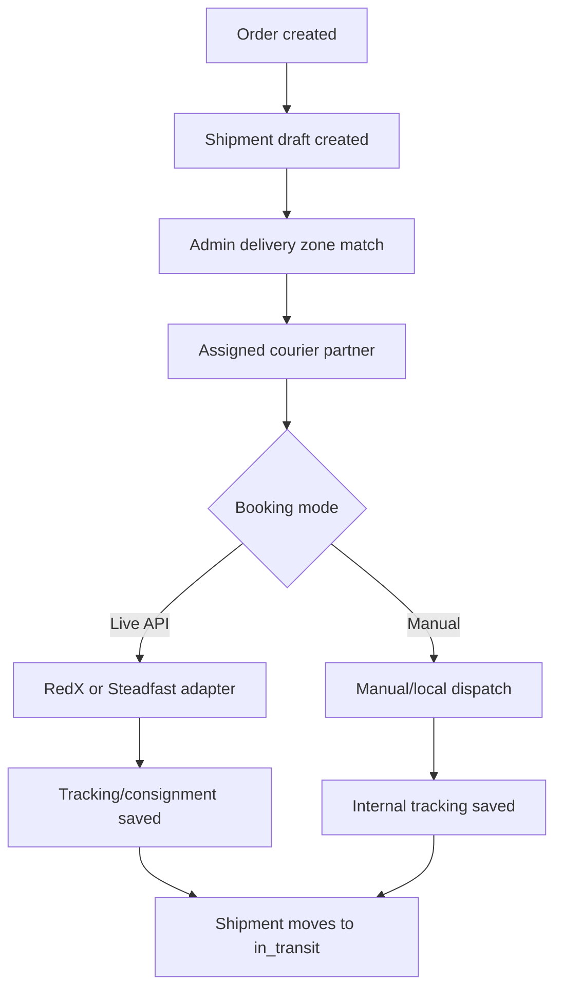

# Amiyo-Go Courier Integration Workflow

This document explains the RedX, Steadfast, and future local courier workflow without storing courier secrets in the repository.

## Credential Rule

Courier credentials must live only in `Server/.env` or deployment secret settings.

Required env names:

```env
COURIER_API_MODE=live
REDX_API_TOKEN=replace_with_rotated_redx_token
STEADFAST_API_KEY=replace_with_rotated_steadfast_key
STEADFAST_SECRET_KEY=replace_with_rotated_steadfast_secret
```

Because courier credentials were shared outside a secret manager, rotate them before production use.

## Admin Setup

1. Go to `Admin > Logistics & Delivery > Couriers`.
2. Create courier partners:
   - RedX: provider `RedX`, booking mode `Live API booking`, coverage `Outside districts`.
   - Steadfast: provider `Steadfast`, booking mode `Live API booking`, coverage `Outside districts`.
   - Local instant courier later: provider `Local instant`, booking mode `Manual booking`, coverage `Local instant area`.
3. Go to `Zones`.
4. Create or edit each delivery zone.
5. Add district names and select the courier partners for that area.
6. Set a fallback default courier.

The zone selection is the area-based routing rule. Dispatch manifests and shipment assignment prefer zone courier partners first, then the fallback courier.

## Shipment Assignment Flow



## Provider Behavior

RedX and Steadfast adapters:

- Read credentials from env only.
- Build booking payload from the stored shipment address, item count, weight, COD amount, and order id.
- Save only safe booking metadata on the shipment: provider, status, tracking number, consignment id, tracking URL, and booked time.
- Do not save API keys or secrets into MongoDB.

Manual and local couriers:

- Keep the same shipment state machine.
- Use platform-generated tracking numbers.
- Can be replaced by a live local instant-delivery adapter later.

## Current API Config

Defaults can be overridden if the courier portal gives a merchant-specific endpoint:

```env
REDX_API_BASE_URL=https://openapi.redx.com.bd/v1.0.0-beta
REDX_CREATE_PARCEL_PATH=/parcel
REDX_AUTH_HEADER=API-ACCESS-TOKEN

STEADFAST_API_BASE_URL=https://portal.packzy.com/api/v1
STEADFAST_CREATE_ORDER_PATH=/create_order
```

If a provider changes its endpoint or required fields, update env paths first. Only edit the adapter when the payload contract changes.

## Operational Notes

- Keep `COURIER_API_MODE=manual` in development unless you intentionally want real courier booking calls.
- Use `bookingMode=manual` for local instant couriers until the local delivery provider is selected.
- Use the admin provider readiness cards to confirm whether RedX/Steadfast credentials are loaded after server restart.
- For production, add courier API failures to the ops monitoring page and retry failed bookings from the shipment detail workflow.
