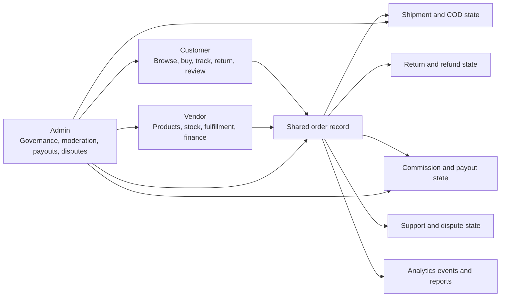
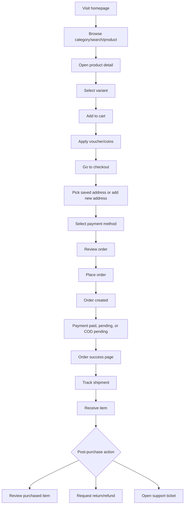
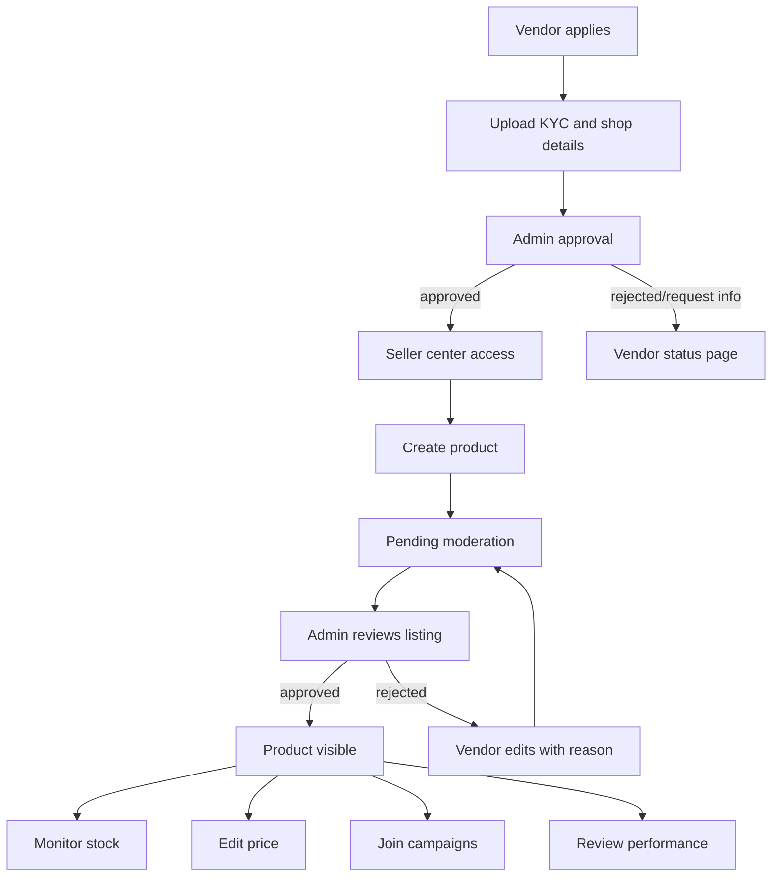
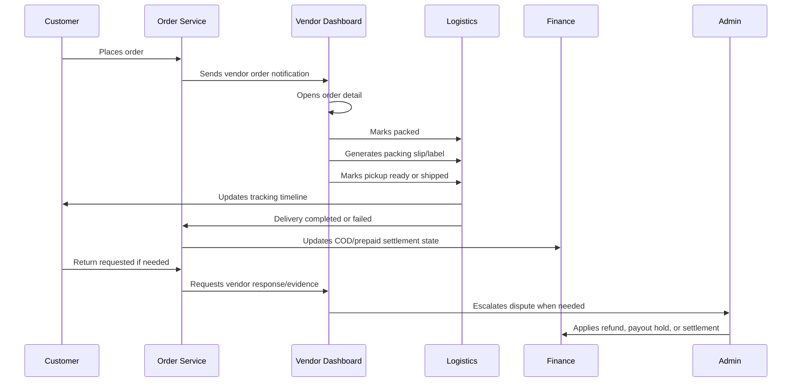
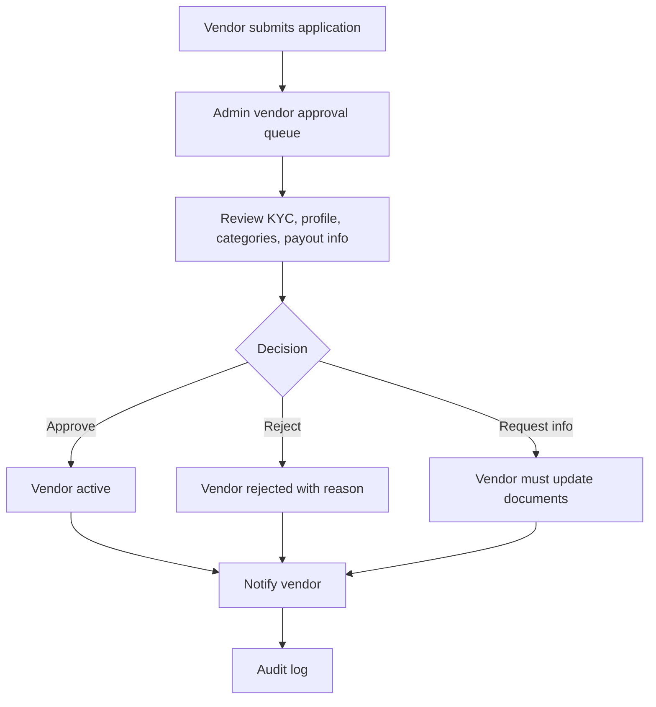
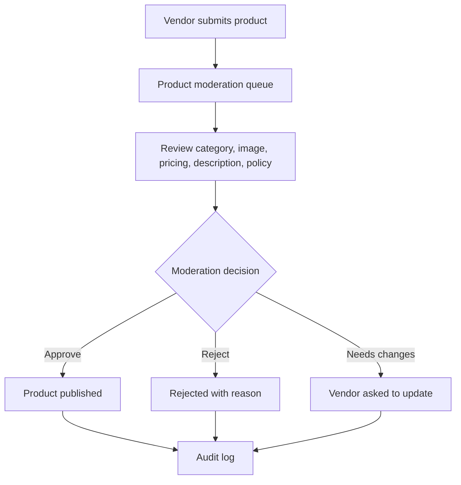
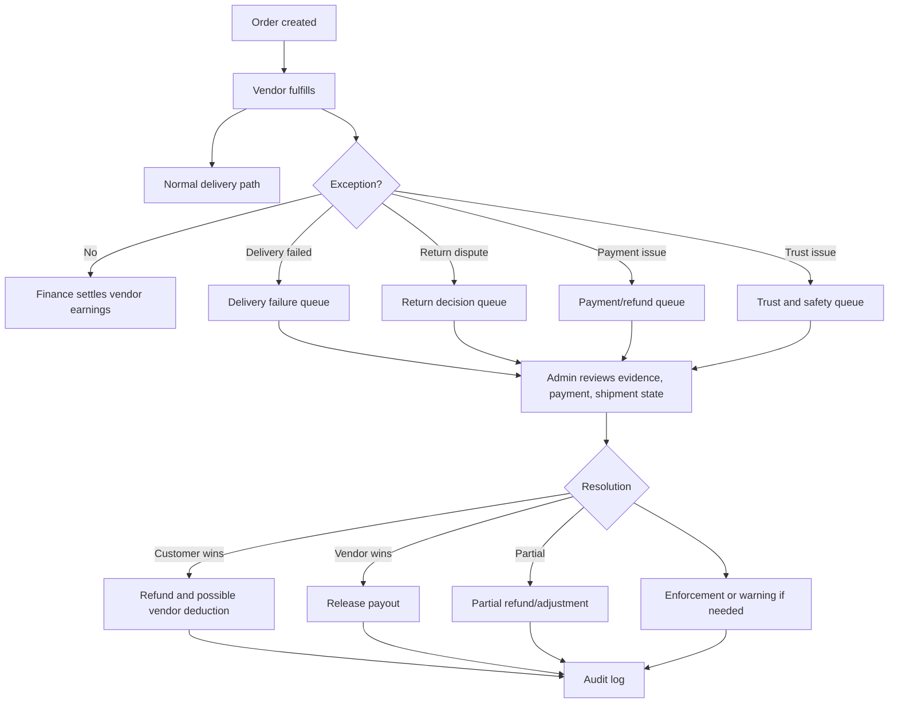
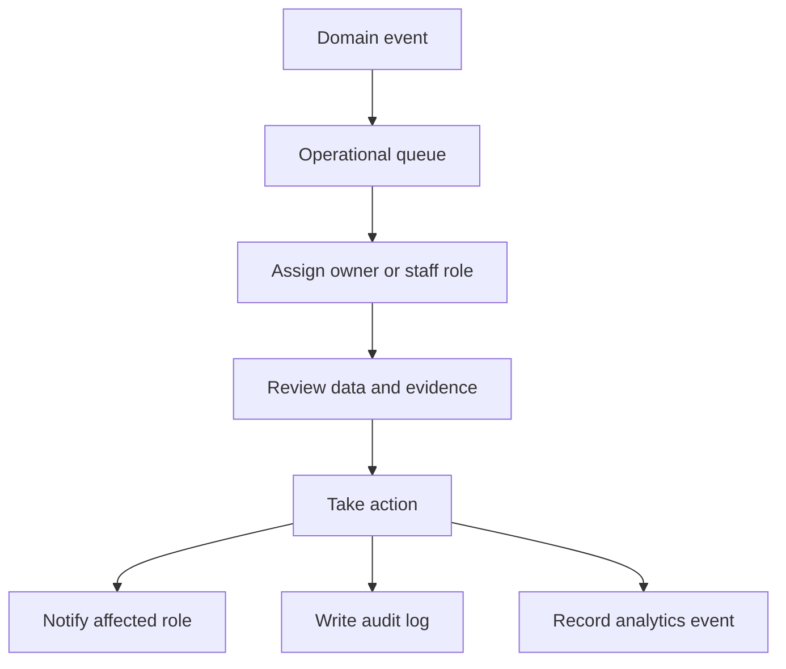

# Amiyo-Go Role Workflow Operating Model

Amiyo-Go should operate as a three-role marketplace system. The customer, vendor, and admin workflows are separate experiences, but they are connected through the same order, fulfillment, return, settlement, trust, and analytics records.

Use this document as the product workflow reference. Use `MARKETPLACE_WORKFLOW_DIAGRAMS.md` for architecture diagrams and implementation status.

## Role Overview

| Role | Primary job | Owns | Depends on |
| --- | --- | --- | --- |
| Customer | Browse, buy, track, return, review, and get support | Account, cart, wishlist, orders, returns, reviews, support tickets, notifications | Catalog, checkout, payment, logistics, vendor fulfillment, admin policy |
| Vendor | Run a seller business inside the marketplace | Shop, KYC, products, inventory, orders, fulfillment, returns, finance, promotions, reputation | Admin approval, category permissions, payment settlement, logistics, support |
| Admin | Operate and govern the platform | Approvals, moderation, RBAC, commissions, payouts, disputes, delivery rules, campaigns, trust, analytics | All customer/vendor workflows and audit logs |

## Customer Functionality

### Account and Identity

- Register, login, logout, forgot password, reset password.
- Guest checkout support.
- Email verification and phone verification.
- Profile editing.
- Saved addresses, default address, notification preferences.
- Account delete/export workflows.

### Browse and Shopping

- Homepage, category pages, search, product detail, vendor storefront.
- Filters, sorting, recommendations, followed vendors.
- Wishlist, compare, save for later.
- Flash sales, offers, vouchers, loyalty/coins.

### Cart and Checkout

- Add/remove cart items.
- Vendor-grouped cart.
- Guest cart and logged-in cart merge where applicable.
- Apply voucher, promo, loyalty coins, and shipping selection.
- Address selection, payment selection, order review, order placement.
- COD and online/manual payment flows.

### Orders and Post-Purchase

- Order success page.
- Order history and order detail.
- Shipment timeline and tracking.
- Cancel when allowed.
- Return/refund request.
- Review purchased items.
- Support ticket linked to order.

### Customer Engagement

- Notification center.
- Price-drop alerts.
- Back-in-stock alerts.
- Followed vendor updates.
- Review status and return updates.

## Vendor Functionality

### Onboarding and Shop Setup

- Apply to become vendor.
- Upload KYC documents.
- Wait for approval, rejection, or request-for-info.
- Setup shop profile, logo, banner, description, policies, pickup details.
- Configure payout details and shipping preferences.

### Catalog and Inventory

- Product list.
- Add/edit product.
- Product variants and SKU stock.
- Product images and media.
- Inventory management.
- Draft, pending, approved, rejected, disabled states.
- Bulk CSV upload.
- Product performance view.

### Orders and Fulfillment

- Orders list by status.
- Order detail page.
- Update order status.
- Print packing slip.
- Generate label.
- Mark packed, pickup ready, shipped.
- Add tracking info if manual.
- Handle return request and dispute evidence.

### Finance

- Earnings dashboard.
- Transaction ledger.
- Commission deductions.
- Refund adjustments.
- Payout request and payout history.
- COD settlement visibility.

### Marketing and Growth

- Create vouchers.
- Join campaigns.
- View promotion performance.
- Manage seller picks or featured products.
- Follow conversion, revenue, and repeat buyers.

### Support and Reputation

- Customer message/support inbox.
- Review management.
- Reply to reviews.
- Return dispute replies.
- Shop rating and performance analytics.

## Admin Functionality

### Platform Control

- Admin login and RBAC.
- Staff roles and permissions.
- Audit logs.
- Platform-wide settings and policies.
- Content and policy management.

### Vendor Management

- Vendor list.
- Vendor approval queue.
- Vendor detail page.
- KYC review.
- Suspend, activate, reject, or request more info.
- Vendor performance monitoring.
- Requested category approvals.
- Payout detail checks.

### Catalog Moderation

- Product moderation queue.
- Approve/reject products.
- Edit or request changes.
- Category manager.
- Attribute manager.
- Brand/listing quality control.
- Duplicate listing review.

### Orders and Returns Operations

- Orders overview.
- Order detail and override tools.
- Returns queue.
- Return decision panel.
- Refund processing.
- Delivery failure and dispute handling.

### Finance and Payout Operations

- Commission settings.
- Vendor transaction monitoring.
- Payout queue.
- Approve, hold, or reject payouts.
- Refund reconciliation.
- COD reconciliation.
- Marketplace revenue reporting.

### Promotions and Notifications

- Create platform-wide promotions.
- Manage flash sales and campaigns.
- Approve vendor campaigns when needed.
- Notification templates.
- Delivery logs and retries.

### Trust and Safety

- Review moderation queue.
- Fraud and risk flags.
- Dispute center.
- Suspicious return and promo abuse queue.
- Enforcement and appeal workflow.

### Logistics and Operations

- Courier assignment.
- Delivery settings and area fee rules.
- Manifest monitoring.
- COD status.
- Reverse logistics oversight.
- SLA and failed-job monitoring.

## Customer Purchase Workflow

## Vendor Product Workflow

## Vendor Order Workflow

## Admin Vendor Approval Workflow

## Admin Product Moderation Workflow

## Admin Order and Dispute Workflow

## Full Marketplace Loop

```mermaid
flowchart LR
    DISCOVER[User discovers product] --> ORDER[User places order]
    ORDER --> PAYMENT[Payment captured or COD marked]
    PAYMENT --> VENDOR_NOTIFY[Vendor notified]
    VENDOR_NOTIFY --> FULFILL[Vendor packs and ships]
    FULFILL --> TRACK[Logistics updates tracking]
    TRACK --> DELIVER[User receives order]
    DELIVER --> POST[Review, support, or return possible]
    POST --> ADMIN[Admin monitors exceptions]
    ADMIN --> FINANCE[Finance settles vendor earnings]
    FINANCE --> ANALYTICS[Analytics records every step]
    ANALYTICS --> GROWTH[Promotions and notifications drive repeat purchase]
    GROWTH --> DISCOVER
```

## Frontend Module Boundaries

Recommended frontend organization by role and domain:

- `customer/`
- `vendor/`
- `admin/`
- `shared-ui/`
- `auth/`
- `checkout/`
- `orders/`
- `logistics/`
- `returns/`
- `promotions/`
- `notifications/`
- `analytics/`

Current repo note: the existing frontend already separates many role pages under `Client/src/pages`, `Client/src/pages/vendor`, `Client/src/pages/admin`, `Client/src/layouts`, `Client/src/routes`, and shared components. A future folder refactor should be mechanical and tested, not mixed into feature work.

## Backend Module Boundaries

Recommended backend domains:

- `auth`
- `users`
- `vendors`
- `catalog`
- `categories`
- `search`
- `cart`
- `checkout`
- `orders`
- `payments`
- `refunds`
- `logistics`
- `returns`
- `reviews`
- `support`
- `promotions`
- `loyalty`
- `notifications`
- `trust`
- `analytics`
- `admin`
- `audit`

Current repo note: the backend already has domain route/controller/model/service files for most of these. Checkout is currently handled primarily through order creation routes and helpers rather than a standalone checkout module.

## Queue-Based Workflow Targets

Use queue-style workflows for:

- Orders requiring seller action.
- Returns requiring vendor/admin decision.
- Product moderation.
- Vendor approval and KYC review.
- Notifications and retries.
- Payout approval.
- Logistics exceptions.
- Trust and safety reports.

## Implementation Order

1. Auth, roles, and route guards.
2. Customer browse, cart, checkout, and order flow.
3. Vendor onboarding and product workflow.
4. Vendor orders, finance, and shop settings.
5. Admin vendor, product, and order moderation.
6. Returns, support, and reviews.
7. Logistics, COD, and reverse logistics.
8. Promotions, notifications, and loyalty.
9. Trust, fraud, and disputes.
10. Analytics, reports, and dashboards.

## Practical Rule

The marketplace is healthy when every role can finish its side of the same workflow:

- Customer can buy and resolve post-purchase issues.
- Vendor can list, fulfill, earn, and respond.
- Admin can approve, moderate, reconcile, and govern.

If those three workflows stay connected through structured order, shipment, return, payout, support, audit, and analytics records, Amiyo-Go behaves like a real marketplace operating system instead of a simple ecommerce storefront.
