# Amiyo-Go Marketplace Workflow Diagrams

This document maps the intended marketplace workflow to the current Amiyo-Go codebase. It is diagram-first and should be read together with `PROJECT_WORKFLOW.md`, `MARKETPLACE_ROLE_WORKFLOWS.md`, `DARAZ_LEVEL_MARKETPLACE_AUDIT.md`, and `TESTING_DOCUMENTATION.md`.

## Current Workflow Verdict

The project broadly follows the target modular-monolith marketplace workflow:

- Customer, vendor, and admin frontends are routed through role-based React layouts.
- The backend is a Node.js/Express modular monolith with route groups for catalog, checkout/orders, payments, logistics, returns, reviews, support, promotions, trust, analytics, and admin.
- The current data store is MongoDB through both native Mongo collections and Mongoose models. The supplied PostgreSQL box is a target architecture item, not the current implementation.
- Redis is optional infrastructure. BullMQ exists for selected background workflows, and marketplace events now use a Mongo-backed outbox with an optional BullMQ worker adapter.
- Search currently uses API/database search. A dedicated search index such as Typesense is still a future adapter.
- Shipment state machines, COD states, returns, trust, growth, and analytics foundations exist, but some external integrations are still manual or adapter-ready.

## System Architecture

```mermaid
flowchart TB
    subgraph Clients
        C1[Customer Web App]
        C2[Vendor Dashboard]
        C3[Admin Dashboard]
    end

    subgraph Frontend["React Frontend"]
        FE[Role-based layouts]
        CL[CustomerLayout]
        VL[VendorLayout]
        AL[AdminLayout]
        GUARDS[Route guards and RBAC]
    end

    subgraph Backend["Node.js API - Modular Monolith"]
        API[Express API Layer]
        AUTH[Auth and Identity]
        USER[Users and Addresses]
        VENDOR[Vendors, KYC, Staff]
        CATALOG[Catalog, Products, Categories]
        SEARCH[Search and Discovery]
        CART[Client Cart and Wishlist APIs]
        CHECKOUT[Checkout via Orders]
        ORDER[Orders and Vendor Orders]
        PAYMENT[Payments, Manual Verification, Refunds]
        LOGISTICS[Shipments, Dispatch, COD]
        RETURNS[Returns and Reverse Logistics]
        REVIEW[Reviews, Q and A, Moderation]
        SUPPORT[Support Tickets and Chat]
        PROMO[Coupons, Offers, Promotions, Loyalty]
        NOTIF[Notifications, Email, Push]
        TRUST[Trust, Reports, Disputes, Enforcement]
        ANALYTICS[Analytics Events and Reports]
        ADMIN[Admin, RBAC, Audit]
    end

    subgraph Data["Current Data Layer"]
        MDB[(MongoDB)]
        MONGO[Mongoose + native Mongo models]
        REDIS[(Redis optional)]
        QUEUE[Mongo event outbox + BullMQ selected jobs]
        STORAGE[(Uploads / object storage adapters)]
        FTS[(Search index later)]
    end

    subgraph External["External Integrations"]
        EMAIL[Email Provider]
        PUSH[Push / Service Worker]
        SMS[SMS Provider later]
        COURIER[Courier APIs later]
        PAYGW[Payment APIs / webhooks]
    end

    C1 --> FE
    C2 --> FE
    C3 --> FE
    FE --> CL
    FE --> VL
    FE --> AL
    FE --> GUARDS
    GUARDS --> API

    API --> AUTH
    API --> USER
    API --> VENDOR
    API --> CATALOG
    API --> SEARCH
    API --> CART
    API --> CHECKOUT
    API --> ORDER
    API --> PAYMENT
    API --> LOGISTICS
    API --> RETURNS
    API --> REVIEW
    API --> SUPPORT
    API --> PROMO
    API --> NOTIF
    API --> TRUST
    API --> ANALYTICS
    API --> ADMIN

    AUTH --> MDB
    USER --> MDB
    VENDOR --> MDB
    CATALOG --> MDB
    SEARCH --> MDB
    CART --> MDB
    CHECKOUT --> MDB
    ORDER --> MDB
    PAYMENT --> MDB
    LOGISTICS --> MDB
    RETURNS --> MDB
    REVIEW --> MDB
    SUPPORT --> MDB
    PROMO --> MDB
    NOTIF --> MDB
    TRUST --> MDB
    ANALYTICS --> MDB
    ADMIN --> MDB
    MDB --> MONGO

    CATALOG --> STORAGE
    VENDOR --> STORAGE
    RETURNS --> STORAGE
    REVIEW --> STORAGE
    LOGISTICS --> STORAGE
    ANALYTICS --> STORAGE

    API --> REDIS
    API --> QUEUE
    SEARCH -. future .-> FTS

    QUEUE --> EMAIL
    QUEUE --> PUSH
    QUEUE -. later .-> SMS
    LOGISTICS -. later .-> COURIER
    PAYMENT --> PAYGW
```

## Module Dependency Map

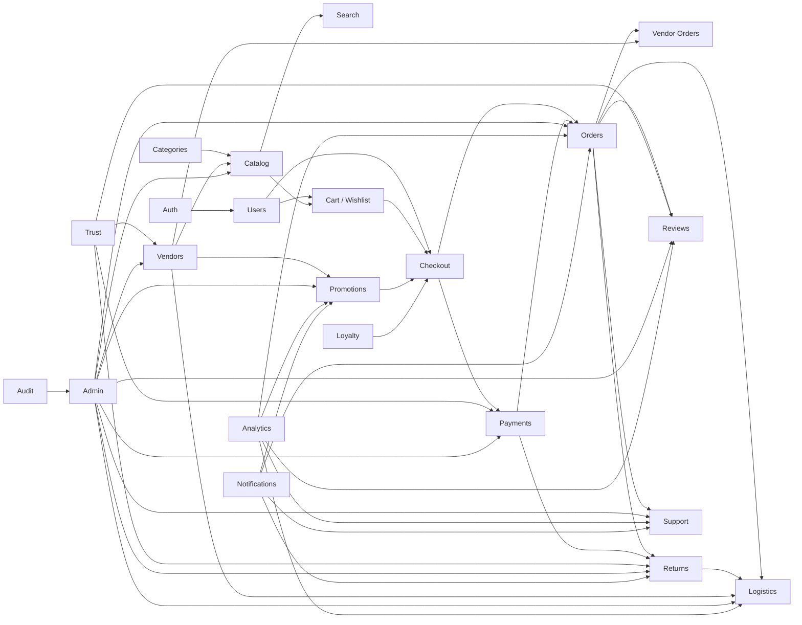

## Customer Buying Flow

Current important routes:

- Frontend: `/products`, `/search`, `/product/:id`, `/cart`, `/checkout`, `/checkout/guest`, `/orders`, `/orders/:orderId`, `/returns`, `/support`, `/notifications`
- Backend: `/api/products`, `/api/search`, `/api/coupons/validate`, `/api/growth/promotions/evaluate`, `/api/orders`, `/api/orders/guest`, `/api/payments`, `/api/shipments/track/:orderId`, `/api/returns`

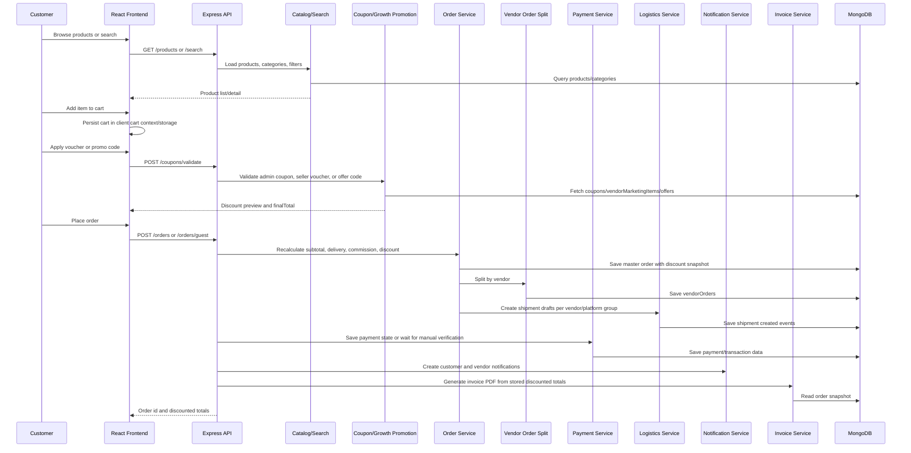

## Voucher and Discount Persistence Flow

This flow is important because checkout previews must match the final order, order list, and invoice.

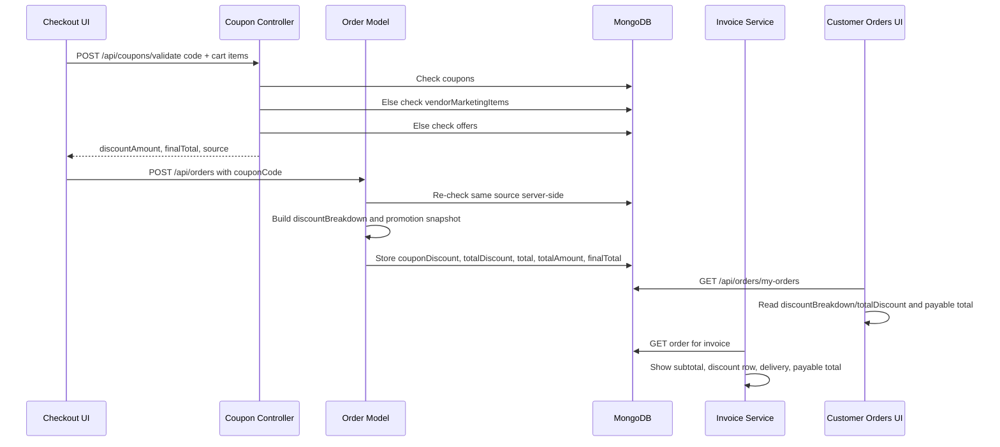

## Vendor Operations Flow

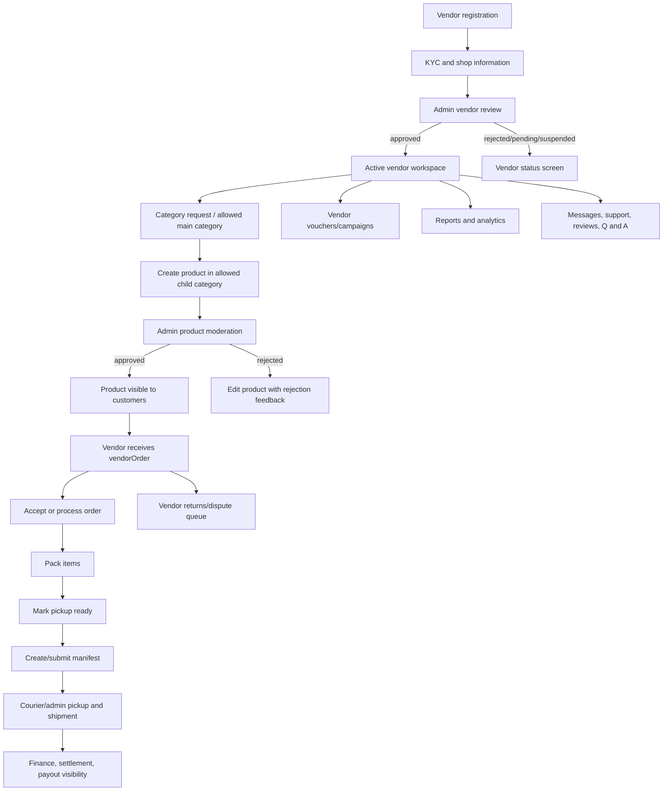

## Admin Operations Flow

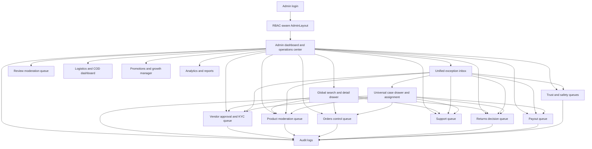

## Logistics State Machine

The current code has state machines in `Server/utils/logisticsStateMachine.js` and shipment routes under `/api/shipments`, `/api/vendor/logistics`, and `/api/admin/logistics`.

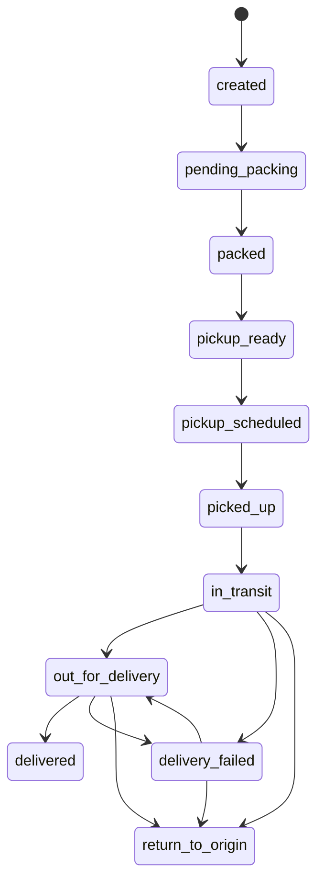

## Reverse Logistics State Machine

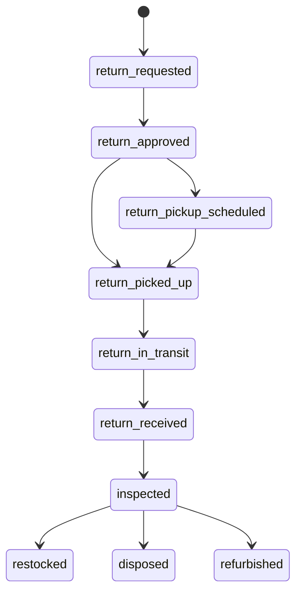

## COD State Machine

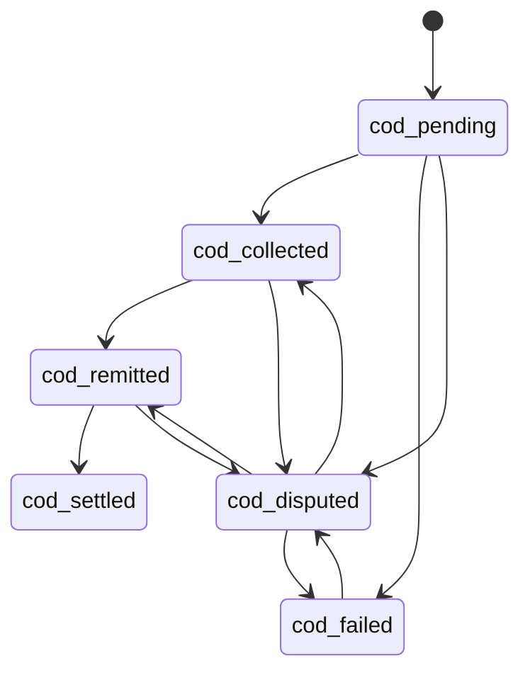

## Analytics and Intelligence Flow

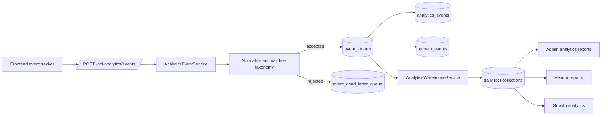

## Marketplace Event Bus Flow

The current code has a platform-wide event bus in `Server/services/marketplaceEventBus.js`. It writes important workflow events into `marketplace_events`, stages in-app/email/push work in `marketplace_notification_queue`, and processes in-app notifications immediately when Redis/BullMQ is not enabled. When Redis is enabled with `MARKETPLACE_EVENT_USE_REDIS=true` or `REDIS_URL`, the same event IDs can be processed by the BullMQ `marketplace-events` worker.

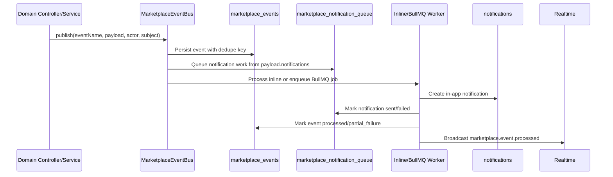

## Main Collections and Persistence Map

| Domain | Main current collections/models |
| --- | --- |
| Identity | `users`, Firebase identity claims, admin role/permission data |
| Vendor | `vendors`, `vendorStaff`, KYC fields, vendor category requests |
| Catalog | `products`, `categories`, dynamic category/field collections |
| Cart | Mostly frontend cart state; wishlist is persisted through `wishlists` |
| Checkout/order | `orders`, `vendorOrders`, `promotion_snapshots` |
| Payments | `payments`, manual verification fields, payment webhooks |
| Logistics | `shipments`, `shipment_events`, `manifests`, `couriers` |
| Returns | `returns`, return evidence, vendor responses, refund fields |
| Promotions | `coupons`, `offers`, `vendorMarketingItems`, campaign collections |
| Notifications | `marketplace_events`, `marketplace_notification_queue`, `notifications`, notification subscriptions, push/email logs where configured |
| Trust | risk/report/dispute/enforcement/appeal collections and audit logs |
| Analytics | `event_stream`, `analytics_events`, `growth_events`, daily analytics summary collections |
| Admin/audit | `audit_logs`, RBAC permissions and staff-role records |

## Target Diagram Match Status

| Target area | Current status | Notes |
| --- | --- | --- |
| Customer web, vendor dashboard, admin dashboard | Present | Routed through React role layouts and guards. |
| Node.js modular monolith | Present | `Server/index.js` registers domain route modules. |
| REST API | Present | Express routes under `/api/*`. |
| Realtime/push | Partial | Push/service-worker support exists; not every domain emits through one realtime bus. |
| PostgreSQL | Not current | Current database is MongoDB. PostgreSQL would be a migration, not documentation of today. |
| Redis | Partial/optional | Config exists and can be required by env, but app can run without Redis. |
| BullMQ jobs | Partial | Used for selected jobs such as bulk upload; marketplace events have a Mongo outbox and optional BullMQ worker adapter. |
| Marketplace event bus | Present | `MarketplaceEventBus` persists workflow events, queues notification work, and powers order-created/timeline events. |
| Object storage | Partial | Upload routes/services exist; storage provider depends on configuration. |
| Search index/Typesense | Future | Search currently works through API/database search. |
| Checkout to order flow | Present | `/api/orders` and `/api/orders/guest`; discount persistence is now aligned with invoice/order views. |
| Payment gateway flow | Partial | Payment records, manual verification, and webhooks exist; gateway depth depends on provider setup. |
| Logistics state machine | Present | Forward, reverse, and COD state machines exist. |
| Auto shipment draft at order placement | Present | Order creation now creates shipment drafts for each vendor/platform group; vendor logistics actions continue the state machine. |
| Vendor seller action center | Present | Vendor dashboard groups late fulfillment, return responses, rejected listings, stock risk, payout holds, category requests, KYC, payout setup, and marketing gaps into one prioritized seller queue. |
| Vendor bulk operations | Present | Seller center supports server-side bulk order status transitions, product bulk field edits, bulk submit/delist/delete actions, and CSV exports for selected/filtered rows. |
| Vendor finance command view | Present | Vendor dashboard summarizes available payout estimate, pending payout exposure, COD pending/collected, return deductions, payout holds, delivered earnings, and refund exposure. |
| Vendor finance reconciliation | Present | Vendor finance center reconciles gross sales, commission, shipping adjustments, returns, COD exposure, pending/held/paid payouts, and available balance. |
| Vendor fulfillment command view | Present | Vendor dashboard shows active packing/pickup work, late SLA breaches, due-soon orders, and the next fulfillment deadline. |
| Vendor readiness checks | Present | Vendor dashboard scores KYC, shop profile, category access, payout setup, catalog readiness, fulfillment health, returns, marketing, and team access. |
| Admin global search | Present | Admin header can search orders, vendors, products, customers, returns, and support tickets with a detail drawer. |
| Admin exception inbox | Present | Admin dashboard now consolidates vendor, catalog, finance, support, trust, notification, and job exceptions with priority, SLA, owner, next action, and workspace links. |
| Admin universal case workflow | Present | Exception inbox items can be opened in a shared case drawer with assignment, priority, status, due date, notes, history, audit logging, and workspace handoff links. |
| Admin bulk queue actions | Present | Exception inbox items can be selected and updated in bulk with assignment, status, priority, due date, and notes. |
| Saved admin filters/views | Present | Dashboard views are persisted per admin user in `admin_saved_views` and restore date, vendor, and exception filters. |
| Staff workload dashboard | Present | Admin dashboard shows active ownership, overdue work, unassigned work, critical load, and top workflow per staff member. |
| Finance reconciliation command view | Present | Admin dashboard summarizes COD outstanding, refund exposure, payout holds, pending payout exposure, and vendor deductions. |
| Integration readiness monitor | Present | Admin dashboard reports courier, payment, notification, event-bus, and analytics readiness from env and failure signals. |
| Admin queue operations | Present/partial | Vendors, products, orders, returns, payouts, support, trust, logistics, analytics pages exist. Depth varies by workflow. |
| Analytics event taxonomy and warehouse | Present/partial | Event ingestion, taxonomy, and intelligence services exist; dashboard completeness depends on events being emitted consistently. |
| Admin E2E UI hooks | Present | Dashboard exception inbox, case drawer, bulk action bar, and hardening panels expose stable test ids for browser automation. |
| Vendor E2E UI hooks | Present | Seller action center and seller command panels expose stable test ids for browser automation. |

## Recommended Next Hardening Steps

1. Decide whether PostgreSQL is a real migration target. If yes, add a separate migration plan instead of mixing it into current architecture diagrams.
2. Add a server-side cart collection only if cross-device cart persistence is required.
3. Continue expanding event-bus publishers to every remaining payment-updated, shipment-updated, return-updated, and support-replied path.
4. Add a search adapter boundary so Mongo search can later be replaced by Typesense without changing page code.
5. Add courier API adapters on top of the existing shipment drafts/state machine when a delivery partner is selected.
6. Add vendor payout statement export from the reconciliation tab if finance wants a single CSV for orders, returns, COD, and payout movement.
7. Add Playwright/Cypress browser runs against the new admin and vendor test ids once an E2E runner is selected.
8. Add a diagram update checklist to every future phase so docs and workflow stay synced with implementation.
